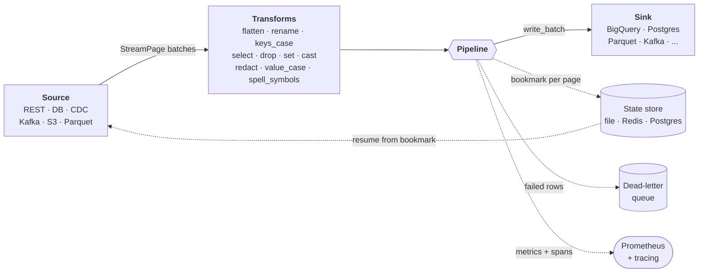

<p align="center">
  
</p>

# faucet-stream

[](https://crates.io/crates/faucet-stream)
[](https://docs.rs/faucet-stream)
[](https://pawansikawat.github.io/faucet-stream/)
[](https://github.com/PawanSikawat/faucet-stream/actions/workflows/ci.yml)
[](https://codecov.io/gh/PawanSikawat/faucet-stream)
[](https://crates.io/crates/faucet-stream)
[](rust-toolchain.toml)
[](deny.toml)
[](#license)
[](CHANGELOG.md)

**The fast, config-driven way to move data in Rust.**

faucet-stream wires **21 source** and **17 sink** connectors together with a single
`faucet` binary that runs pipelines declaratively from a YAML/JSON file — no Rust
code required. Or skip the binary and embed the same engine in your own service
through the typed `Source` / `Sink` traits. One toolkit, whether you want a CLI you
can drop on any box or a library you compile in.

- **Fast and reliable by default** — native streaming with bounded memory,
  connection pooling, multi-row inserts, bulk APIs, and parallel I/O. Every
  connector is built to be the fastest way to move its data in Rust.
- **Config-driven _or_ embeddable** — run `faucet run pipeline.yaml`, or call
  `Pipeline::new(&source, &sink).run().await?` from Rust. Same orchestration either way.
- **A runtime, not just connectors** — incremental + resumable replication,
  PostgreSQL change-data-capture, built-in data-quality checks (13 per-record and
  per-batch assertions with quarantine routing and abort policies), dead-letter
  queues, automatic retries, adaptive batch sizing (AIMD controller that tunes
  write batch size from sink latency and error rate), secrets-manager interpolation
  (`${vault:…}`, `${aws-sm:…}`, `${gcp-sm:…}`, `${azure-kv:…}`), cron scheduling
  (`faucet schedule`), an HTTP control plane (`faucet serve` — submit/poll/cancel
  runs over REST), and built-in Prometheus metrics + `tracing` spans, all with
  zero per-connector code.
- **Pay only for what you use** — every connector is a Cargo feature, so a slim
  build can be just REST + JSONL, or pull in all 38 connectors with `--features full`.

Inspired by [Meltano's Singer SDK](https://sdk.meltano.com/) — reimagined for Rust
as both a reusable library and a standalone CLI.

**Documentation:** the [faucet-stream guide](https://pawansikawat.github.io/faucet-stream/)
(getting started, tutorials, cookbook, operations) · API reference on
[docs.rs](https://docs.rs/faucet-stream) · [`cli/README.md`](cli/README.md) for the full config grammar.

## Run a pipeline from a YAML file (no Rust required)

```bash
cargo install faucet-cli
faucet init my_pipeline --source postgres --sink bigquery   # scaffold pipeline.yaml from schemas
faucet validate pipeline.yaml
faucet doctor pipeline.yaml                                  # preflight: probe auth/network/permissions
faucet run pipeline.yaml
faucet schedule pipeline.yaml                               # run on cron schedule (add a schedule: block)
faucet serve --no-auth                                      # HTTP control plane: submit/poll/cancel runs over REST
```

```yaml
# faucet.yaml — `faucet run` auto-discovers this file (and a sibling `.env`) in cwd
version: 1
pipeline:
  source:
    type: rest
    config:
      base_url: https://api.github.com
      path: /repos/PawanSikawat/faucet-stream/issues
      method: GET
      auth: { type: api_key, config: { header: Authorization, value: "Bearer ${env:GITHUB_TOKEN}" } }
      query_params: { state: open }
      pagination: { type: LinkHeader }
      max_retries: 3
      retry_backoff: 1
      tolerated_http_errors: []
      replication_method: { type: FullTable }
      primary_keys: ["id"]
      partitions: []
      schema_sample_size: 100
  transforms:
    - type: snake_case
  sink:
    type: jsonl
    config:
      path: ./out/issues.jsonl
```

Add a `matrix:` block to run many invocations from one config (independent fan-out or parent/child DAG), and `execution:` to bound concurrency. See [`cli/README.md`](cli/README.md) for the full grammar, [`cli/examples/rest_to_bigquery_matrix.yaml`](cli/examples/rest_to_bigquery_matrix.yaml) for independent matrix fan-out, and [`cli/examples/rest_users_posts_dag.yaml`](cli/examples/rest_users_posts_dag.yaml) for the DAG pattern.

## How it compares

There are many great data-movement tools. faucet-stream's niche is being **a single
fast native binary _and_ an embeddable Rust library** — config-driven like Meltano or
Benthos, but with no Python runtime, no platform to operate, and a typed library API
when you want to compile pipelines into your own service.

| | **faucet-stream** | Meltano (Singer) | Airbyte | Benthos / Redpanda Connect | Vector | Fivetran |
|---|---|---|---|---|---|---|
| Runtime | Rust, native binary | Python | Java/Python on Docker | Go, native binary | Rust, native binary | Hosted SaaS |
| Single static binary | ✓ | ✗ | ✗ | ✓ | ✓ | n/a |
| Config-driven (YAML/JSON) | ✓ | ✓ | via UI/API | ✓ | ✓ | via UI |
| Embeddable as a library | ✓ (Rust) | ✗ | ✗ | ✓ (Go) | ✗ | ✗ |
| Connector count | 38, growing | 600+ taps | 350+ | dozens | dozens | 500+ |
| Change data capture | ✓ PostgreSQL | partial¹ | ✓ | partial | ✗ | ✓ |
| Incremental + resumable state | ✓ | ✓ | ✓ | partial | n/a | ✓ |
| Built-in data-quality checks | ✓ native | ✗ | paywalled add-on | ✗ | ✗ | paywalled add-on |
| Built-in metrics + tracing | ✓ Prometheus + `tracing` | partial | ✓ (platform) | ✓ | ✓ | ✓ (hosted) |
| Self-hosted, no daemon | ✓ run-to-completion | ✓ | ✗ needs platform | usually a service | agent | ✗ SaaS |
| License | MIT / Apache-2.0 | MIT | ELv2 + MIT | Apache-2.0 / source-available² | MPL-2.0 | Proprietary |

¹ Singer CDC depends on the individual tap. ² The original Benthos is Apache-2.0; Redpanda Connect's maintained build is source-available. *Comparison reflects the general shape of each tool as of 2026-05 — check each project for current details.*

**[dbt](https://www.getdbt.com/) is complementary, not a competitor:** it transforms
data already in your warehouse (the "T" in ELT); faucet-stream handles the "EL" of
getting data in and out. **[Singer](https://www.singer.io/) is a spec**, and Meltano
is its most common runtime.

## When to use faucet-stream

**Reach for it when:**

- You want **one fast static binary** (or a Rust library) to move data between APIs, databases, object stores, and warehouses — without standing up a platform, scheduler, or Python environment.
- You want **version-controlled, config-driven pipelines** you can run anywhere: locally, in CI, behind cron, or inside another service.
- You need **streaming with bounded memory, incremental/resumable replication, CDC, data-quality assertions, retries, dead-letter queues, and metrics** without hand-writing that plumbing.
- You're **already in Rust** and want typed `Source`/`Sink` traits you can embed and extend.

**Look elsewhere (for now) when:**

- You need a connector faucet-stream **doesn't ship yet and can't write** — [Meltano](https://meltano.com/) (600+ Singer taps) and [Airbyte](https://airbyte.com/) (350+) have far broader catalogs today.
- You want a **fully-managed, hosted service** with a UI and a team operating it — Fivetran or Airbyte Cloud.
- Your job is **in-warehouse transformation** — use dbt, and pair it with faucet-stream for the extract/load.
- You need a **continuous record-by-record streaming processor** — [Benthos / Redpanda Connect](https://www.redpanda.com/connect) and [Vector](https://vector.dev/) are purpose-built for that. faucet-stream runs discrete pipelines to completion; even the long-running modes (`faucet schedule`, `faucet serve`) orchestrate complete runs rather than a never-ending stream.

## Architecture

A `Source` streams batches of records, optional `Transform`s reshape them, and the
`Pipeline` writes each batch to a `Sink` — bounding memory at one batch on both
sides regardless of total volume. The pipeline also drives the cross-cutting
runtime (bookmarks, dead-letter routing, metrics) so connectors stay simple:



faucet-stream is a Cargo workspace with 50 crates — 21 sources, 17 sinks, 6 shared connector libraries, the shared auth-provider library, 2 state-store backends, the shared core, the umbrella crate, and the CLI binary:

| Crate | Description |
|-------|-------------|
| [`faucet-core`](crates/core) | Shared types, traits (`Source`, `Sink`, `AuthProvider`), pipeline orchestration, transforms, error types |
| [`faucet-auth`](crates/auth) | Shared single-flight auth providers (OAuth2, token-endpoint) for `auth: { ref }` |
| **Sources** | |
| [`faucet-source-rest`](crates/source/rest) | REST API — auth, pagination, extraction, schema inference |
| [`faucet-source-graphql`](crates/source/graphql) | GraphQL API — cursor-based pagination, variable injection |
| [`faucet-source-xml`](crates/source/xml) | XML/SOAP API — XML-to-JSON conversion, dot-path extraction |
| [`faucet-source-grpc`](crates/source/grpc) | gRPC — dynamic protobuf via `prost-reflect`, TLS support |
| [`faucet-source-postgres`](crates/source/postgres) | PostgreSQL — run SQL queries, return rows as JSON |
| [`faucet-source-postgres-cdc`](crates/source/postgres-cdc) | PostgreSQL CDC — logical replication via pgoutput, resumable with any StateStore |
| [`faucet-source-mysql`](crates/source/mysql) | MySQL — run SQL queries, return rows as JSON |
| [`faucet-source-mssql`](crates/source/mssql) | Microsoft SQL Server — run SQL queries (streaming, incremental), rows as JSON |
| [`faucet-source-sqlite`](crates/source/sqlite) | SQLite — run SQL queries, return rows as JSON |
| [`faucet-source-s3`](crates/source/s3) | AWS S3 — read objects as JSONL, JSON array, or raw text |
| [`faucet-source-gcs`](crates/source/gcs) | Google Cloud Storage — read objects as JSONL, JSON array, or raw text |
| [`faucet-source-mongodb`](crates/source/mongodb) | MongoDB — find() with filter, projection, sort |
| [`faucet-source-redis`](crates/source/redis) | Redis — read from streams, lists, or key patterns |
| [`faucet-source-webhook`](crates/source/webhook) | Webhook — temporary HTTP server collecting POST payloads |
| [`faucet-source-websocket`](crates/source/websocket) | WebSocket — live streaming feed; subscribe frames, reconnect, ping keepalive |
| [`faucet-source-csv`](crates/source/csv) | CSV — read CSV files as JSON objects |
| [`faucet-source-elasticsearch`](crates/source/elasticsearch) | Elasticsearch — search/scroll API |
| [`faucet-source-kafka`](crates/source/kafka) | Apache Kafka — consumer with idle/max-messages termination |
| [`faucet-source-parquet`](crates/source/parquet) | Apache Parquet — local file, glob, or S3; vectorized Arrow async reader, column projection |
| [`faucet-source-bigquery`](crates/source/bigquery) | Google BigQuery — `jobs.query` + `jobs.getQueryResults`, type-aware row decoding |
| [`faucet-source-snowflake`](crates/source/snowflake) | Snowflake — SQL REST API with server-side partition pagination, JWT / OAuth |
| **Sinks** | |
| [`faucet-sink-bigquery`](crates/sink/bigquery) | Google BigQuery — streaming inserts |
| [`faucet-sink-postgres`](crates/sink/postgres) | PostgreSQL — JSONB or auto-mapped columns |
| [`faucet-sink-jsonl`](crates/sink/jsonl) | JSON Lines — file output with append/truncate |
| [`faucet-sink-snowflake`](crates/sink/snowflake) | Snowflake — SQL REST API with JWT/OAuth |
| [`faucet-sink-mysql`](crates/sink/mysql) | MySQL — JSON column or auto-mapped columns |
| [`faucet-sink-mssql`](crates/sink/mssql) | Microsoft SQL Server — JSON column or auto-mapped columns |
| [`faucet-sink-sqlite`](crates/sink/sqlite) | SQLite — JSON column or auto-mapped columns |
| [`faucet-sink-s3`](crates/sink/s3) | AWS S3 — write JSONL files to bucket |
| [`faucet-sink-gcs`](crates/sink/gcs) | Google Cloud Storage — write JSONL files to bucket |
| [`faucet-sink-mongodb`](crates/sink/mongodb) | MongoDB — insert_many documents |
| [`faucet-sink-redis`](crates/sink/redis) | Redis — write to streams, lists, or key-value |
| [`faucet-sink-csv`](crates/sink/csv) | CSV — write JSON records as CSV rows |
| [`faucet-sink-elasticsearch`](crates/sink/elasticsearch) | Elasticsearch — bulk index API |
| [`faucet-sink-http`](crates/sink/http) | HTTP — POST records to any endpoint |
| [`faucet-sink-stdout`](crates/sink/stdout) | Stdout/stderr — JSON Lines, pretty JSON, or TSV |
| [`faucet-sink-kafka`](crates/sink/kafka) | Apache Kafka — producer with FuturesUnordered batching, multi-topic routing |
| [`faucet-sink-parquet`](crates/sink/parquet) | Apache Parquet — local file or S3; schema inference, compression, row/byte rollover |
| **Shared libraries** | |
| [`faucet-common-bigquery`](crates/common/bigquery) | Shared BigQuery types — `BigQueryCredentials` enum and `build_client` helper |
| [`faucet-common-elasticsearch`](crates/common/elasticsearch) | Shared `ElasticsearchAuth` enum for Elasticsearch source/sink |
| [`faucet-common-gcs`](crates/common/gcs) | Shared GCS types — credentials enum, Storage/StorageControl client builders |
| [`faucet-common-kafka`](crates/common/kafka) | Shared Kafka types — auth, value formats, Schema Registry client |
| [`faucet-common-snowflake`](crates/common/snowflake) | Shared Snowflake types — `SnowflakeAuth` enum + auth header helpers |
| [`faucet-common-mssql`](crates/common/mssql) | Shared MSSQL types — connection/TLS config, `tiberius`+`bb8` pool builder, identifier quoting |
| **State stores** | |
| [`faucet-state-redis`](crates/state/redis) | Redis-backed `StateStore` for persistent bookmarks |
| [`faucet-state-postgres`](crates/state/postgres) | PostgreSQL-backed `StateStore` for persistent bookmarks |
| [`faucet-stream`](faucet-stream) | Umbrella crate — feature-gated re-exports of all connectors and state backends |
| **CLI** | |
| [`faucet-cli`](cli) | `faucet` binary — YAML/JSON config-driven pipeline runner (`run`, `validate`, `schema`, `list`, `preview`, `init`, `doctor`, `schedule`, `serve`) |

See the [connector capability matrix](https://pawansikawat.github.io/faucet-stream/reference/connectors.html)
(streaming, resumable state, compression, auth per connector) and the
[choosing-a-connector guide](https://pawansikawat.github.io/faucet-stream/reference/choosing.html)
for help picking between overlapping connectors (Postgres query vs CDC, S3 vs Parquet, Redis vs Kafka, …).

Install only what you need:

```toml
# Everything (default includes REST source)
faucet-stream = "1.0"

# All sources
faucet-stream = { version = "1.0", features = ["source"] }

# All sinks
faucet-stream = { version = "1.0", features = ["sink"] }

# All connectors
faucet-stream = { version = "1.0", features = ["full"] }

# Pick individual connectors
faucet-stream = { version = "1.0", features = ["source-rest", "sink-postgres", "sink-s3"] }

# Or use individual crates directly
faucet-source-rest = "1.0"

faucet-source-mongodb = "1.0"
```

## Performance

Every connector is optimised for throughput out of the box:

| Technique | Where |
|-----------|-------|
| **Parallel I/O** | S3 reads/writes objects concurrently (configurable `concurrency`); HTTP sink sends requests in parallel; REST source processes partitions concurrently |
| **Multi-row INSERT** | PostgreSQL, MySQL, SQLite, and SQL Server sinks batch records into single INSERT statements instead of one per row (MSSQL auto-splits at the 2100-parameter limit) |
| **Transaction wrapping** | SQLite sink wraps batches in `BEGIN`/`COMMIT` for 10-50x write speedup |
| **Connection pooling** | All database connectors (PostgreSQL, MySQL, SQLite, SQL Server) use connection pools with configurable `max_connections` |
| **Connection reuse** | S3, MongoDB, Redis, Elasticsearch, and HTTP connectors create clients once and reuse across all operations |
| **Redis pipelining** | Redis sink batches commands with `pipe()`; Redis source uses `MGET` for bulk key reads |
| **Bulk APIs** | Elasticsearch uses the bulk NDJSON API; BigQuery uses `insertAll`; MongoDB uses `insert_many` |
| **Buffered I/O** | JSONL sink uses `BufWriter`; CSV uses buffered readers/writers in blocking threads |
| **Streaming pagination** | REST, GraphQL, XML, and Elasticsearch sources stream pages one at a time via `stream_pages()` to bound memory |

## Streaming by default

`Pipeline::run` drives sources via `stream_pages` and writes each page to the sink as it arrives, keeping sink-side memory bounded at the configured `batch_size`.

### Tuning

Most connectors expose configuration knobs for throughput:

```rust
// S3: parallel object reads
let config = S3SourceConfig::new("my-bucket")
    .with_concurrency(20);  // default: 10

// PostgreSQL: connection pool size
let config = PostgresSourceConfig::new("postgres://...", "SELECT ...")
    .with_max_connections(20);  // default: 10

// HTTP sink: parallel requests
let config = HttpSinkConfig::new("https://api.example.com/ingest")
    .with_concurrency(20);  // default: 10

// REST: parallel partition processing
let config = RestStreamConfig::new("https://api.example.com")
    .partition_concurrency(Some(5));  // default: sequential
```

## Observability

Every pipeline emits OTel-compatible `tracing` spans and Prometheus metrics automatically — labelled by `pipeline`, `row` (matrix row id), and `connector`. The CLI exposes a `/metrics` endpoint via the optional `observability:` block in `faucet.yaml`. See [CLI README](cli/README.md#observability-prometheus--tracing) for the YAML grammar and the OpenTelemetry bridge snippet.

## Features

### Source: REST API (`faucet-source-rest`)

- **Authentication** — Bearer, Basic, API Key (header or query param), OAuth2 (client credentials), Token Endpoint (fetch from any API), or custom headers
- **Pagination** — cursor/token (JSONPath), page number, offset/limit, Link header, next-link-in-body
- **JSONPath extraction** — point at where records live in any JSON response
- **Record transforms** — flatten, rename keys (regex), `keys_case` (snake / camel / pascal / kebab / screaming_snake), plus config-exposed `select` / `drop` / `set` / `rename_field` / `cast` / `redact` / `value_case` / `spell_symbols`, or custom closures
- **Schema inference** — automatically derive a JSON Schema from sampled records
- **Incremental replication** — bookmark-based filtering so you only fetch new records
- **Partitions** — run the same stream across multiple contexts (e.g. per-org, per-repo)
- **Retries with backoff** — exponential backoff with configurable limits and 429 rate-limit handling
- **Typed deserialization** — get `Vec<Value>` or deserialize directly into your structs

### Source: GraphQL API (`faucet-source-graphql`)

- **Cursor-based pagination** — Relay-style with configurable `hasNextPage` and `endCursor` JSONPaths
- **Variable injection** — cursor and page size automatically injected into GraphQL variables
- **JSONPath extraction** — extract records from nested GraphQL response structures
- **Authentication** — Bearer token or custom headers
- **GraphQL error handling** — detects and reports errors from the `errors` array

### Source: XML/SOAP API (`faucet-source-xml`)

- **XML-to-JSON conversion** — automatic conversion using `quick-xml` with attribute (`@`), text (`#text`), and repeated-element (array) handling
- **SOAP support** — handles namespace-prefixed elements (e.g. `soap:Envelope`)
- **Dot-path extraction** — extract records from nested XML structures (e.g. `Envelope.Body.Response.Items.Item`)
- **Pagination** — page-number and offset/limit styles
- **Authentication** — Bearer, Basic, or custom headers
- **POST bodies** — supports SOAP request bodies for POST-based APIs

### Source: gRPC (`faucet-source-grpc`)

- **Dynamic protobuf** — call any gRPC method at runtime using a compiled `FileDescriptorSet` (no code generation)
- **Unary + server-streaming RPCs** — `rpc_kind` selects between one-shot calls and long-lived server-driven streams; streaming mode flushes pages as messages arrive, with reconnect-on-transient-error and exponential backoff
- **JSON request/response** — send requests as JSON, receive responses as JSON via `prost-reflect`
- **TLS support** — automatic TLS detection from `https://` endpoint, or explicit override
- **Authentication** — Bearer token or custom metadata key-value pairs
- **JSONPath extraction** — extract records from the response using JSONPath

### Sink: BigQuery (`faucet-sink-bigquery`)

- **Streaming inserts** — write `Vec<Value>` records via the BigQuery `insertAll` API
- **Batch control** — configurable batch size (default 500 rows per request)
- **Authentication** — service account key file, inline JSON key, or application default credentials
- **Error reporting** — per-row error details from BigQuery
- **Async-first** — built on `reqwest` + `tokio`

### Sink: PostgreSQL (`faucet-sink-postgres`)

- **JSONB mode** — insert entire records as JSONB values into a single column
- **Auto-map mode** — discover table columns from `information_schema` and map JSON fields to columns automatically
- **Connection pooling** — built on `sqlx` with `PgPool` for efficient async connections
- **Batch inserts** — uses `UNNEST` for efficient multi-row inserts

### Sink: JSON Lines (`faucet-sink-jsonl`)

- **File output** — write records as one-JSON-per-line to a local file
- **Append/truncate modes** — append to existing files or overwrite
- **Pretty printing** — optional pretty-printed JSON output
- **Buffered async I/O** — uses `tokio::io::BufWriter` for efficient writes
- **Lazy file opening** — file is created on first write, not at construction

### Sink: Snowflake (`faucet-sink-snowflake`)

- **SQL REST API** — uses Snowflake's SQL REST API for INSERT operations
- **Authentication** — JWT (key-pair) with RSA private key, or OAuth token
- **Batch inserts** — wraps records in `PARSE_JSON()` for VARIANT column insertion
- **Configurable** — account, warehouse, database, schema, role all configurable

### Source: PostgreSQL (`faucet-source-postgres`)

- **SQL queries** — run any SQL query and get results as JSON records
- **Connection pooling** — built on `sqlx` with `PgPool`
- **Type conversion** — automatic row-to-JSON conversion (strings, numbers, booleans, JSON/JSONB columns)
- **Parameterised queries** — bind parameters to prevent SQL injection

### Source: MySQL (`faucet-source-mysql`)

- **SQL queries** — run any SQL query and get results as JSON records
- **Connection pooling** — built on `sqlx` with `MySqlPool`

### Source: Microsoft SQL Server (`faucet-source-mssql`)

- **SQL queries** — run any SQL query and get results as JSON records
- **Streaming + connection pooling** — built on `tiberius` + `bb8`, streams rows page-by-page
- **Incremental replication** — tracking-column bookmark with an `@bookmark` token for server-side pushdown
- **Type-aware decoding** — DECIMAL/MONEY → precision-preserving strings, DATETIMEOFFSET keeps its offset, binary → base64

### Source: SQLite (`faucet-source-sqlite`)

- **SQL queries** — run any SQL query and get results as JSON records
- **Connection pooling** — built on `sqlx` with `SqlitePool`
- **Dynamic typing** — automatic type probing (JSON, string, integer, float, boolean) for SQLite's flexible type system
- **In-memory support** — works with `sqlite::memory:` for testing and ephemeral use cases

### Source: AWS S3 (`faucet-source-s3`)

- **Object listing** — list and read objects from a bucket with optional prefix filter
- **Multiple formats** — JSONL (one record per line), JSON array, or raw text mode
- **S3-compatible** — custom endpoint URL for MinIO, LocalStack, etc.

### Source: MongoDB (`faucet-source-mongodb`)

- **Find queries** — configurable filter, projection, sort, limit, batch size
- **BSON conversion** — automatic JSON ↔ BSON document conversion

### Source: Redis (`faucet-source-redis`)

- **Multiple data types** — read from lists (LRANGE), streams (XREAD/XREADGROUP), or key patterns (SCAN+GET)
- **JSON parsing** — automatic JSON deserialization; non-JSON values wrapped as strings

### Source: Webhook (`faucet-source-webhook`)

- **HTTP receiver** — starts a temporary axum HTTP server to collect incoming POST payloads
- **Configurable** — listen address, path, timeout, max payloads

### Source: CSV (`faucet-source-csv`)

- **File reading** — read CSV files with configurable delimiter, quote character, headers
- **JSON mapping** — each row becomes a JSON object keyed by header names

### Source: Elasticsearch (`faucet-source-elasticsearch`)

- **Scroll API** — efficient pagination through large result sets
- **Query DSL** — pass any Elasticsearch query as JSON
- **Authentication** — None, Basic, Bearer, or API key

### Sink: MySQL (`faucet-sink-mysql`)

- **JSON mode** — insert records as JSON strings into a column
- **Auto-map mode** — discover columns from INFORMATION_SCHEMA, map JSON fields automatically
- **Connection pooling** — built on `sqlx` with `MySqlPool`

### Sink: Microsoft SQL Server (`faucet-sink-mssql`)

- **JSON mode** — insert records as JSON strings into a single column (optionally auto-creating the table)
- **Auto-map mode** — discover columns from `sys.columns` (IDENTITY columns skipped), map JSON fields automatically
- **2100-parameter auto-split** — multi-row INSERTs split to stay within MSSQL's per-request limit, wrapped in a transaction
- **Row-isolation DLQ** — on batch failure, retries row-by-row so only the offending row is dead-lettered

### Sink: SQLite (`faucet-sink-sqlite`)

- **JSON mode** — insert records as JSON text
- **Auto-map mode** — discover columns from PRAGMA table_info
- **File or in-memory** — supports file paths or `:memory:` databases

### Sink: AWS S3 (`faucet-sink-s3`)

- **JSONL output** — write records as JSON Lines files to S3
- **UUID file names** — unique object keys with configurable prefix and extension
- **File splitting** — optionally limit records per file

### Sink: MongoDB (`faucet-sink-mongodb`)

- **Bulk inserts** — `insert_many` with configurable batch size
- **BSON conversion** — automatic JSON-to-BSON document conversion

### Sink: Redis (`faucet-sink-redis`)

- **Multiple modes** — write to lists (RPUSH), streams (XADD), or key-value (SET)
- **Pipeline batching** — efficient Redis pipeline execution

### Sink: CSV (`faucet-sink-csv`)

- **File output** — write JSON records as CSV rows
- **Auto headers** — column order derived from first record's keys
- **Append mode** — append to existing files or overwrite

### Sink: Elasticsearch (`faucet-sink-elasticsearch`)

- **Bulk API** — NDJSON bulk index with configurable batch size
- **Document IDs** — optionally extract `_id` from a record field
- **Error checking** — per-item error detection in bulk responses

### Sink: HTTP (`faucet-sink-http`)

- **POST records** — send records to any HTTP endpoint
- **Batch modes** — individual (one request per record) or array (single request)
- **Authentication** — Bearer, Basic, or custom headers
- **Retries** — configurable retry with retriable status detection

### Pipeline (`faucet-core`)

- **Source → Sink orchestration** — connect any source to any sink with `Pipeline::new(&source, &sink).run()`
- **Batch mode** — fetch all records, then write; supports incremental replication bookmarks
- **Streaming mode** — write page-by-page as records arrive, keeping memory bounded
- **Plug-and-play** — implement `Source` or `Sink` for your own connectors and they work with everything

## Config Loading

All connector configs support loading from JSON files, environment variables, or `.env` files:

```rust
use faucet_core::config::{load_json, load_env, load_env_file};
use faucet_source_rest::RestStreamConfig;
use faucet_sink_bigquery::BigQuerySinkConfig;

// From a JSON file
let source: RestStreamConfig = load_json("source_config.json")?;

// From environment variables (reads REST_BASE_URL, REST_PATH, etc.)
let source: RestStreamConfig = load_env("REST")?;

// From a .env file + environment variables
let sink: BigQuerySinkConfig = load_env_file(".env", "BQ")?;
```

### Config Schema Introspection

Every source and sink can tell you exactly what configuration it needs via `config_schema()`:

```rust
let source = RestStream::new(config)?;
let schema = source.config_schema();
println!("{}", serde_json::to_string_pretty(&schema)?);
// Prints a full JSON Schema with field names, types, required/optional, defaults
```

This is auto-generated from the config struct — it always stays in sync with the code.

## Quick Start

Add to your `Cargo.toml`:

```toml
[dependencies]
faucet-stream = "1.0"
tokio = { version = "1", features = ["full"] }
serde = { version = "1", features = ["derive"] }
```

### Cursor-based pagination with Bearer auth

```rust
use faucet_stream::{RestStream, RestStreamConfig, Auth, PaginationStyle};

#[tokio::main]
async fn main() -> Result<(), Box<dyn std::error::Error>> {
    let stream = RestStream::new(
        RestStreamConfig::new("https://api.example.com", "/v1/users")
            .auth(Auth::Bearer {
                token: "my-token".into(),
            })
            .records_path("$.data[*]")
            .pagination(PaginationStyle::Cursor {
                next_token_path: "$.meta.next_cursor".into(),
                param_name: "cursor".into(),
            })
            .max_pages(50),
    )?;

    let users: Vec<serde_json::Value> = stream.fetch_all().await?;
    println!("Fetched {} users", users.len());
    Ok(())
}
```

### Page-number pagination with API key

```rust
use faucet_stream::{RestStream, RestStreamConfig, Auth, PaginationStyle};

let stream = RestStream::new(
    RestStreamConfig::new("https://api.example.com", "/v2/orders")
        .auth(Auth::ApiKey {
            header: "X-Api-Key".into(),
            value: "secret".into(),
        })
        .records_path("$.results[*]")
        .pagination(PaginationStyle::PageNumber {
            param_name: "page".into(),
            start_page: 1,
            page_size: Some(100),
            page_size_param: Some("per_page".into()),
        }),
)?;
```

### Offset pagination with Basic auth

```rust
use faucet_stream::{RestStream, RestStreamConfig, Auth, PaginationStyle};
use std::time::Duration;

let stream = RestStream::new(
    RestStreamConfig::new("https://api.example.com", "/records")
        .auth(Auth::Basic {
            username: "user".into(),
            password: "pass".into(),
        })
        .records_path("$.items[*]")
        .pagination(PaginationStyle::Offset {
            offset_param: "offset".into(),
            limit_param: "limit".into(),
            limit: 50,
            total_path: Some("$.total_count".into()),
        })
        .request_delay(Duration::from_millis(200)),
)?;
```

### OAuth2 client credentials

```rust
use faucet_stream::{Auth, fetch_oauth2_token};

let token = fetch_oauth2_token(
    "https://auth.example.com/oauth/token",
    "client-id",
    "client-secret",
    &["read:data".into()],
).await?;

let config = RestStreamConfig::new("https://api.example.com", "/data")
    .auth(Auth::Bearer { token });
```

### Token endpoint (fetch credentials from an API)

When your auth token comes from an external API (e.g. a login endpoint, a secrets
manager, or a custom auth service), use `Auth::TokenEndpoint` to fetch and cache
it automatically:

```rust
use faucet_stream::{Auth, RestStream, RestStreamConfig, ResponseValidator, DEFAULT_TOKEN_ENDPOINT_EXPIRY_RATIO};
use reqwest::header::{HeaderMap, HeaderName, HeaderValue};
use serde_json::json;

let mut token_headers = HeaderMap::new();
token_headers.insert(
    HeaderName::from_static("x-api-key"),
    HeaderValue::from_static("bootstrap-key"),
);

let config = RestStreamConfig::new("https://api.example.com", "/data")
    .auth(Auth::TokenEndpoint {
        url: "https://auth.example.com/token".into(),
        method: reqwest::Method::POST,
        headers: token_headers,
        body: Some(json!({"grant_type": "api_key"})),
        token_path: "$.access_token".into(),           // JSONPath to extract the token
        expiry_path: Some("$.expires_in".into()),       // optional: seconds until expiry
        expiry_ratio: DEFAULT_TOKEN_ENDPOINT_EXPIRY_RATIO,
        response_validator: None,                       // None = default 2xx check
    });

let stream = RestStream::new(config)?;
let records = stream.fetch_all().await?;
```

The token is cached across pages and automatically refreshed when the expiry is
reached (at `expiry_ratio` of the reported lifetime, default 90%).

Pass a `ResponseValidator` to customize which HTTP status codes are considered
successful for the token endpoint:

```rust
// Accept 200 and 202 as success:
response_validator: Some(ResponseValidator::new(|status| status == 200 || status == 202)),

// Accept anything below 400:
response_validator: Some(ResponseValidator::new(|status| status < 400)),
```

### Streaming page-by-page

Process records as each page arrives without waiting for all pages to complete:

```rust
use faucet_stream::{RestStream, RestStreamConfig, PaginationStyle};
use futures::StreamExt;

let stream = RestStream::new(
    RestStreamConfig::new("https://api.example.com", "/v1/events")
        .records_path("$.events[*]")
        .pagination(PaginationStyle::Cursor {
            next_token_path: "$.next_cursor".into(),
            param_name: "cursor".into(),
        }),
)?;

let mut pages = stream.stream_pages();
while let Some(result) = pages.next().await {
    let records = result?;
    println!("processing page of {} records", records.len());
}
```

### Typed deserialization

```rust
use serde::Deserialize;
use faucet_stream::{RestStream, RestStreamConfig};

#[derive(Debug, Deserialize)]
struct User {
    id: u64,
    name: String,
    email: String,
}

let stream = RestStream::new(
    RestStreamConfig::new("https://api.example.com", "/users")
        .records_path("$.data[*]"),
)?;

let users: Vec<User> = stream.fetch_all_as::<User>().await?;
```

### Record transforms

Transform every record as it's extracted by wrapping any `Source` with
`TransformingSource`. Built-in transforms are feature-gated (all enabled by
default):

```rust
use faucet_stream::{
    KeyCaseMode, Labels, RecordTransform, RestStream, RestStreamConfig, Source,
    TransformingSource,
};

let inner = RestStream::new(
    RestStreamConfig::new("https://api.example.com", "/data").records_path("$.results[*]"),
)?;
let stream = TransformingSource::new(
    Box::new(inner) as Box<dyn Source>,
    vec![
        // Flatten nested objects: {"user": {"id": 1}} -> {"user__id": 1}
        RecordTransform::Flatten { separator: "__".into() },
        // Re-case every key — snake / camel / pascal / kebab / screaming_snake
        RecordTransform::KeysCase { mode: KeyCaseMode::Snake },
        // Regex-based key renaming
        RecordTransform::RenameKeys {
            pattern: r"^_sdc_".into(),
            replacement: "".into(),
        },
        // Custom closure
        RecordTransform::custom(|mut record| {
            if let serde_json::Value::Object(ref mut map) = record {
                map.insert("_source".to_string(), serde_json::json!("my-api"));
            }
            record
        }),
    ],
    Labels::for_named("rest"),
)?;
```

Disable transforms you don't need:

```toml
[dependencies]
faucet-stream = { version = "1.0", default-features = false, features = ["transform-flatten"] }
```

### Schema inference

Automatically derive a JSON Schema from sampled records:

```rust
use faucet_stream::{RestStream, RestStreamConfig};

let stream = RestStream::new(
    RestStreamConfig::new("https://api.example.com", "/users")
        .records_path("$.data[*]")
        .schema_sample_size(50),  // sample up to 50 records (default: 100)
)?;

let schema = stream.infer_schema().await?;
// Returns a JSON Schema object with inferred types, nullable fields, etc.
```

### Incremental replication

Only fetch records newer than a stored bookmark:

```rust
use faucet_stream::{RestStream, RestStreamConfig, ReplicationMethod};
use serde_json::json;

let stream = RestStream::new(
    RestStreamConfig::new("https://api.example.com", "/events")
        .records_path("$.data[*]")
        .replication_method(ReplicationMethod::Incremental)
        .replication_key("updated_at")
        .start_replication_value(json!("2024-06-01T00:00:00Z")),
)?;

// fetch_all_incremental returns records + the new bookmark to persist
let (records, bookmark) = stream.fetch_all_incremental().await?;
// Save `bookmark` for the next run
```

### Partitions

Run the same stream config across multiple contexts:

```rust
use faucet_stream::{RestStream, RestStreamConfig};
use serde_json::json;
use std::collections::HashMap;

let stream = RestStream::new(
    RestStreamConfig::new("https://api.github.com", "/orgs/{org}/repos")
        .records_path("$[*]")
        .add_partition(HashMap::from([("org".into(), json!("rust-lang"))]))
        .add_partition(HashMap::from([("org".into(), json!("tokio-rs"))])),
)?;

// Fetches repos for both orgs and concatenates the results
let repos = stream.fetch_all().await?;
```

### Pipeline: Source → Sink

Connect any source to any sink — the pipeline handles data transfer automatically:

```rust
use faucet_stream::{Pipeline, RestStream, RestStreamConfig, PaginationStyle};
// Assume `bigquery_sink` is a configured BigQuerySink

// Batch mode: fetch all, then write
let source = RestStream::new(
    RestStreamConfig::new("https://api.example.com", "/v1/users")
        .records_path("$.data[*]")
        .pagination(PaginationStyle::Cursor {
            next_token_path: "$.meta.next_cursor".into(),
            param_name: "cursor".into(),
        }),
)?;

let result = Pipeline::new(&source, &bigquery_sink).run().await?;
println!("Wrote {} records", result.records_written);
// result.bookmark contains the incremental replication bookmark
```

For large datasets, use streaming mode to write page-by-page (bounded memory):

```rust
use faucet_stream::run_stream;
use futures::StreamExt;

let result = run_stream(source.stream_pages(), &bigquery_sink).await?;
```

### Custom connectors

Implement `Source` or `Sink` to build your own connectors — they plug into the
pipeline and work with every existing connector automatically:

```rust
use faucet_stream::{Source, Sink, FaucetError, Pipeline};
use async_trait::async_trait;
use serde_json::Value;

struct MyCustomSource { /* ... */ }

#[async_trait]
impl Source for MyCustomSource {
    async fn fetch_all(&self) -> Result<Vec<Value>, FaucetError> {
        // Fetch records from your custom system
        todo!()
    }
}

struct MyCustomSink { /* ... */ }

#[async_trait]
impl Sink for MyCustomSink {
    async fn write_batch(&self, records: &[Value]) -> Result<usize, FaucetError> {
        // Write records to your custom system
        todo!()
    }
}

// Any source works with any sink
// Pipeline::new(&MyCustomSource { .. }, &MyCustomSink { .. }).run().await?;
```

## Authentication Methods

| Method | Description |
|--------|-------------|
| `Bearer` | `Authorization: Bearer <token>` header |
| `Basic` | `Authorization: Basic <base64>` header |
| `ApiKey` | Custom header (e.g. `X-Api-Key: secret`) |
| `ApiKeyQuery` | API key as a query parameter (e.g. `?api_key=secret`) |
| `OAuth2` | Client credentials flow with automatic token caching and refresh |
| `TokenEndpoint` | Fetch token from any HTTP API via JSONPath, with caching and refresh |
| `Custom` | Arbitrary headers |

## Pagination Styles

| Style | Use When |
|-------|----------|
| `Cursor` | API returns a next-page token in the response body |
| `PageNumber` | API uses `?page=1&per_page=100` style |
| `Offset` | API uses `?offset=0&limit=50` style |
| `LinkHeader` | API returns pagination in `Link` HTTP header (GitHub-style) |
| `NextLinkInBody` | API returns the full next-page URL in the response body |

Every pagination style has a termination/loop guard. `Cursor`, `LinkHeader`, and `NextLinkInBody` stop when the same token/link repeats; `PageNumber` stops on a zero-record page or when an identical page body is returned twice (content-fingerprint detection); `Offset` stops when the offset reaches `total` or a page returns fewer records than the limit. `max_pages` is a hard cap across all styles.

## Feature Flags (umbrella crate)

| Feature | Default | Description |
|---------|---------|-------------|
| `source-rest` | yes | REST API source |
| `source-graphql` | no | GraphQL API source |
| `source-xml` | no | XML/SOAP API source |
| `source-grpc` | no | gRPC source |
| `source-postgres` | no | PostgreSQL query source |
| `source-postgres-cdc` | no | PostgreSQL CDC source (logical replication) |
| `source-mysql` | no | MySQL query source |
| `source-mssql` | no | Microsoft SQL Server query source |
| `source-sqlite` | no | SQLite query source |
| `source-s3` | no | AWS S3 file source |
| `source-gcs` | no | Google Cloud Storage file source |
| `source-mongodb` | no | MongoDB query source |
| `source-redis` | no | Redis source |
| `source-webhook` | no | Webhook HTTP receiver |
| `source-websocket` | no | WebSocket live streaming source |
| `source-csv` | no | CSV file source |
| `source-elasticsearch` | no | Elasticsearch source |
| `source-kafka` | no | Apache Kafka consumer source |
| `source-parquet` | no | Apache Parquet file source (local, glob, S3) |
| `source-bigquery` | no | Google BigQuery query source |
| `source-snowflake` | no | Snowflake query source |
| `sink-bigquery` | no | Google BigQuery sink |
| `sink-postgres` | no | PostgreSQL sink |
| `sink-jsonl` | no | JSON Lines file sink |
| `sink-snowflake` | no | Snowflake sink |
| `sink-mysql` | no | MySQL sink |
| `sink-mssql` | no | Microsoft SQL Server sink |
| `sink-sqlite` | no | SQLite sink |
| `sink-s3` | no | AWS S3 file sink |
| `sink-gcs` | no | Google Cloud Storage file sink |
| `sink-mongodb` | no | MongoDB sink |
| `sink-redis` | no | Redis sink |
| `sink-csv` | no | CSV file sink |
| `sink-elasticsearch` | no | Elasticsearch bulk index sink |
| `sink-http` | no | HTTP POST sink |
| `sink-stdout` | no | Stdout/stderr sink (JSON Lines, pretty JSON, TSV) |
| `sink-kafka` | no | Apache Kafka producer sink |
| `sink-parquet` | no | Apache Parquet file sink (local, S3) |
| `kafka-schema-registry` | no | Confluent Schema Registry support for the Kafka pair (Avro, Protobuf, JSON Schema) |
| `state-redis` | no | Redis-backed `StateStore` backend |
| `state-postgres` | no | PostgreSQL-backed `StateStore` backend |
| `source` | no | All source connectors |
| `sink` | no | All sink connectors |
| `state` | no | All state-store backends (file backend lives in `faucet-core` directly) |
| `full` | no | Every connector and state backend |
| `transform-flatten` | yes | Flatten nested objects (forwarded to source-rest) |
| `transform-rename-keys` | yes | Regex key renaming (forwarded to source-rest) |
| `transform-keys-case` | yes | Re-case every key — snake / camel / pascal / kebab / screaming_snake (forwarded to source-rest) |
| `transform-select` | no | Keep only listed top-level fields |
| `transform-drop` | no | Remove listed top-level fields |
| `transform-set` | no | Add/overwrite top-level fields with constants |
| `transform-rename-field` | no | Exact-name field rename (single or batch) |
| `transform-cast` | no | Per-field type coercion (`int`/`float`/`bool`/`string`/`timestamp`) with `on_error` policy |
| `transform-redact` | no | Replace listed field values with a mask |
| `transform-value-case` | no | Lowercase / uppercase / trim string field values |
| `transform-spell-symbols` | no | Spell out symbols in keys (`%` → `percent`, `#` → `number`, …) |
| `transforms` | no | All built-in transforms above |
| `compression` | no | gzip / zstd read+write on JSONL/CSV/S3/GCS source and sink connectors |

`RecordTransform::Custom` is always available regardless of feature flags.

## Compression

**Compression**: read/write `.gz` and `.zst` directly on the file-shaped connectors (JSONL/CSV/S3/GCS source and sink) — enable with the `compression` feature.

## Building Custom Connectors

You can build your own source or sink connector as a standalone crate. The only
dependency you need is `faucet-core` — it re-exports everything required
(`async_trait`, `serde_json`, `Value`, `json!`, `JsonSchema`, `schema_for!`):

```toml
[dependencies]
faucet-core = "1.0"
serde = { version = "1", features = ["derive"] }
tokio = { version = "1", features = ["rt"] }
```

### Custom Source

```rust
use faucet_core::{async_trait, FaucetError, Source, Value, json, JsonSchema, schema_for};
use serde::{Deserialize, Serialize};

#[derive(Debug, Clone, Serialize, Deserialize, JsonSchema)]
pub struct MySourceConfig {
    pub api_url: String,
    pub api_key: String,
    #[serde(default = "default_batch")]
    pub batch_size: usize,
}
fn default_batch() -> usize { 100 }

pub struct MySource {
    config: MySourceConfig,
}

#[async_trait]
impl Source for MySource {
    async fn fetch_all(&self) -> Result<Vec<Value>, FaucetError> {
        // Your logic here — fetch from an API, database, file, etc.
        Ok(vec![json!({"id": 1, "name": "example"})])
    }

    fn config_schema(&self) -> Value {
        serde_json::to_value(schema_for!(MySourceConfig)).expect("schema serialization")
    }
}
```

### Custom Sink

```rust
use faucet_core::{async_trait, FaucetError, Sink, Value, JsonSchema, schema_for};
use serde::{Deserialize, Serialize};

#[derive(Debug, Clone, Serialize, Deserialize, JsonSchema)]
pub struct MySinkConfig {
    pub output_path: String,
}

pub struct MySink {
    config: MySinkConfig,
}

#[async_trait]
impl Sink for MySink {
    async fn write_batch(&self, records: &[Value]) -> Result<usize, FaucetError> {
        // Your logic here — write to a database, file, API, etc.
        Ok(records.len())
    }

    fn config_schema(&self) -> Value {
        serde_json::to_value(schema_for!(MySinkConfig)).expect("schema serialization")
    }
}
```

### Error Handling

Map your errors to `FaucetError` variants:

- `FaucetError::Source("...")` — source-specific failures (query errors, connection issues)
- `FaucetError::Sink("...")` — sink-specific failures (write errors, insert failures)
- `FaucetError::Config("...")` — configuration or validation errors
- `FaucetError::Custom(boxed_err)` — wrap any `std::error::Error` without losing the error chain

```rust
use faucet_core::FaucetError;

// Wrap a custom error type
let err: FaucetError = Box::new(my_lib::Error::ConnectionFailed).into();

// Or use a string variant
let err = FaucetError::Source("query returned invalid data".into());
```

### Using with Pipeline

Custom connectors work seamlessly with the built-in pipeline and all existing connectors:

```rust
use faucet_core::Pipeline;

let source = MySource { api_url: "https://api.example.com".into() };
let sink = faucet_sink_jsonl::JsonlSink::new(
    faucet_sink_jsonl::JsonlSinkConfig::new("/tmp/output.jsonl")
);

let result = Pipeline::new(&source, &sink).run().await?;
println!("Wrote {} records", result.records_written);
```

### Naming Convention

If you publish your connector to crates.io, use the naming convention:
- Sources: `faucet-source-<name>` (e.g. `faucet-source-dynamodb`)
- Sinks: `faucet-sink-<name>` (e.g. `faucet-sink-kafka`)

## Project Structure

```
Cargo.toml                    — workspace manifest
crates/
  core/                       — faucet-core: shared types, traits, pipeline, config loading
    src/
      lib.rs, error.rs, traits.rs, pipeline.rs, config.rs,
      transform.rs, replication.rs, schema.rs, util.rs
  source/
    rest/                     — REST API (auth, pagination, extraction, retry, serde_helpers)
    graphql/                  — GraphQL API (cursor pagination)
    xml/                      — XML/SOAP API (XML-to-JSON conversion)
    grpc/                     — gRPC (dynamic protobuf)
    postgres/                 — PostgreSQL queries
    postgres-cdc/             — PostgreSQL CDC (logical replication)
    mysql/                    — MySQL queries
    mssql/                    — Microsoft SQL Server queries (streaming, incremental)
    sqlite/                   — SQLite queries

    s3/                       — AWS S3 object reader
    mongodb/                  — MongoDB find()
    redis/                    — Redis streams/lists/keys
    webhook/                  — HTTP webhook receiver
    websocket/                — WebSocket live streaming source
    csv/                      — CSV file reader
    elasticsearch/            — Elasticsearch search/scroll
    kafka/                    — Apache Kafka consumer
    parquet/                  — Apache Parquet reader (local, glob, S3)
    bigquery/                 — Google BigQuery query source
    snowflake/                — Snowflake query source (SQL REST API)
  sink/
    bigquery/                 — Google BigQuery streaming inserts
    postgres/                 — PostgreSQL (JSONB or auto-map)
    jsonl/                    — JSON Lines file output
    snowflake/                — Snowflake SQL REST API
    mysql/                    — MySQL (JSON or auto-map)
    mssql/                    — Microsoft SQL Server (JSON or auto-map, 2100-param split)
    sqlite/                   — SQLite (JSON or auto-map)

    s3/                       — AWS S3 JSONL writer
    mongodb/                  — MongoDB insert_many
    redis/                    — Redis streams/lists/key-value
    csv/                      — CSV file writer
    elasticsearch/            — Elasticsearch bulk index
    http/                     — HTTP POST
    stdout/                   — Stdout / stderr (JSON Lines, pretty JSON, TSV)
    kafka/                    — Apache Kafka producer
    parquet/                  — Apache Parquet writer (local, S3)
  common/
    bigquery/                 — faucet-common-bigquery: shared BigQueryCredentials + build_client
    elasticsearch/            — faucet-common-elasticsearch: shared ElasticsearchAuth enum
    gcs/                      — faucet-common-gcs: shared GCS credentials + client builders
    kafka/                    — faucet-common-kafka: shared Kafka auth, formats, Schema Registry
    snowflake/                — faucet-common-snowflake: shared SnowflakeAuth + JWT/OAuth header helpers
    mssql/                    — faucet-common-mssql: shared MSSQL connection/TLS config + tiberius/bb8 pool
  state/
    redis/                    — Redis-backed StateStore
    postgres/                 — PostgreSQL-backed StateStore
faucet-stream/                — umbrella crate with feature-gated re-exports
cli/                          — faucet-cli: `faucet` binary, YAML/JSON pipeline runner
  src/
    main.rs, lib.rs, cli.rs, config.rs, interpolate.rs,
    registry.rs, state.rs, transforms.rs, error.rs,
    init_template.rs,
    commands/{run, validate, schema, list, preview, init}.rs
  examples/                   — ready-to-run pipeline YAMLs
  tests/                      — assert_cmd + wiremock integration tests
examples/                     — repo-level examples: docker-compose infra stack + run index
docs/
  book/                       — mdBook documentation site (source under docs/book/src)
  launch/                     — launch kit: blog draft + checklist/ready-to-post copy
.github/workflows/            — ci.yml, release.yml, docs.yml (mdBook → GitHub Pages)
.github/assets/               — brand assets: logo tile, transparent mark, mono mark, wordmark, social-preview banner, favicon
```

## Contributing

Contributions — core changes and third-party connectors alike — are welcome. See
[CONTRIBUTING.md](CONTRIBUTING.md) for setup, the checks CI runs, and the
add-a-connector checklist, and the
[authoring guide](https://pawansikawat.github.io/faucet-stream/extending/authoring-connectors.html)
for building your own `faucet-source-*` / `faucet-sink-*` crate. Please review our
[Code of Conduct](CODE_OF_CONDUCT.md). To report a vulnerability, see
[SECURITY.md](SECURITY.md).

## License

Licensed under either of

- Apache License, Version 2.0 ([LICENSE-APACHE](LICENSE-APACHE) or <http://www.apache.org/licenses/LICENSE-2.0>)
- MIT license ([LICENSE-MIT](LICENSE-MIT) or <http://opensource.org/licenses/MIT>)

at your option.

## Contribution

Unless you explicitly state otherwise, any contribution intentionally submitted
for inclusion in the work by you, as defined in the Apache-2.0 license, shall be
dual licensed as above, without any additional terms or conditions.
