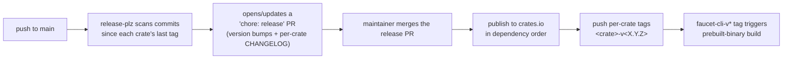

# Releasing faucet-stream

*The release process for maintainers — the automated default, the manual fallback, and the gotchas that have bitten real releases.*

faucet-stream is a Cargo workspace of independently-versioned crates published to
[crates.io](https://crates.io), plus the `faucet` CLI binary distributed as
prebuilt archives. This document is the public release runbook. It is
intentionally maintainer-facing; contributors do not need it to open a PR.

> **Versioning rule:** every crate we deploy is versioned **`1.0.0` or higher —
> never `0.x`**. A *new* crate is created at `1.0.0`. Existing crates keep their
> independent published versions. Semver is enforced by the `cargo-semver-checks`
> CI gate on the public API.

## The default path — release-plz

Day-to-day releases go through [release-plz](https://release-plz.dev/)
(`release-plz.toml` + `.github/workflows/release-plz.yml`):

1. On every push to `main`, release-plz scans for `feat` / `fix` / `perf`
   commits since each crate's last `<crate>-v<X.Y.Z>` tag.
2. It opens (or updates) a **`chore: release` PR** that bumps only the affected
   crates and prepends a section to each bumped crate's **per-package
   `CHANGELOG.md`**.
3. Merging that PR publishes to crates.io **in dependency order** (release-plz
   waits for sparse-index propagation between dependents) and pushes the tags.

Only `feat` / `fix` / `perf` commits trigger a version bump
(`release_commits = "^(feat|fix|perf)"`), so `docs` / `chore` / `refactor` /
`test` / `ci` / `build` commits never cause a publish. **Write
[Conventional Commit](https://www.conventionalcommits.org/) subjects** so this
classification and the changelog grouping work.

### Required secrets

- **`CARGO_REGISTRY_TOKEN`** — required, for publishing to crates.io.
- **`RELEASE_PLZ_TOKEN`** (PAT or GitHub App) — recommended, so the release PR
  and its tags trigger downstream CI/builds. GitHub forbids the default
  `GITHUB_TOKEN` from triggering downstream workflows.
- **`HOMEBREW_TAP_TOKEN`** — PAT with repo scope on the tap repo, for the
  Homebrew publish step (see below). Without it, archives/installer still
  publish; only the tap push fails.

## Prebuilt binaries — cargo-dist

When release-plz pushes a `faucet-cli-v*` tag, `dist-workspace.toml` +
`.github/workflows/release-binaries.yml` build prebuilt `faucet` binaries:
GitHub Release archives for four targets (macOS arm64/x86_64, Linux
x86_64/aarch64 — all on native runners), a `curl | sh` installer, SHA256
checksums, and a Homebrew formula pushed to the `homebrew-faucet-stream` tap.

- release-plz owns the GitHub Release (`create-release = false`); dist only
  uploads artifacts to it.
- Shipped feature set: CLI `default` + `serve`, `serve-ui`, `schedule`,
  `lineage`. Excluded: `transform-sql`, `otel`, `triggers*`, `catalog`,
  `serve-history-*` (documented in the installation guide).
- **Tag-trigger gotcha:** tags pushed with the default `GITHUB_TOKEN` do **not**
  trigger workflows. If `RELEASE_PLZ_TOKEN` is not configured, the binary build
  will not fire automatically after a release — dispatch it manually with
  `gh workflow run release-binaries.yml --ref faucet-cli-vX.Y.Z`.

## The manual fallback

`.github/workflows/release.yml` ("Release (manual fallback)") is a
`workflow_dispatch` workflow for ad-hoc or bulk re-publishes (a registry
incident, re-publishing every crate from a known-good revision). It bumps with
`cargo-release` and publishes in **waves of 5 with a 15-minute wait between
waves**. Use it only as a fallback; day-to-day releases go through release-plz.
Both paths share the `<crate>-v<X.Y.Z>` tag format so they do not fight.

## Gotchas learned the hard way

These bit during real releases; re-read before any bulk or local publish:

1. **The `no-commit-to-branch` pre-commit hook blocks commits to `main`.** Use
   `git commit --no-verify` for release commits — this is the intended escape;
   CI's release-plz does not run pre-commit.
2. **crates.io new-crate rate limit is a burst of 5, then 1 per 10 minutes.**
   Publishing many *new* crate names drips slowly. `cargo release --execute`
   **aborts** when publishing >30 new crates — do not use it for a large bulk
   publish. Instead drive a **resumable, 429-aware per-crate `cargo publish`
   loop** in dependency order that skips already-published crates (via the
   sparse index), sleeps ~10.5 min on `429`, and aborts on any genuine error.
   New *versions* of existing crates use a separate, generous bucket — fast.
3. **`cargo-release` bumps `Cargo.toml` only — not version strings in
   README/docs.** `faucet-* = "X.Y"` install examples baked into a published
   crate cannot be edited after publish. **Bump README/docs install examples
   before publishing.**
4. **The per-crate publish order must include dev-dependency edges** — a
   versioned dev-dep blocks `cargo publish` until its dep is on crates.io.
   Compute the order over *all* dependency kinds; confirm there is no dev-dep
   cycle.
5. **Keep `Cargo.lock` in sync** — after a bump, run `cargo update --workspace`
   for the bumped members.

## docs.rs

Every publishable crate must render its full API (including feature-gated code)
on docs.rs. This requires two pieces on **every** crate:

- a `[package.metadata.docs.rs]` block with `all-features = true` and
  `rustdoc-args = ["--cfg", "docsrs"]`;
- `#![cfg_attr(docsrs, feature(doc_cfg))]` as the first line of `lib.rs`.

Verify locally:
`RUSTDOCFLAGS="--cfg docsrs" rustup run nightly cargo doc --workspace --all-features --no-deps`
(must be clean). A new crate missing either piece is documented incompletely.

## Pre-release checklist

- [ ] CI is green on `main` (all required checks).
- [ ] README/docs install examples reflect the new version.
- [ ] The docs.rs dry-run above is clean.
- [ ] `cargo publish --dry-run` passes for changed crates.
- [ ] For a new crate: version is `1.0.0`, keywords/categories set, docs.rs
  block + `doc_cfg` present, added to the umbrella + CLI features, the CI
  `feature-check` matrix, and (if a connector) `connectors/registry.json`.

## Related

- [Contributing](./CONTRIBUTING.md) · [Stability policy](./docs/stability.md)
- [Architecture: extensibility](./docs/architecture/extensibility.md)
- [Documentation home](./docs/README.md)
