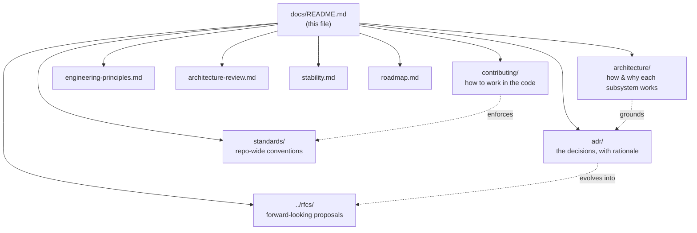

# faucet-stream documentation

*The documentation home — how the project's docs are organized and where to start.*

faucet-stream keeps two complementary bodies of documentation, aimed at two
different readers:

| Body | Audience | Location |
|------|----------|----------|
| **User guide (mdBook)** | *Users* running pipelines — installation, tutorials, cookbook, connector catalog, CLI/config reference. | [`book/`](./book/) → published at <https://pawansikawat.github.io/faucet-stream/> |
| **Engineering documentation** | *Maintainers and contributors* — why the system is built the way it is. | this tree (`architecture/`, `adr/`, `contributing/`, `standards/`, `../rfcs/`) |

If you want to *use* faucet-stream, start with the [book](./book/src/introduction.md).
If you want to *change* or *extend* it, start here.

## Engineering documentation map

### [Architecture](./architecture/README.md)

How each subsystem works and the trade-offs behind it. Start with the
[overview](./architecture/overview.md), then the execution spine:
[execution](./architecture/execution.md) →
[pipeline](./architecture/pipeline.md) →
[stream-pages](./architecture/stream-pages.md) →
[state](./architecture/state-management.md) →
[recovery](./architecture/recovery.md) →
[retries](./architecture/retries.md) →
[observability](./architecture/observability.md).
The [design invariants](./architecture/invariants.md) are the load-bearing
rules the whole system depends on.

### [Architecture Decision Records](./adr/)

One record per major decision — Context, Problem, Decision, Alternatives,
Trade-offs, Consequences, Future work. These explain *why* the architecture is
what it is. See especially
[ADR 0002 — checkpoint ordering](./adr/0002-checkpoint-ordering.md), the
data-integrity keystone.

### [Contributing](./contributing/architecture.md)

Practical, code-level guidance:
[a map of the codebase](./contributing/architecture.md),
[authoring a connector](./contributing/connector-authoring.md),
[testing](./contributing/testing.md),
[performance](./contributing/performance.md),
[debugging](./contributing/debugging.md), and a
[common-mistakes catalogue](./contributing/common-mistakes.md). The
build/test/PR mechanics live in the top-level
[`CONTRIBUTING.md`](../CONTRIBUTING.md).

### [Standards](./standards/api-design.md)

Enforceable repo-wide conventions a reviewer can point at:
[API design](./standards/api-design.md),
[error handling](./standards/error-handling.md),
[logging & metrics](./standards/logging.md),
[testing](./standards/testing.md),
[performance](./standards/performance.md),
[state & durability](./standards/state.md).

### [RFCs](../rfcs/README.md)

Forward-looking design proposals for cross-cutting or breaking changes.

### Cross-cutting documents

- [Glossary](./glossary.md) — the canonical vocabulary (bookmark, page, watermark, effectively-once, …).
- [Security model](./architecture/security.md) — how faucet handles credentials and data; the redaction boundary and hardening checklist.
- [Engineering principles](./engineering-principles.md) — the values the code embodies.
- [Architecture review](./architecture-review.md) — a dated, objective critique of the current state.
- [Stability policy](./stability.md) — what's Stable / Experimental / Internal.
- [Roadmap](./roadmap.md) — architectural direction.
- [Releasing](../RELEASING.md) — the maintainer release runbook.

## Relationship to the always-on maintainer rules

The operational rules a maintainer must follow (release flow, coverage gate,
branch protection, docs-sync triggers) live in `CLAUDE.md` and
`.claude/rules/*.md` at the repo root. This tree explains the *architecture*
those rules protect; the two are complementary and should stay consistent.
