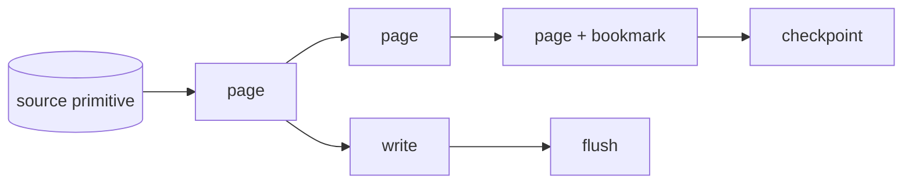

# ADR 0001 — Page-based streaming (`StreamPage`)

*Move data one bounded page at a time instead of materialising whole datasets.*

- **Status:** Accepted (implemented) — the core streaming model since the earliest pipeline design; `crates/core/src/pipeline.rs`, `traits.rs`.

## Context

faucet-stream must move datasets of unbounded size between arbitrary sources and
sinks, and its Primary Goal is that every connector be as fast,
efficient, and reliable as possible. Memory footprint and time-to-first-write are
both first-order concerns.

## Problem

A "fetch everything, then write everything" model buffers the entire dataset in
memory and delays the first sink write until the last source record arrives. For a
multi-gigabyte table or an unbounded CDC stream this is either impossible or
ruinously slow, and it makes incremental checkpointing impossible (there is nothing
to checkpoint until the end).

## Decision

The unit of work is a **`StreamPage { records: Vec<Value>, bookmark: Option<Value> }`**.
`Source::stream_pages(ctx, batch_size)` returns a `Stream` of pages; the pipeline
writes each page to the sink as it arrives and checkpoints whenever a page carries a
bookmark. Memory is bounded at `O(batch_size)` on both sides regardless of total
volume.

`stream_pages` has a **default implementation** that calls `fetch_all` and chunks
the result — so a connector author can implement only `fetch_with_context` and still
work (buffered but correct). Connectors that can stream natively (`rest`, the CDC
sources, `postgres`, `parquet`, `kafka`, `elasticsearch` scroll, …) **override**
`stream_pages` to be truly incremental.

## Alternatives considered

- **Full materialisation (`fetch_all` only).** Simplest trait, but unbounded memory
  and no incremental checkpointing. Rejected as the *primary* model; kept as the
  *default* impl for author convenience.
- **An external queue/broker between source and sink.** Adds an operational
  dependency and a second durability domain to reason about; overkill for a library
  whose value is being embeddable and dependency-light.
- **Row-at-a-time streaming.** Maximal memory frugality but pathological
  per-record overhead against batch/bulk sink APIs (multi-row INSERT, `_bulk`,
  `insertAll`). Pages let sinks amortise round-trips.

## Trade-offs

- Page size is a throughput/latency/durability knob (see [batching](../architecture/batching.md)).
- The default impl buffers — correct but not memory-bounded, a smell for large
  sources.

## Consequences

- **Positive:** bounded memory, immediate first write, per-page (and per-CDC-txn)
  checkpointing for free, sink bulk-API friendliness.
- **Negative:** connectors that want the memory bound must implement `stream_pages`,
  not just `fetch_all`; throughput is coupled to page size and sink latency.

## Future work

- Backpressure and multi-page pipelining, and a columnar page variant — see
  [RFC 0004](../../rfcs/0004-streaming-improvements.md) and
  [RFC 0002](../../rfcs/0002-arrow-support.md).

## Related

- [Architecture: stream pages](../architecture/stream-pages.md) · [batching](../architecture/batching.md) · [pipeline](../architecture/pipeline.md)
- [ADR 0002 — Checkpoint ordering](./0002-checkpoint-ordering.md)
