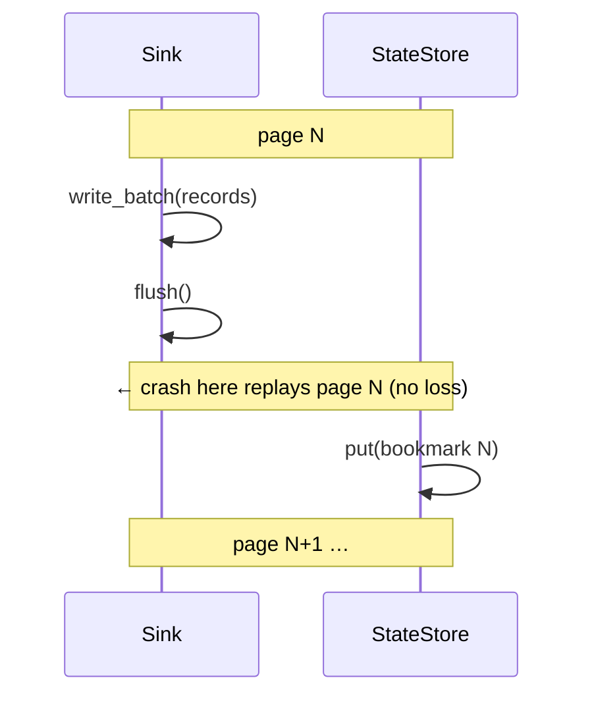

# ADR 0002 — Checkpoint ordering (write → flush → persist)

*Persist a page's bookmark only after the sink has durably written and flushed it. The data-integrity keystone.*

- **Status:** Accepted (implemented) — enforced in all three write paths of `run_stream`, `crates/core/src/pipeline.rs`.

## Context

Incremental replication and crash recovery both hinge on a durable record of
progress (a **bookmark**). The order in which the sink write and the bookmark
persist happen — relative to each other and to a possible crash — decides whether a
failure causes data loss, duplication, or neither.

## Problem

There are two possible orderings:

1. **persist-then-write** — checkpoint first, then write. A crash in between skips
   the page's records *forever*: silent data loss.
2. **write-then-persist** — write and flush first, then checkpoint. A crash in
   between replays the page: at worst a bounded duplicate, never loss.

Silent data loss and silent downstream corruption are the worst bug classes this
project can ship. The ordering is therefore not a performance choice — it is a
correctness invariant.

## Decision

**Always write, then flush, then persist the bookmark.** In every one of
`run_stream`'s three write paths the sequence ends:

```
… write_batch* (records) …
… flush() …
… StateStore::put(key, bookmark) …
```

The consequence is that the state store is always **equal to or behind** the sink,
never ahead. Recovery can therefore only ever replay already-attempted work; it can
never skip data the sink did not receive.



The three paths:

- **Default (at-least-once):** `write_batch` → `flush` → `put`. A window-B crash
  duplicates the page on resume.
- **Exactly-once (atomic watermark):** `write_batch_idempotent(scope, token)` →
  `flush` → `put(wrap_state(bookmark, seq))`. A replayed token-stamped write is a
  no-op, so the duplicate is neutralised. On resume the sink watermark is authoritative.
- **DLQ:** `write_batch_partial` (survivors + routed failures) → `flush` (main and
  DLQ sink) → `put`. Deferred aborts fire only after the page is durable.

## Alternatives considered

- **persist-then-write** — rejected: silent data loss on the crash window.
- **Two-phase commit across source and sink** — rejected: not all sinks or sources
  support it; it would exclude most connectors and add large complexity for a
  guarantee (no duplicates) that the exactly-once mechanism already provides where
  the sink can support it.
- **Best-effort "checkpoint every N seconds" independent of writes** — rejected:
  decouples the checkpoint from durability, reintroducing the loss window.

## Trade-offs

- At-least-once accepts bounded duplicates (one page) as the price of working with
  any source/sink and needing no watermark table.
- Flushing per bookmark-carrying page costs a round-trip; sources that bookmark
  every page (CDC) pay it per transaction — the price of per-transaction durability.

## Consequences

- **Positive:** no ordering-induced data loss, ever; recovery is always "replay from
  a safe position"; exactly-once and DLQ inherit the same guarantee.
- **Negative:** at-least-once callers must tolerate duplicates; per-page flush has a
  latency cost that page sizing must balance.

## Future work

- Fault-injection tests at each crash window as a first-class CI job — see
  [recovery](../architecture/recovery.md).

## Related

- [Design invariants (I1–I3)](../architecture/invariants.md) · [state management](../architecture/state-management.md) · [recovery](../architecture/recovery.md)
- [ADR 0005 — Runtime recovery](./0005-runtime-recovery.md) · [ADR 0007 — Retries](./0007-retries.md)
