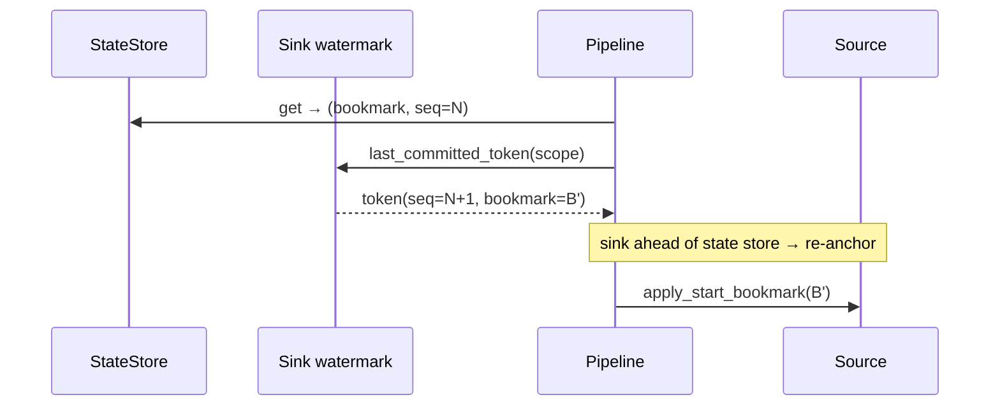

# ADR 0005 — Sink-anchored resume for exactly-once recovery

*Embed the resume bookmark in the commit token so recovery re-anchors from the sink's watermark, not from replayed page boundaries.*

- **Status:** Accepted (implemented) — issue #291; `crates/core/src/idempotency.rs`, `pipeline.rs`. Orphan recovery: issue #146 H7, `cli/src/serve/history/`.

## Context

Exactly-once delivery needs a way, on resume, to know which pages the sink already
committed so it can skip re-writing them. The [checkpoint-ordering invariant](./0002-checkpoint-ordering.md)
leaves a window (sink durable, state store one page behind) that recovery must
resolve without re-delivering data.

## Problem

The naïve exactly-once resume compares a per-page sequence counter: skip any page
whose seq ≤ the sink's committed seq. This silently assumes the source **replays
identical page boundaries** on resume. Log-positional sources like Kafka cannot
promise that — the same offset range may partition into pages differently — so the
count-based skip is unsafe for them, which excluded Kafka from exactly-once.

## Decision

Make the **sink's committed watermark the authoritative record of stream position**.
Each exactly-once commit token embeds the page's resume bookmark
(`format_token_with_bookmark(seq, bookmark)`). On resume, `Pipeline::run`:

1. reads the sink's `last_committed_token(scope)`;
2. if the sink's seq is ahead of the state store, decodes the **embedded bookmark**;
3. calls `apply_start_bookmark` to re-anchor the source to that exact position and
   fast-forwards the sequence.

Nothing is re-written, and nothing depends on reproducing page boundaries. This is
what qualifies the Kafka source for exactly-once. Legacy bare tokens (no embedded
bookmark) fall back to the count-based skip path.

**Orphan recovery (serve).** A separate recovery concern in a clustered/persistent
`serve` deployment: a run owned by a dead process. Each serve process has a UUID
`instance_id`; runs carry `owner` + `lease_expires_at`; a lease loop heartbeats an
instance's own runs, and a run is failed **only** when its owner's lease has expired
— so a live peer's in-flight runs are never failed on a shared database.

## Alternatives considered

- **Count-based skip only.** Simple, but unsafe for non-deterministic-replay
  sources; would keep Kafka out of exactly-once. Retained only as the legacy
  fallback for tokens without an embedded bookmark.
- **A separate position table** distinct from the commit token. More moving parts
  and a second write to keep atomic with the data; embedding in the existing token
  keeps position and durability in one atomic commit.
- **Requiring deterministic page boundaries from all sources.** Would exclude
  log-positional sources entirely. Rejected.

## Trade-offs

- The commit token grows to carry a JSON bookmark suffix; sinks store it opaquely
  (they must never parse it — see [invariant I10](../architecture/invariants.md)).
- Recovery reads from the sink (`last_committed_token`), adding a resume-time
  round-trip — negligible next to the safety it buys.

## Consequences

- **Positive:** exactly-once works for log-positional sources; recovery is a no-op
  re-anchor with zero re-delivery; the sink watermark is a single source of truth.
- **Negative:** larger tokens; sinks must implement `last_committed_token` to
  participate; a subtle contract (opaque token, embedded bookmark) that reviewers
  must respect.

## Future work

- Extending sink-anchored resume to more sinks as their watermark storage matures.

## Related

- [Recovery](../architecture/recovery.md) · [retries](../architecture/retries.md) · [state management](../architecture/state-management.md)
- [ADR 0002 — Checkpoint ordering](./0002-checkpoint-ordering.md) · [Design invariants (I3)](../architecture/invariants.md)
