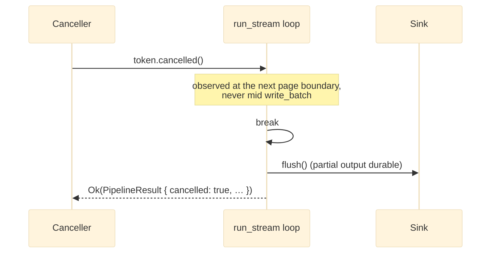

# ADR 0011 — Cooperative, flush-completing cancellation

*A cancel stops the run at the next page boundary, flushes the sinks, and returns the partial result as `Ok` — it never tears down a run mid-write.*

- **Status:** Accepted (implemented) — the `biased` page-poll race in `run_stream`, `crates/core/src/pipeline.rs` (#146 H16); caller-side grace backstops in `cli/src/executor.rs` and `cli/src/serve/runner.rs` (#321 M8/M9).

## Context

A run must be stoppable — a `serve` deployment shutting down, an executor aborting
sibling rows after a `stop`-mode failure, an operator cancelling a long backfill. But
the streaming loop holds live, unflushed state: buffered rows in a sink, an open
Parquet/S3 multipart writer, a bookmark that is durable in the sink but not yet
persisted (the [checkpoint-ordering](./0002-checkpoint-ordering.md) window). *How* a
cancel unwinds decides whether that state is finalised cleanly or corrupted.

## Problem

The obvious way to cancel an async run is to drop the future — `select!` the work
against a cancellation signal and let the losing branch be dropped. But dropping the
loop future mid-`write_batch` abandons a sink with rows buffered and, worse, leaves a
multipart Parquet/S3 upload unfinalised — an unreadable object, not merely a lost
page. Cancellation therefore cannot be "stop *now*"; it must be "stop at a point where
the sink can be left durable."

## Decision

**Cancellation is cooperative and flush-completing.** The core races the cancel token
against the *next page poll only* — never against a write in progress:

```rust
// crates/core/src/pipeline.rs — run_stream
let page = match &cancel {
    Some(token) => tokio::select! {
        biased;                                   // check cancel first each iteration
        _ = token.cancelled() => { cancelled = true; break; }
        p = poll_fn(|cx| Pin::new(&mut pages).poll_next(cx)) => p,
    },
    None => poll_fn(|cx| Pin::new(&mut pages).poll_next(cx)).await,
};
```

On cancel the loop **breaks** rather than unwinds; control falls through to the same
post-loop path every early exit uses (invariant [I7](../architecture/invariants.md)),
which flushes the sinks and returns a *partial* `PipelineResult` with `cancelled: true`
as `Ok` — partial output is durable, and the bookmark reflects only what was flushed.
A cancel that arrives mid-`write_batch` is not observed until that write returns and the
loop reaches the next poll, so no write is ever torn in half by the core.



**A caller enforces the grace, not the core.** A sink genuinely wedged *inside* a write
(a hung network call) would never reach the next poll, so the core alone cannot bound
shutdown time. That backstop lives with the owner of the run, which decides how long a
clean stop is worth waiting for:

- **Executor** — `STOP_FLUSH_GRACE = 5s` (`cli/src/executor.rs`): after `stop`-mode
  aborts the `JoinSet`, a wedged task past the grace is hard-dropped.
- **Serve** — `RUN_FLUSH_GRACE = 30s` (`cli/src/serve/runner.rs`): a shutdown wraps the
  in-flight work in `tokio::time::timeout` at this grace before dropping it, matching the
  S3 multipart finalise budget in `serve/server.rs`.

The core stays grace-free and deterministic; the hard-drop is a last resort the caller
opts into, accepting the corrupted-partial-object risk only past its own deadline.

## Alternatives considered

- **Drop the loop future on cancel** (`select!` the whole run against the token).
  Rejected: abandons buffered rows and unfinalised multipart uploads — the corrupted-
  Parquet failure this ADR exists to prevent.
- **A grace timeout in the core.** Rejected: the core has no policy view of how long a
  caller wants to wait, and a timer in the hot loop is state the deterministic page
  loop is better without. The grace belongs to the caller (executor / serve).
- **Cancel at record granularity** (check the token between records within a page).
  Rejected: finer than the checkpoint unit buys nothing — the page is already the
  flush/persist unit, so stopping mid-page cannot be made more durable than stopping at
  its boundary.

## Trade-offs

- Shutdown latency is bounded by *one page* of remaining work (plus the caller's grace),
  not instantaneous — the price of leaving the sink durable.
- The caller must own the hard-drop backstop; two graces (`STOP_FLUSH_GRACE`,
  `RUN_FLUSH_GRACE`) exist for the two callers rather than one core constant.

## Consequences

- **Positive:** a cancel never produces a corrupt sink object; partial output is always
  durable and its bookmark honest; cancellation reuses the same flush-on-exit path as
  every other early exit (I7), so there is one unwind path to reason about.
- **Negative:** not immediate; a wedged in-write sink is only stopped by the caller's
  grace, and a hard-drop past that grace still carries the corruption risk the
  cooperative path avoids.

## Future work

- Surface a per-run configurable grace so operators can trade shutdown speed against
  flush completeness without recompiling.

## Related

- [Design invariants — I7 (every early exit flushes), I8 (cooperative cancellation)](../architecture/invariants.md) · [execution](../architecture/execution.md)
- [ADR 0001 — Page-based streaming](./0001-stream-pages.md) · [ADR 0002 — Checkpoint ordering](./0002-checkpoint-ordering.md)
