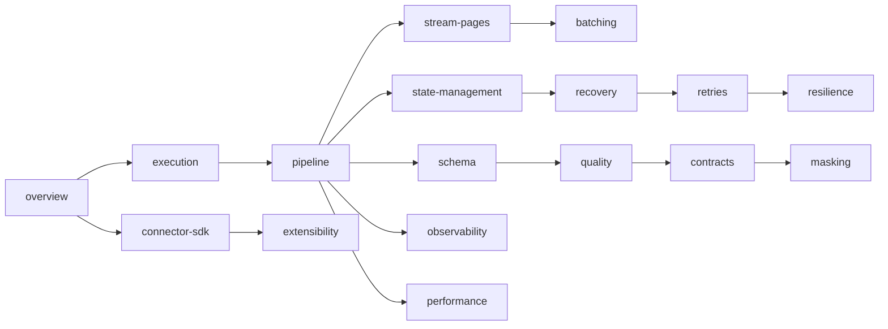

# faucet-stream architecture

*The maintainer's map of how faucet-stream is built and why — read this before changing the runtime.*

This directory is the **internal engineering reference** for faucet-stream. It
explains the *why* behind the system: the invariants that protect data, the
trade-offs that shaped each subsystem, and the failure modes each was designed to
survive. It is deliberately distinct from the **user-facing documentation** under
[`../book/`](../book/src/introduction.md) (how to *use* the tool) — where a
how-to already exists there, these pages link to it rather than repeat it.

If you are about to touch `crates/core`, add a connector, or change delivery
semantics, start here.

## How the documentation is organised

| Set | Location | Audience | Answers |
|---|---|---|---|
| Architecture | `docs/architecture/` | Maintainers | *Why is it built this way?* |
| Decision records | [`../adr/`](../adr/) | Maintainers | *Why did we choose X over Y?* |
| Contributor guides | [`../contributing/`](../contributing/architecture.md) | New contributors | *How do I add/change things safely?* |
| Standards | [`../standards/`](../standards/api-design.md) | Everyone | *What are the repo-wide conventions?* |
| RFCs | [`../../rfcs/`](../../rfcs/README.md) | Proposers | *What might change, and how?* |
| User docs (mdBook) | [`../book/`](../book/src/introduction.md) | Operators | *How do I run a pipeline?* |

## Reading order

The subsystems form a chain — each page ends with a `## Related` section linking
forward and back, so the set reads as one book rather than isolated files.

### The pages

- **[overview](./overview.md)** — the whole system in one page: crate topology, the data path, layering.
- **[execution](./execution.md)** — how a run is scheduled and driven, from CLI config to core loop.
- **[pipeline](./pipeline.md)** — the `Pipeline` / `run_stream` engine and its per-page loop.
- **[stream-pages](./stream-pages.md)** — the `StreamPage` streaming model that bounds memory.
- **[batching](./batching.md)** — batch sizing, the `0` sentinel, adaptive control.
- **[connector-sdk](./connector-sdk.md)** — the `Source` / `Sink` trait contracts.
- **[state-management](./state-management.md)** — bookmarks, the `StateStore`, key scheme.
- **[recovery](./recovery.md)** — crash recovery and sink-anchored resume.
- **[retries](./retries.md)** — the two retry layers and the duplication-safety rule.
- **[resilience](./resilience.md)** — circuit breaker, poison-pill, backoff policy.
- **[schema](./schema.md)** — inference and the ordered per-page passes.
- **[quality](./quality.md)** · **[contracts](./contracts.md)** · **[masking](./masking.md)** — the validation/protection passes.
- **[observability](./observability.md)** — automatic metrics, spans, and OTLP.
- **[performance](./performance.md)** — the Primary Goal and how it is upheld.
- **[security](./security.md)** — credential/secret handling, the redaction boundary, and the hardening checklist.
- **[extensibility](./extensibility.md)** — the third-party connector ecosystem.
- **[invariants](./invariants.md)** — the load-bearing guarantees, in one place.
- **[roadmap](./roadmap.md)** — architectural direction for these subsystems.

## The one invariant to internalise first

> **A page's bookmark is persisted to the state store only *after* the sink has
> durably written and flushed that page.**

Every recovery, retry, and delivery guarantee in the system is built on this
single ordering. It is documented in full in **[invariants](./invariants.md)** and
**[ADR 0002](../adr/0002-checkpoint-ordering.md)**; it is enforced in `run_stream`
(`crates/core/src/pipeline.rs`).

## Related

- [Engineering principles](../engineering-principles.md)
- [Architecture review](../architecture-review.md)
- [API stability](../stability.md)
- [Contributor architecture guide](../contributing/architecture.md)
