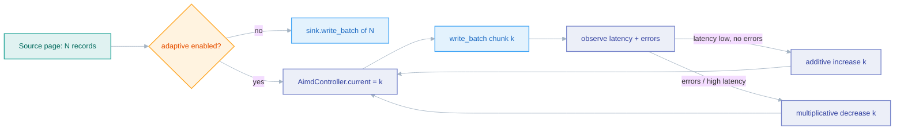

# Batching

*How records are grouped into pages to bound memory while keeping throughput high.*

## Why it exists

Moving data must not require holding the whole dataset in memory — a 500M-row
table cannot be buffered. faucet-stream's answer is the **page**: sources emit
records in chunks (`StreamPage`), the pipeline writes each page to the sink as it
arrives, and only one page is resident at a time. Batch size is the single knob
that trades memory against per-request overhead.

## Problem it solves

- **Unbounded memory.** Without paging, a naïve source→sink copy is O(total
  records) in RAM. Paging makes it O(batch_size) on both sides regardless of
  total volume.
- **Per-request overhead.** Writing one record per request wastes round-trips;
  batching amortizes them (multi-row INSERT, bulk NDJSON, `insertAll`).
- **Mismatched natural units.** A source's natural read chunk and a sink's
  natural write chunk differ. Both sides carry their own `batch_size` so each can
  be tuned independently.

## Major components

- `StreamPage { records, bookmark }` (`crates/core/src/pipeline.rs`) — the unit
  of transfer. See [stream-pages](./stream-pages.md) for the streaming contract.
- `DEFAULT_BATCH_SIZE = 1000`, `MAX_BATCH_SIZE = 1_000_000` — the default hint and
  the hard cap.
- `validate_batch_size(usize)` — rejects any value above `MAX_BATCH_SIZE` at
  config-load time to prevent an accidental O(total) buffer via a typo.
- **`batch_size = 0`** — the opt-out sentinel: sources emit the entire result set
  in one page, sinks accept whatever arrives without re-chunking. Intended for
  small lookup tables and for sinks that prefer one large request (SQL `COPY`,
  BigQuery load jobs, whole-page MERGE).
- Adaptive controller (`crates/core/src/adaptive.rs`) — an opt-in AIMD controller
  that resizes sub-batches from observed sink latency + error rate.

## Execution flow

Source `batch_size` shapes the page the source *emits*; sink `batch_size`
re-chunks the page the sink *writes*. When adaptive batching is enabled
(`Pipeline::with_adaptive`), each source page is resliced into adaptive
sub-batches:

The controller is created lazily on the first non-empty page
(`AimdController::new`) and never grows a sub-batch beyond the source page it was
handed.

## Invariants

- **`batch_size` on `Source::stream_pages` is a *hint*.** Every overriding source
  treats its own config field as authoritative, so a pipeline-supplied hint can
  never silently override an explicit config value.
- **Memory is O(batch_size), not O(total).** One page resident at a time is the
  guarantee that makes arbitrarily large transfers safe.
- **`batch_size = 0` means "no batching", not "empty batch".** It is a sentinel,
  handled explicitly at both ends.
- **Adaptive sub-batches never cross a page boundary** and never change the
  [checkpoint ordering](./invariants.md) — a bookmark is still persisted only
  after the full page's writes flush.

## Trade-offs

- **Larger pages = fewer round-trips but more RAM and coarser checkpoints.** A
  crash re-does the whole in-flight page (at-least-once) or skips it
  (exactly-once), so page size also sets the replay granularity.
- **Adaptive batching adds a control loop** whose value shows up only under
  variable sink latency; it is off by default to keep the common path
  predictable.

## Failure scenarios

- **A page too large for the sink's request limit** (e.g. BigQuery ~10 MB
  `jobs.query`) → the operator must size `batch_size` down; the whole-page MERGE
  path is intentionally not re-chunked.
- **Config typo `batch_size: 1000000000`** → rejected by `validate_batch_size`
  before the run starts, not discovered as an OOM mid-run.

## Future evolution

- Byte-aware paging (size pages by serialized bytes, not row count) for sinks with
  hard request-size limits.
- An Arrow-native record model (see [RFC 0002](../../rfcs/0002-arrow-support.md))
  would let a page be a columnar batch, cutting per-record allocation — see
  [performance](./performance.md).

## Related

- [Stream pages](./stream-pages.md) · [Pipeline](./pipeline.md) · [Performance](./performance.md)
- [State management](./state-management.md) · [Design invariants](./invariants.md)
- [ADR 0001 — Stream pages](../adr/0001-stream-pages.md)
- User guide: [../book/src/cookbook/adaptive-batching.md](../book/src/cookbook/adaptive-batching.md)
