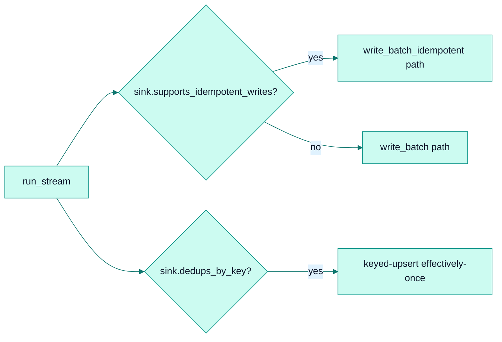

# Connector SDK

*The `Source` and `Sink` trait contracts — small, object-safe, and defaulted, so connectors stay simple and forward-compatible.*

## Why it exists

faucet-stream is a *marketplace ecosystem*: third parties should be able to publish
`faucet-source-*` / `faucet-sink-*` crates against a stable, minimal surface. The
two connector traits are the contract that makes that possible. They are designed
under three hard constraints — **object-safe**, **minimal required surface**, and
**every new method defaulted** — so that `Box<dyn Source>` works, a new connector
needs to implement almost nothing, and adding a capability never breaks existing
connectors. See [ADR 0003](../adr/0003-builder-pattern.md) and
[extensibility](./extensibility.md).

## The `Source` contract

Defined in `crates/core/src/traits.rs`. The required method is a single fetch; all
resumability, streaming, exactly-once, sharding, and discovery are **defaulted**.

| Method | Required? | Purpose |
|---|---|---|
| `fetch_with_context` | **yes** | the one primitive: pull records for a context |
| `stream_pages` | defaulted (chunks `fetch_all`) | native streaming — override to bound memory |
| `state_key` / `apply_start_bookmark` | defaulted (`None` / no-op) | resumability |
| `capture_resume_position` | defaulted (`None`) | anchor CDC before a snapshot (replication) |
| `supports_exactly_once` / `replay_guarantee` | defaulted (`false`) | delivery capability |
| `is_shardable` / `enumerate_shards` / `apply_shard` | defaulted (single shard) | sharded execution |
| `supports_discover` / `discover` | defaulted (unsupported) | live catalog introspection |
| `config_schema` / `connector_name` / `dataset_uri` | defaulted | introspection & labels |
| `check` | defaulted (pulls one page) | `faucet doctor` preflight |

A minimal source implements exactly one method and inherits everything else.

## The `Sink` contract

The required method is a single batch write; everything advanced is defaulted.

| Method | Required? | Purpose |
|---|---|---|
| `write_batch` | **yes** | write a slice of records |
| `flush` | defaulted (no-op) | make buffered writes durable |
| `write_batch_partial` | defaulted | per-row success/failure for the DLQ path |
| `supports_idempotent_writes` / `write_batch_idempotent` / `last_committed_token` | defaulted | exactly-once atomic watermark |
| `sink_guarantee` / `dedups_by_key` | defaulted | typed delivery capability |
| `supported_write_modes` | defaulted (`[Append]`) | upsert / delete support |
| `current_schema` / `supports_schema_evolution` / `evolve_schema` | defaulted | schema-drift handling |
| `config_schema` / `connector_name` / `dataset_uri` / `check` | defaulted | introspection & probes |

## The capability pattern

Advanced behaviour is expressed as **capabilities**: a boolean (or typed) probe
method plus the methods that implement it. A sink advertises exactly-once with
`supports_idempotent_writes() → true` and then implements `write_batch_idempotent` +
`last_committed_token`. The pipeline queries the capability and selects a code path.

This keeps the traits object-safe (no associated types, no generic methods) while
still letting the runtime specialise. The current pattern uses booleans; a richer,
typed capability model is proposed in
[RFC 0001](../../rfcs/0001-capability-traits.md).

## Connector crate layout

Every connector follows the same module layout (enforced by convention, documented
in `.claude/rules/connectors.md`):

- `lib.rs` — re-exports; first line `#![cfg_attr(docsrs, feature(doc_cfg))]`.
- `config.rs` — the config struct + sub-enums, deriving
  `Serialize + Deserialize + JsonSchema`. **No I/O here.**
- `stream.rs` (source) / `sink.rs` (sink) — the **only** place protocol I/O happens;
  holds reusable clients/pools created in `new()`.
- optional helpers — `auth/`, `pagination/`, `extract/`, `convert.rs`, `state.rs`.

The full authoring walkthrough is in
[the contributor guide](../contributing/connector-authoring.md).

## Invariants

- **Traits are object-safe** — `Box<dyn Source>` / `Box<dyn Sink>` must always work;
  no associated types or generic trait methods.
- **New trait methods must be defaulted** — adding a capability never breaks an
  existing connector. This is a stability guarantee, not a style preference (see
  [stability](../stability.md)).
- **`faucet-core` is the only required dependency** for a connector author; it
  re-exports `async_trait`, `serde_json`, and `schemars`.
- **`connector_name()` must return a non-empty `&'static str`** — empty falls back to
  `"unknown"` and breaks metric labels.

## Trade-offs

- **Boolean capabilities** are simple and object-safe but stringly-typed at the CLI
  gate (allowlists in `registry.rs`). A typed model would remove the allowlists at
  the cost of trait complexity — deferred to [RFC 0001](../../rfcs/0001-capability-traits.md).
- **`serde_json::Value` records** maximise author ergonomics at an allocation cost —
  see [ADR 0004](../adr/0004-json-record-model.md).

## Future evolution

- Typed capability traits ([RFC 0001](../../rfcs/0001-capability-traits.md)).
- A stable connector ABI for dynamically-loaded plugins
  ([RFC 0003](../../rfcs/0003-plugin-system.md)); today plugins link at compile time
  via `PluginRegistry` (see [extensibility](./extensibility.md)).

## Related

- [Extensibility](./extensibility.md) · [Pipeline engine](./pipeline.md) · [Stream pages](./stream-pages.md)
- [Connector authoring guide](../contributing/connector-authoring.md) · [Standards: API design](../standards/api-design.md)
- [ADR 0003 — Builder pattern](../adr/0003-builder-pattern.md) · [ADR 0004 — JSON record model](../adr/0004-json-record-model.md)
- Spec: [Faucet Connector Protocol v0](../spec/faucet-connector-spec-v0.md)
