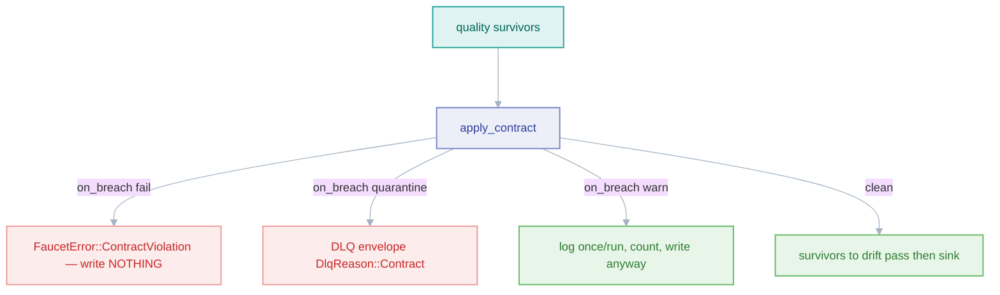

# Data contracts

*A versioned promise about a pipeline's output shape, enforced per page with fail/quarantine/warn semantics.*

## Why it exists

Quality checks assert ad-hoc invariants; a **contract** is a stronger, versioned
statement: "this pipeline emits records of exactly this shape, and I will break
loudly if that stops being true." It is the interface a downstream consumer can
depend on, and it can be exported as JSON Schema or an OpenLineage facet so the
promise is machine-readable.

## Problem it solves

- **Undeclared output shape.** Consumers otherwise reverse-engineer the shape and
  break silently when it changes. A contract makes the shape explicit and
  versioned.
- **Choosing the blast radius of a breach.** `fail` stops the run, `quarantine`
  isolates breaching records, `warn` records-and-continues — the operator picks
  the severity.

## Major components

Under `crates/core/src/contract/`:

- `ContractSpec` — `version` (required), `on_breach` (`fail` default /
  `quarantine` / `warn`), `allow_extra_fields`, and `fields[]` with type,
  `required`/`nullable`, `enum`, `pattern`, numeric `min`/`max`, string
  `min_length`/`max_length`.
- `CompiledContract::compile` — fail-fast (regex, enum, bounds, type
  compatibility validated at load time).
- `apply_contract(page, &c) -> ContractOutcome { survivors, quarantined, warned }`
  — per record, first breach wins (fields in declared order, then the extra-field
  check).
- `export.rs` — pure `to_json_schema` / `to_openlineage_facet` (used by
  `faucet contract --export`).

## Execution flow

Runs after the quality pass and before the schema-drift pass (see
[schema](./schema.md)).

## Invariants — the fail asymmetry

- **`contract: fail` mirrors a quality `abort`: it propagates immediately and
  writes nothing from the page.** A contract must never commit breaching data.
- **`drift: fail` defers** (writes the page's survivors, then aborts) because
  drift's records are *individually valid* — only their shape diverged. A
  contract breach means the record itself is wrong. This is the precise reason
  the two `fail` modes behave differently; conflating them would either strand
  valid rows or commit invalid ones.
- **`quarantine` requires a DLQ** (`requires_dlq()`), gated at expand time and at
  run start; transitively incompatible with exactly-once (which bans a DLQ).
- **Compilation is fail-fast** — an empty version, duplicate field names, bad
  regex, type-mismatched enum, or `min > max` is a `FaucetError::Config` at load.

## Trade-offs

- **Top-level fields only**, like drift — nested constraints are out of scope.
- **`warn` is a foot-gun by design**: it lets breaches through, but makes the
  breach observable (`faucet_contract_violations_total`) so an operator can tighten
  to `quarantine`/`fail` once the volume is understood.

## Failure scenarios

- **A required field disappears** → breach; `fail` aborts, `quarantine` routes the
  record, `warn` counts it.
- **An enum gains a new value upstream** → breach on `enum`; same three outcomes.

## Future evolution

- Contract *evolution* rules (e.g. additive-only changes auto-accepted across
  versions), and wiring the exported JSON Schema into the
  [catalog](./observability.md) schema timeline.

## Related

- [Quality](./quality.md) · [Schema handling](./schema.md) · [Masking](./masking.md)
- [Pipeline](./pipeline.md) · [Design invariants](./invariants.md)
- [ADR 0009 — Schema validation](../adr/0009-schema-validation.md)
- User guide: [../book/src/cookbook/contracts.md](../book/src/cookbook/contracts.md)
