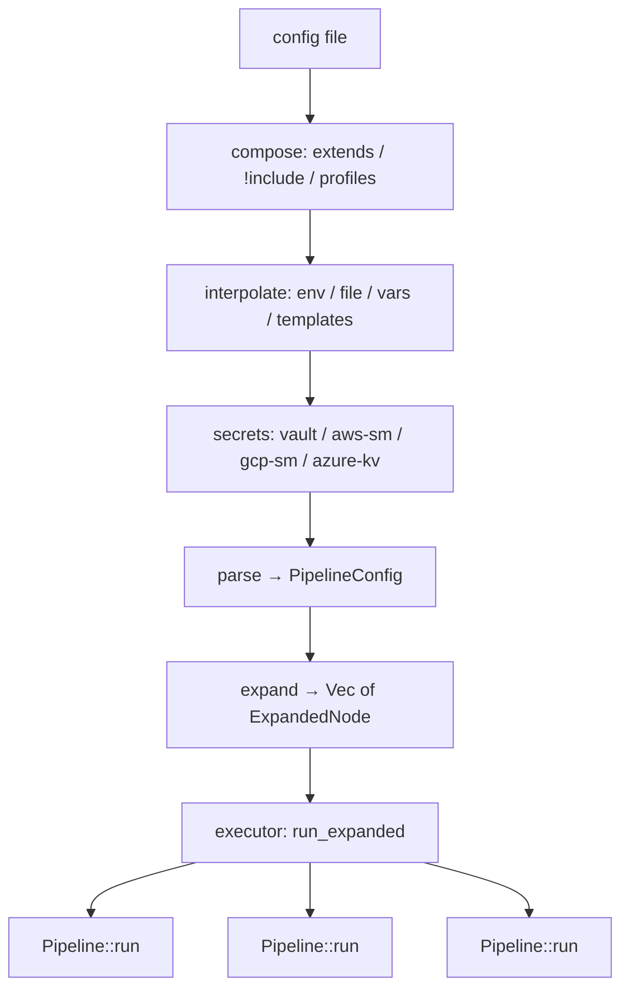

# Execution model

*How a config becomes a running pipeline — from file to matrix DAG to the core loop.*

## Why it exists

A single `Pipeline` moves one source to one sink. Real deployments need more:
templated fan-out, per-row overrides, dependency ordering, scheduling, an HTTP
control plane. Rather than push those concerns into `faucet-core` (which 60+
connectors depend on), faucet-stream implements them as a thin **orchestration
layer in the CLI** that compiles a declarative config into a set of independent
pipeline invocations and drives them. See [ADR 0010](../adr/0010-pipeline-runtime.md).

## The pipeline of compilers

Loading a config is a sequence of pure-ish passes, each with a single job. The
order matters: composition happens before interpolation, secrets resolve last at
load time, and expansion produces the executable node set.

- **`compose`** (`cli/src/compose.rs`) — stitches `extends:`, substitutes
  `!include` fragments, overlays the selected `profiles:` overlay, strips
  metadata. File-loads only (a submitted `serve` body skips it).
- **`interpolate`** (`cli/src/interpolate.rs`) — resolves `${env:…}`,
  `${file:…}`, `${vars.X}`, `${sources.NAME.PATH}` at load; leaves `${row_id.path}`
  and `${now.*}` for runtime.
- **secrets** (`cli/src/secrets/`) — the final load-time stage; resolves
  `${vault:…}` and friends over the parsed tree, then installs a redaction boundary.
- **`expand`** (`cli/src/expand.rs`) — turns the `matrix:` into a `Vec<ExpandedNode>`,
  validating ids, template refs, `depends_on` edges (Kahn's algorithm), and the
  **delivery / write-mode / schema gates** *at config-load time* so an invalid
  topology never starts a run.
- **`executor`** (`cli/src/executor.rs`) — runs the nodes under one bounded
  `Semaphore`, honouring `on_error` (continue/stop), parent→child fan-out, and
  cooperative cancellation.

## The matrix DAG

A `matrix:` row is deep-merged onto the base `pipeline`. Rows form a DAG:

- **parent/child** — a row with `parent: <id>` runs once per record the parent
  emits, resolving `${parent.path}` per record.
- **`depends_on`** — pure completion ordering (no record hand-off); a row starts
  only after every listed row's invocations succeed.

State keys encode the position in the DAG: `{name}::{row_id}` for roots,
`{name}::{row_id}::{parent_record_key}` for children. This is what makes each
invocation independently resumable — see [state-management](./state-management.md).

## Runtimes built on the executor

Every long-running mode is the same `expand` + `run_expanded`, wrapped in a driver:

| Runtime | Driver | What it adds |
|---|---|---|
| `faucet run` | one-shot | nothing — runs the DAG once |
| `faucet schedule` | cron loop | croner + chrono-tz ticks, overlap policy, drain |
| `faucet serve` | axum server | HTTP submit/track, RBAC, idempotency, history, cluster |
| `faucet replicate` | 2-phase | snapshot → CDC handoff anchored by `capture_resume_position` |
| `faucet backfill` | windowed | `--from/--to` chunked into units with `${backfill.*}` tokens |

None of these touch `faucet-core`. They are pure CLI logic (`cli/src/schedule/`,
`cli/src/serve/`, `cli/src/replication/`, `cli/src/backfill/`). That is the
layering payoff: the core stays a stable, embeddable library while orchestration
evolves independently.

## Invariants

- **Gates run at load, not mid-run.** Delivery, write-mode, and quarantine-DLQ
  requirements are validated in `expand`; `faucet validate` catches them before any
  data moves. A run that starts is a run whose topology is sound.
- **Each invocation is independent.** No shared mutable state between DAG nodes
  except the `StateStore` (keyed per node) and shared auth providers (single-flight
  token cache).
- **Cancellation is cooperative and flush-completing.** `on_error: stop`, serve
  timeouts, and shutdown all cancel a token threaded into the pipeline; runs stop at
  a page boundary and flush. See [recovery](./recovery.md).

## Failure scenarios

- **A child's parent fails** → the child (and its subtree) is skipped, not run
  against stale data.
- **A `depends_on` dependency fails or is skipped** → the dependent is skipped,
  mirroring the failed-parent cascade.
- **Sibling state-key collision** under one parent → surfaced as
  `CliError::DuplicateStateKey` before execution.

## Future evolution

- A capability-typed node model so the executor can reason about delivery/shard
  support without string allowlists ([RFC 0001](../../rfcs/0001-capability-traits.md)).
- Distributed execution beyond the current serve cluster modes.

## Related

- [Overview](./overview.md) · [Pipeline engine](./pipeline.md)
- [State management](./state-management.md) · [Recovery](./recovery.md)
- [ADR 0010 — Pipeline runtime](../adr/0010-pipeline-runtime.md)
- User guide: [matrix DAGs](../book/src/tutorials/matrix-dag.md) · [serve](../book/src/cookbook/serve.md)
