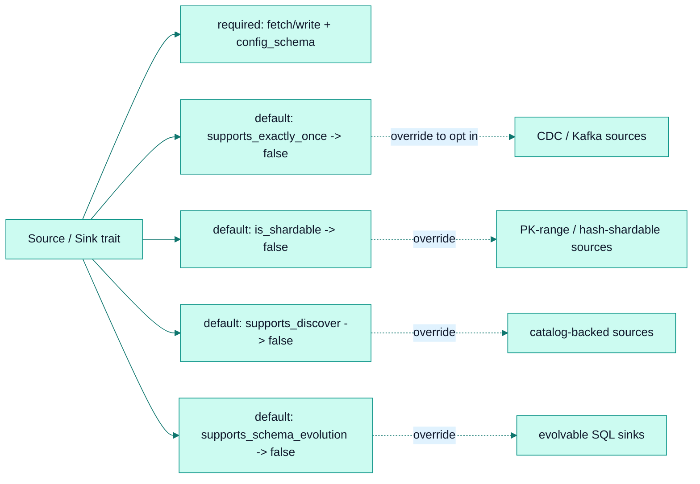

# Extensibility

*The marketplace model: how third parties build, publish, and register connectors with minimal friction.*

## Why it exists

faucet-stream is designed as an *ecosystem*, not a monolith. The explicit goal is
that a third-party developer can publish a `faucet-source-foo` / `faucet-sink-foo`
crate and have it be a first-class citizen — as observable, as testable, and as
composable as a built-in. Every design choice in the connector surface is filtered
through "does this keep the barrier to a third-party connector low?"

## Problem it solves

- **Coupling to the core.** If connectors depended on many core internals, the
  ecosystem could not evolve independently. Only `faucet-core` is required.
- **Trait fragility.** If the `Source`/`Sink` traits were not object-safe or
  required connector-specific types, `Box<dyn Source>` and the generic pipeline
  would break. New capabilities must be *additive*.
- **Registration friction.** A custom binary must be able to add connectors
  without forking the CLI.

## Major components

- **`faucet-core` is the only required dependency.** It re-exports everything a
  connector author needs: `async_trait`, `serde_json` (`Value`, `json!`),
  `schemars` (`JsonSchema`, `schema_for!`), `async_stream`, and
  `CancellationToken`. If authors need a new common dependency, it is re-exported
  from core rather than added to their manifest.
- **Object-safe `Source`/`Sink` traits** (`crates/core/src/traits.rs`) — no
  associated types, no generics on methods, so `Box<dyn Source>` works. New
  capabilities (`supports_exactly_once`, `is_shardable`, `supports_discover`,
  `supports_schema_evolution`) are **defaulted methods**, so existing connectors
  keep compiling.
- **`FaucetError::Custom(Box<dyn Error + Send + Sync>)`** — lets authors wrap their
  own error types without extending the core enum.
- **Naming convention** `faucet-source-<name>` / `faucet-sink-<name>`; shared
  source/sink config lives in a `faucet-common-<name>` crate.
- **`PluginRegistry`** (`cli/src/registry.rs`) — a custom-CLI author calls
  `faucet_cli::run_main(PluginRegistry::with_builtins().register_source(...).register_sink(...))`;
  the registry is consulted before built-ins by `build_source`/`build_sink`/
  `source_schema`/`sink_schema`. Example: `cli/examples/custom-cli/`.

## Capability model

A connector opts into a capability by overriding one defaulted method — it never
has to know about the runtime machinery that consumes it. This is the mechanism
that keeps the trait small while the runtime grows.

## Invariants

- **New trait methods must have defaults.** Adding a capability must never break an
  existing connector — the ecosystem-compatibility contract.
- **`faucet-core` stays lightweight.** No DB drivers or cloud SDKs in core;
  connector-specific deps belong in the connector crate.
- **The pipeline stays generic** over any `Source` + `Sink`; it is never coupled
  to a specific connector.

## Trade-offs

- **Defaulted-method capabilities** mean a capability is invisible unless queried;
  the CLI's expand-time gates (`registry::source_supports_exactly_once`, etc.)
  bridge the gap by validating capability requirements before a run.
- **`serde_json::Value` record model** keeps authoring trivial at an allocation
  cost — see [performance](./performance.md) and
  [ADR 0004](../adr/0004-json-record-model.md).

## Failure scenarios

- **A plugin name collides with a built-in** → the registry is collision-checked
  and rejects it at registration.
- **A capability requirement unmet** (exactly-once on a non-deterministic source)
  → rejected at config-load by the expand gate, not mid-run.

## Future evolution

- Formalized capability traits ([RFC 0001](../../rfcs/0001-capability-traits.md)).
- A dynamic plugin/ABI story so connectors need not be compiled in
  ([RFC 0003](../../rfcs/0003-plugin-system.md)).
- Connector certification (a conformance suite proving a connector honours the
  contract) — see [roadmap](./roadmap.md).

## Related

- [Connector SDK](./connector-sdk.md) · [Performance](./performance.md) · [Roadmap](./roadmap.md)
- [Connector protocol (FCP v0)](../spec/faucet-connector-spec-v0.md)
- [RFC 0001 — Capability traits](../../rfcs/0001-capability-traits.md) · [RFC 0003 — Plugin system](../../rfcs/0003-plugin-system.md)
- Contributor guide: [../contributing/connector-authoring.md](../contributing/connector-authoring.md)
