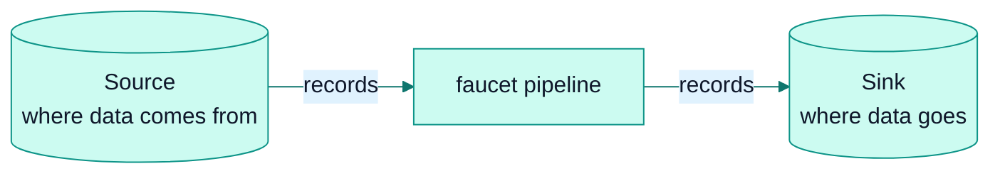
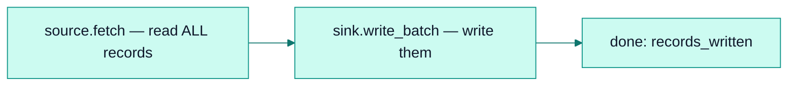
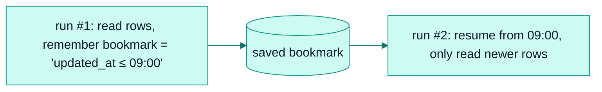

# Learn faucet-stream from scratch

*The whole architecture as a story — read top to bottom, one idea at a time. No prior knowledge assumed.*

<table>
<tr>
<td>🎓 <b>Beginner's guide</b><br/><sub>you're here — start from zero</sub></td>
<td><a href="./README.md">🏛 Architect reference →</a><br/><sub>the deep, subsystem-by-subsystem docs</sub></td>
</tr>
</table>

> **Two ways to read the architecture.** This page is the **learning path**: it
> builds the system up in the order you'd naturally discover it, in plain
> language. Every section ends with a **🔍 Go deeper** link that flips you to the
> matching **architect reference** page for the same topic. Read straight through
> the first time; follow the deep links when you want the full story.

---

## The one-sentence idea

**faucet-stream moves data from one place to another.**

That's it. Picture a kitchen faucet: water comes *from* a pipe (the **source**),
flows *through* the tap, and out *into* the sink (the **sink**). faucet-stream is
the tap. You tell it where the data comes from and where it goes, and it moves
the data — reliably, without losing or scrambling it.



Everything else in this project — pages, bookmarks, retries, exactly-once — exists
to make that one sentence true *even when things go wrong*. We'll add those ideas
one at a time. By the end you'll understand the whole architecture, and it'll feel
obvious.

---

## Chapter 1 — The two characters: Source and Sink

The entire system is built from just **two roles**:

- A **Source** knows how to **read** records from somewhere (a database, an API,
  a file, a queue).
- A **Sink** knows how to **write** records somewhere else.

A **connector** is just a Source or a Sink for one specific system — e.g.
`faucet-source-postgres` reads from PostgreSQL, `faucet-sink-bigquery` writes to
BigQuery. There are dozens, but they all speak the same two-role language, which
is why *any* source can feed *any* sink.

### What a record is

A record is just **JSON** (`serde_json::Value` in Rust terms). No schema
paperwork, no code generation — a row from a database, a JSON object from an API,
a line from a file, they all become plain JSON objects flowing through the pipe.
That choice keeps connectors simple to write.

### The smallest possible connector

A Source, at its simplest, is one function: *"give me your records."*

```rust
// A Source implements one required method:
async fn fetch_with_context(&self, ctx) -> Result<Vec<Value>, FaucetError> {
    // …talk to the system, return a list of JSON records
}
```

A Sink is also one function: *"here are some records, write them."*

```rust
// A Sink implements one required method:
async fn write_batch(&self, records: &[Value]) -> Result<usize, FaucetError> {
    // …write the records, return how many you wrote
}
```

That's a working connector. Everything else a connector *can* do (streaming,
resuming, exactly-once…) is optional and added later — you'll see how in the next
chapters.

> 🔍 **Go deeper:** [Connector SDK](./connector-sdk.md) — the full `Source` /
> `Sink` trait contracts and why they're shaped this way.

---

## Chapter 2 — Moving data once (the normal fetch)

Now connect a Source to a Sink. That connection is the **Pipeline**:

```rust
let result = Pipeline::new(&source, &sink).run().await?;
println!("wrote {} records", result.records_written);
```

What happens under the hood, in the simplest case:



Read everything, write everything, report how many. For a one-time copy — "move
this table into that warehouse once" — this is genuinely all you need. You now
understand the *happy path* of the whole tool.

But two real-world problems break this simple version, and fixing them is where
the interesting architecture comes from:

1. *"I don't want to re-copy everything every time I run."* → **Chapter 3.**
2. *"My dataset is too big to hold in memory."* → **Chapter 4.**

> 🔍 **Go deeper:** [Pipeline engine](./pipeline.md) — the `Pipeline` type and the
> loop that drives every run.

---

## Chapter 3 — Only the new stuff (incremental fetch)

Say you sync a table every hour. You don't want to re-read all 10 million rows
each time — just the ones that changed since last time. How does the tool
*remember* where it got to?

With a **bookmark**.

A bookmark is a small note the Source leaves for itself: *"I got up to here."* It
might be the largest `updated_at` timestamp it saw, or a database log position, or
a Kafka offset. On the next run, the Source reads that note and resumes from that
point instead of the beginning.



Two small additions make a Source resumable:

- `state_key()` — a name for "my saved place."
- `apply_start_bookmark(bookmark)` — "resume from this note."

The note itself is stored in a **state store** (a file, Redis, or Postgres). The
Source produces the bookmark; the pipeline saves it; nobody else needs to
understand what's *inside* it.

### The one rule to remember (introduced gently)

Here's the single most important idea in the whole project, and it's
common-sense once you see it:

> **We save the bookmark only *after* the data is safely written.**

Why? Imagine we saved "I got up to row 1000" *first*, then crashed before actually
writing rows 900–1000. Next run we'd resume at 1000 and those rows would be **lost
forever**. So the order is always: **write the data → make sure it's really
saved → only then save the bookmark.** If we crash in between, the worst case is we
re-do a little work (safe), never that we skip data (catastrophic).

Keep this rule in your pocket — every advanced feature respects it.

> 🔍 **Go deeper:** [State management](./state-management.md) (how bookmarks are
> stored) and [Recovery](./recovery.md) (what happens after a crash).

---

## Chapter 4 — Datasets bigger than memory (streaming)

Chapter 2's "read everything into memory, then write everything" falls apart at a
billion rows — you'd run out of memory. The fix is to stop thinking about "all the
data" and start thinking in **pages**.

A **page** (`StreamPage`) is just a chunk of records — say 1,000 at a time — with
an optional bookmark attached. Instead of one giant read, the Source produces a
*stream* of pages, and the pipeline handles them one at a time:


Read a page, write a page, move on. Only one page is ever in memory, so it
doesn't matter whether the dataset is a thousand rows or a billion — memory stays
flat. This is **bounded memory by construction**, and it's the default behaviour.

Notice the bookmark from Chapter 3 rides along on the pages: whenever a page
carries a bookmark, the pipeline writes the page, makes sure it's durable, and
*then* saves the bookmark — exactly the rule from Chapter 3, now applied
per-page. Database change-feeds (CDC) use this to save a bookmark after every
transaction, so they can resume from the exact right spot.

And the best part: a connector author gets this for free. If they don't do
anything special, the pipeline automatically chops their `fetch` into pages. If
their system has a natural way to stream (a database cursor, the Kafka consumer),
they can plug that in for extra efficiency.

> 🔍 **Go deeper:** [Stream pages](./stream-pages.md) (the streaming contract) and
> [Batching](./batching.md) (page sizing and auto-tuning).

---

## Chapter 5 — The production toolbox (reach for these when you need them)

You now understand the **spine**: a source streams pages, the pipeline writes each
page and checkpoints safely, so you can resume after a crash. That's the whole
core — and it's all you need to move data.

Everything below is **optional**: a toolbox bolted onto the spine. **Find the
situation you're in, then click the tool to jump to its details below.** The
family almost every real pipeline reaches for — shaping the data — comes first.

### Shaping the data

| The situation you're in | The tool you reach for |
|---|---|
| The data isn't in the shape the destination wants | [Transforms](#transforms) |
| You need joins, aggregates, or real query power | [SQL transform](#sql-transform) |

### Guarding the data

| The situation you're in | The tool you reach for |
|---|---|
| Some incoming rows are garbage (nulls, out-of-range) | [Quality checks](#quality-checks) |
| Downstream must never get a surprise shape | [Contracts](#contracts) |
| The data has PII you must never leak | [Masking](#masking) |
| The incoming shape drifts from the destination's | [Schema drift](#schema-drift) |

### Moving it reliably

| The situation you're in | The tool you reach for |
|---|---|
| A few bad rows keep killing the whole run | [Dead-letter queue](#dead-letter-queue) |
| The network or endpoint is flaky | [Retries and resilience](#retries-and-resilience) |
| You must never write a row twice, even after a crash | [Exactly-once](#exactly-once) |
| You need a destination table kept mirrored (upserts, deletes) | [Upsert and write modes](#upsert-and-write-modes) |

### Getting data in and out at scale

| The situation you're in | The tool you reach for |
|---|---|
| One source is too big for a single worker | [Sharding](#sharding) |
| Bootstrap a table, then follow its changes with no gap | [Replication](#replication) |
| Replay a bounded slice of history | [Backfill](#backfill) |
| Auto-generate configs from a live catalog | [Discovery](#discovery) |
| Read or write compressed files | [Compression](#compression) |

### Running & operating it

| The situation you're in | The tool you reach for |
|---|---|
| Run on a cron schedule | [Scheduling](#scheduling) |
| Run as a long-lived HTTP service | [Serve](#serve) |
| Spread runs across many machines | [Cluster](#cluster) |
| Start runs on events (a file lands, a webhook, a queue fills) | [Triggers](#triggers) |
| Turn one config into many pipelines (a DAG) | [Matrix and composition](#matrix-and-composition) |
| Pull credentials from a secrets manager | [Secrets](#secrets) |

### Seeing what happened

| The situation you're in | The tool you reach for |
|---|---|
| Get metrics, traces, and where the data came from | [Observability and lineage](#observability-and-lineage) |
| Alert when data goes stale or volume looks wrong | [SLA monitoring](#sla-monitoring) |
| Browse every dataset your pipelines have touched | [Data Movement Catalog](#data-movement-catalog) |
| Get paged (Slack / PagerDuty) when something breaks | [Notifications](#notifications) |

### How the per-page pieces fit together (still respecting Chapter 3's rule)

When several of the *data-guarding* tools are on, the pipeline runs them in a
fixed, safe order on each page — chosen to be *safe*, not arbitrary:


Masking is first so PII can't leak anywhere. Validation happens before the write
so bad data never lands. And the bookmark is still saved *last* — the golden rule
from Chapter 3 never bends, no matter how many tools you add.

## The toolbox in detail

Short, friendly notes on each tool, in the order of the tables above — each links
to its full how-to.

### Transforms

Records rarely arrive in exactly the shape the destination wants, so this is the
most-used tool in the box. A **transform** rewrites each record as it flows
between the source and the sink — you don't write plumbing, it just sits in the
pipe (`source ─▶ transform · transform · … ─▶ sink`). The everyday ones are small
and composable: **`flatten`** (nested JSON → flat columns), **`select` / `drop`**
(keep or remove fields), **`rename_field` / `keys_case`** (rename or re-case),
**`cast`** (change a field's type, with a policy for bad values), and
**`redact` / `value_case` / `set`**. Transforms layer at three levels —
pipeline-wide, per-source, and per-row — and compose in that order.
→ [Record transforms](../book/src/cookbook/transforms.md)

### SQL transform

When simple field-shaping isn't enough, the **SQL transform** runs an embedded
DuckDB query over each page — `SELECT … FROM batch` — so you can filter, join, or
aggregate with plain SQL and hand the result straight to the sink.
→ [SQL transform](../book/src/cookbook/sql-transform.md)

### Quality checks

Not all incoming data is clean. **Quality checks** validate each record (and the
whole batch) against rules you declare; a failing row is dropped, sent to the
dead-letter queue, or aborts the run — your choice, per check.
→ [Quality checks](./quality.md)

### Contracts

A **contract** is a versioned promise about your *output* shape — required
fields, types, allowed values. A record that would break the promise is blocked
or quarantined, so downstream consumers never get a nasty surprise.
→ [Contracts](./contracts.md)

### Masking

When records carry PII, **masking** redacts, hashes, or tokenises the sensitive
fields — and it runs **first**, before every other stage, so nothing downstream
(not even the dead-letter queue or a lineage sample) ever sees the raw value.
Hashing is deterministic, so masked values still join.
→ [Masking](./masking.md)

### Schema drift

Sources change. **Schema-drift handling** compares each page against the
destination's shape and reacts on your terms — warn, evolve the destination, drop
unknown fields, quarantine, or fail — instead of silently corrupting the target.
→ [Schema drift](./schema.md)

### Dead-letter queue

A single bad row shouldn't kill a whole run. A **dead-letter queue (DLQ)** catches
the rows that fail to write (or that a check quarantines), wraps them in an
envelope, and sends them aside so the rest of the page still lands.
→ [Dead-letter queue](../book/src/cookbook/dlq.md)

### Retries and resilience

Networks blip. The **resilience** policy retries transient failures with backoff,
trips a circuit breaker if a sink stays down, and can quarantine a persistently
"poison" row. Crucially, it refuses to retry a write that isn't safe to repeat,
so it never duplicates data.
→ [Retries](./retries.md) · [Resilience](./resilience.md)

### Exactly-once

By default a crash may replay a page (at-least-once). **Exactly-once** upgrades
that: the sink commits the data and a watermark together, so a replayed page is
skipped or re-anchored — each row lands once, even across crashes.
→ [Exactly-once & recovery](./recovery.md)

### Upsert and write modes

To keep a destination table *mirrored* rather than append-only, set
`write_mode: upsert` (insert-or-update by key) or `delete`. Paired with
**`cdc_unwrap`** — which turns a raw CDC envelope into a clean row plus a
delete/upsert marker — a database change-feed becomes a live mirror of the source
table.
→ [Upsert / mirror tables](../book/src/cookbook/upsert.md)

### Sharding

When one source is too big for a single worker, **sharding** splits it — by
primary-key range, by hash, or by Kafka partition — so several workers pull
disjoint slices in parallel.
→ [Sharding & cluster](../book/src/cookbook/cluster.md)

### Replication

**Replication** does the snapshot-then-follow dance for you: it bookmarks the
change-feed position, bulk-copies the table, then streams changes from that exact
point — no gap, no duplicates, a true mirror.
→ [Replication](../book/src/cookbook/replication.md)

### Backfill

Need to (re)load a slice of history? **Backfill** replays a bounded `--from/--to`
window in chunks, using its own state so it never disturbs your live bookmark.
→ [Backfill](../book/src/cookbook/backfill.md)

### Discovery

Pointing faucet at a new database or bucket? **`faucet discover`** introspects the
live catalog and writes you a ready-to-edit config with one pipeline per
table / collection / prefix it finds.
→ [Discovery](../book/src/cookbook/discover.md)

### Compression

File sources and sinks read and write **gzip / zstd** transparently — usually just
from the filename (`.jsonl.gz`) — so you move compressed data without extra code.
→ [Compression](../book/src/cookbook/compression.md)

### Scheduling

**`faucet schedule`** runs a pipeline on a cron schedule in a long-lived process,
with timezone/DST-correct ticks, an overlap policy, and per-run timeouts.
→ [Scheduling](../book/src/cookbook/scheduling.md)

### Serve

**`faucet serve`** turns faucet into an HTTP control plane: submit pipelines over a
REST API, track runs, stream logs, and optionally drive it from a built-in web
console.
→ [Serve](../book/src/cookbook/serve.md)

### Cluster

For scale or resilience, **cluster mode** spreads runs — and shards of one run —
across several `serve` instances that coordinate through a shared database.
→ [Cluster](../book/src/cookbook/cluster.md)

### Triggers

Instead of polling, **triggers** start a run on an event — an object landing in
S3/GCS, an incoming webhook, or a queue crossing a depth threshold.
→ [Triggers](../book/src/cookbook/triggers.md)

### Matrix and composition

One config can fan out into many pipelines with a **matrix** (a DAG with parent /
child / dependency edges), and **composition** (`extends` / `!include` /
`profiles`) keeps shared config DRY across environments.
→ [Execution model](./execution.md)

### Secrets

Never hard-code credentials. **Secret interpolation** pulls them at load time from
Vault, AWS/GCP Secret Manager, or Azure Key Vault via `${vault:…}`-style
references, and redacts them from faucet's own logs.
→ [Secrets](../book/src/cookbook/secrets.md)

### Observability and lineage

Every run emits **metrics and traces automatically** (Prometheus, plus OTLP if you
want it) with no per-connector code, and can emit **OpenLineage** events so you see
exactly which datasets a run read and wrote.
→ [Observability](./observability.md) · [Lineage](../book/src/cookbook/lineage.md)

### SLA monitoring

**SLA monitoring** watches data *freshness* and *volume* — it can alert when a
pipeline hasn't succeeded recently, or when a run's row count looks anomalous
against its own history.
→ [SLA monitoring](../book/src/cookbook/sla.md)

### Data Movement Catalog

The **catalog** is a persistent record of every dataset your pipelines touch — its
schema over time, per-run volume and freshness, and the source→sink lineage edges
— browsable via the API or the web console.
→ [Data Movement Catalog](../book/src/cookbook/catalog.md)

### Notifications

**Notifications** route run outcomes and incidents to Slack, PagerDuty, or a
webhook, so a failure or an SLA breach pages the right people instead of sitting
in a log.
→ [Notifications](../book/src/cookbook/notifications.md)

---

## The one rule that ties everything together

If you remember nothing else, remember this:

> **A bookmark is saved only *after* the sink has durably written and flushed the
> page.** Write → flush → checkpoint. Always.

Every chapter, every upgrade, every failure mode in this project is a consequence
of that single ordering. It's why a crash never loses data; it's why retries are
safe; it's why exactly-once works. When you read the architect reference and see
"the invariant," this is it.

> 🔍 **Go deeper:** [Design invariants](./invariants.md) — this rule and its
> siblings, written down formally with where each is enforced in the code.

---

## Where to go next

You've built the whole mental model. From here:

- **Keep learning the internals** → switch to the [🏛 Architect reference](./README.md)
  and read the spine in order (overview → execution → pipeline → stream-pages →
  state → recovery).
- **Build your own connector** → [Authoring a connector](../contributing/connector-authoring.md).
- **Actually run a pipeline** → the user guide's
  [first pipeline tutorial](../book/src/getting-started/first-pipeline.md).
- **Look up a term** → the [Glossary](../glossary.md).

## Related

- [Architect reference (home)](./README.md) · [Overview](./overview.md) · [Design invariants](./invariants.md)
- [Glossary](../glossary.md)
- User guide: [Core concepts](../book/src/getting-started/concepts.md) · [Your first pipeline](../book/src/getting-started/first-pipeline.md)
