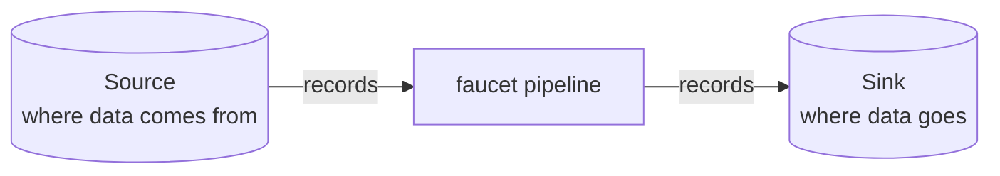
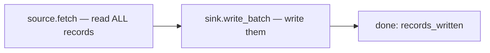
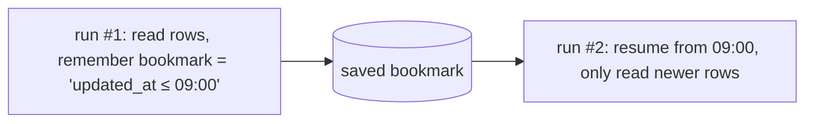
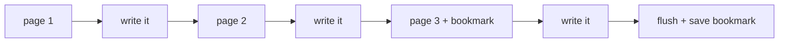
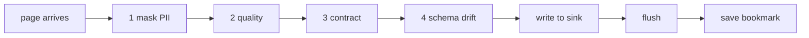

# Learn faucet-stream from scratch

*The whole architecture as a story — read top to bottom, one idea at a time. No prior knowledge assumed.*

<table>
<tr>
<td>🎓 <b>Beginner's guide</b><br/><sub>you're here — start from zero</sub></td>
<td><a href="./README.md">🏛 Architect reference →</a><br/><sub>the deep, subsystem-by-subsystem docs</sub></td>
</tr>
</table>

> **Two ways to read the architecture.** This page is the **learning path**: it
> builds the system up in the order you'd naturally discover it, in plain
> language. Every section ends with a **🔍 Go deeper** link that flips you to the
> matching **architect reference** page for the same topic. Read straight through
> the first time; follow the deep links when you want the full story.

---

## The one-sentence idea

**faucet-stream moves data from one place to another.**

That's it. Picture a kitchen faucet: water comes *from* a pipe (the **source**),
flows *through* the tap, and out *into* the sink (the **sink**). faucet-stream is
the tap. You tell it where the data comes from and where it goes, and it moves
the data — reliably, without losing or scrambling it.



Everything else in this project — pages, bookmarks, retries, exactly-once — exists
to make that one sentence true *even when things go wrong*. We'll add those ideas
one at a time. By the end you'll understand the whole architecture, and it'll feel
obvious.

---

## Chapter 1 — The two characters: Source and Sink

The entire system is built from just **two roles**:

- A **Source** knows how to **read** records from somewhere (a database, an API,
  a file, a queue).
- A **Sink** knows how to **write** records somewhere else.

A **connector** is just a Source or a Sink for one specific system — e.g.
`faucet-source-postgres` reads from PostgreSQL, `faucet-sink-bigquery` writes to
BigQuery. There are dozens, but they all speak the same two-role language, which
is why *any* source can feed *any* sink.

### What a record is

A record is just **JSON** (`serde_json::Value` in Rust terms). No schema
paperwork, no code generation — a row from a database, a JSON object from an API,
a line from a file, they all become plain JSON objects flowing through the pipe.
That choice keeps connectors simple to write.

### The smallest possible connector

A Source, at its simplest, is one function: *"give me your records."*

```rust
// A Source implements one required method:
async fn fetch_with_context(&self, ctx) -> Result<Vec<Value>, FaucetError> {
    // …talk to the system, return a list of JSON records
}
```

A Sink is also one function: *"here are some records, write them."*

```rust
// A Sink implements one required method:
async fn write_batch(&self, records: &[Value]) -> Result<usize, FaucetError> {
    // …write the records, return how many you wrote
}
```

That's a working connector. Everything else a connector *can* do (streaming,
resuming, exactly-once…) is optional and added later — you'll see how in the next
chapters.

> 🔍 **Go deeper:** [Connector SDK](./connector-sdk.md) — the full `Source` /
> `Sink` trait contracts and why they're shaped this way.

---

## Chapter 2 — Moving data once (the normal fetch)

Now connect a Source to a Sink. That connection is the **Pipeline**:

```rust
let result = Pipeline::new(&source, &sink).run().await?;
println!("wrote {} records", result.records_written);
```

What happens under the hood, in the simplest case:



Read everything, write everything, report how many. For a one-time copy — "move
this table into that warehouse once" — this is genuinely all you need. You now
understand the *happy path* of the whole tool.

But two real-world problems break this simple version, and fixing them is where
the interesting architecture comes from:

1. *"I don't want to re-copy everything every time I run."* → **Chapter 3.**
2. *"My dataset is too big to hold in memory."* → **Chapter 4.**

> 🔍 **Go deeper:** [Pipeline engine](./pipeline.md) — the `Pipeline` type and the
> loop that drives every run.

---

## Chapter 3 — Only the new stuff (incremental fetch)

Say you sync a table every hour. You don't want to re-read all 10 million rows
each time — just the ones that changed since last time. How does the tool
*remember* where it got to?

With a **bookmark**.

A bookmark is a small note the Source leaves for itself: *"I got up to here."* It
might be the largest `updated_at` timestamp it saw, or a database log position, or
a Kafka offset. On the next run, the Source reads that note and resumes from that
point instead of the beginning.



Two small additions make a Source resumable:

- `state_key()` — a name for "my saved place."
- `apply_start_bookmark(bookmark)` — "resume from this note."

The note itself is stored in a **state store** (a file, Redis, or Postgres). The
Source produces the bookmark; the pipeline saves it; nobody else needs to
understand what's *inside* it.

### The one rule to remember (introduced gently)

Here's the single most important idea in the whole project, and it's
common-sense once you see it:

> **We save the bookmark only *after* the data is safely written.**

Why? Imagine we saved "I got up to row 1000" *first*, then crashed before actually
writing rows 900–1000. Next run we'd resume at 1000 and those rows would be **lost
forever**. So the order is always: **write the data → make sure it's really
saved → only then save the bookmark.** If we crash in between, the worst case is we
re-do a little work (safe), never that we skip data (catastrophic).

Keep this rule in your pocket — every advanced feature respects it.

> 🔍 **Go deeper:** [State management](./state-management.md) (how bookmarks are
> stored) and [Recovery](./recovery.md) (what happens after a crash).

---

## Chapter 4 — Datasets bigger than memory (streaming)

Chapter 2's "read everything into memory, then write everything" falls apart at a
billion rows — you'd run out of memory. The fix is to stop thinking about "all the
data" and start thinking in **pages**.

A **page** (`StreamPage`) is just a chunk of records — say 1,000 at a time — with
an optional bookmark attached. Instead of one giant read, the Source produces a
*stream* of pages, and the pipeline handles them one at a time:



Read a page, write a page, move on. Only one page is ever in memory, so it
doesn't matter whether the dataset is a thousand rows or a billion — memory stays
flat. This is **bounded memory by construction**, and it's the default behaviour.

Notice the bookmark from Chapter 3 rides along on the pages: whenever a page
carries a bookmark, the pipeline writes the page, makes sure it's durable, and
*then* saves the bookmark — exactly the rule from Chapter 3, now applied
per-page. Database change-feeds (CDC) use this to save a bookmark after every
transaction, so they can resume from the exact right spot.

And the best part: a connector author gets this for free. If they don't do
anything special, the pipeline automatically chops their `fetch` into pages. If
their system has a natural way to stream (a database cursor, the Kafka consumer),
they can plug that in for extra efficiency.

> 🔍 **Go deeper:** [Stream pages](./stream-pages.md) (the streaming contract) and
> [Batching](./batching.md) (page sizing and auto-tuning).

---

## Chapter 5 — Making it production-grade (the extras you add when ready)

You now understand the **spine** of faucet-stream: *a source streams pages, the
pipeline writes each page and checkpoints safely, so you can resume after a
crash.* That's the whole core.

Everything below is **optional**. You don't need any of it to move data — you add
each piece the day you hit the problem it solves. Think of them as upgrades you
bolt onto the spine.

| The problem you hit | The upgrade you add |
|---|---|
| "A few bad rows keep killing the whole run." | **Dead-letter queue (DLQ)** — send the failing rows to a side location and keep going, instead of aborting. |
| "Some incoming rows are garbage (nulls, out-of-range)." | **Quality checks** — validate each record; drop/quarantine the bad ones. |
| "Downstream expects a specific shape and must never get surprised." | **Contracts** — declare a versioned output schema; block anything that breaks it. |
| "The data has PII I must not leak." | **Masking** — redact/hash sensitive fields. It runs *first*, so no other stage (not even the DLQ) ever sees raw PII. |
| "The network is flaky and requests fail sometimes." | **Retries / resilience** — automatic backoff, a circuit breaker, and a poison-pill policy. |
| "I must never write a row twice, even after a crash." | **Exactly-once** (effectively-once) — the sink commits data + a watermark together, so replays are skipped. |
| "I need this to run every hour / as a service / across many machines." | **schedule**, **serve**, and **cluster** modes — orchestration layered on top of the same engine. |

### How they fit together (still respecting Chapter 3's rule)

When several of these are on, the pipeline runs them in a fixed order on each
page — and the order is chosen to be *safe*, not arbitrary:



Masking is first so PII can't leak anywhere. Validation happens before the write
so bad data never lands. And the bookmark is still saved *last* — the golden rule
from Chapter 3 never bends, no matter how many upgrades you add.

> 🔍 **Go deeper (pick what you need):**
> [DLQ](../book/src/cookbook/dlq.md) ·
> [Quality](./quality.md) ·
> [Contracts](./contracts.md) ·
> [Masking](./masking.md) ·
> [Retries](./retries.md) & [Resilience](./resilience.md) ·
> [Recovery / exactly-once](./recovery.md) ·
> [Execution & orchestration](./execution.md)

---

## The one rule that ties everything together

If you remember nothing else, remember this:

> **A bookmark is saved only *after* the sink has durably written and flushed the
> page.** Write → flush → checkpoint. Always.

Every chapter, every upgrade, every failure mode in this project is a consequence
of that single ordering. It's why a crash never loses data; it's why retries are
safe; it's why exactly-once works. When you read the architect reference and see
"the invariant," this is it.

> 🔍 **Go deeper:** [Design invariants](./invariants.md) — this rule and its
> siblings, written down formally with where each is enforced in the code.

---

## Where to go next

You've built the whole mental model. From here:

- **Keep learning the internals** → switch to the [🏛 Architect reference](./README.md)
  and read the spine in order (overview → execution → pipeline → stream-pages →
  state → recovery).
- **Build your own connector** → [Authoring a connector](../contributing/connector-authoring.md).
- **Actually run a pipeline** → the user guide's
  [first pipeline tutorial](../book/src/getting-started/first-pipeline.md).
- **Look up a term** → the [Glossary](../glossary.md).

## Related

- [Architect reference (home)](./README.md) · [Overview](./overview.md) · [Design invariants](./invariants.md)
- [Glossary](../glossary.md)
- User guide: [Core concepts](../book/src/getting-started/concepts.md) · [Your first pipeline](../book/src/getting-started/first-pipeline.md)
