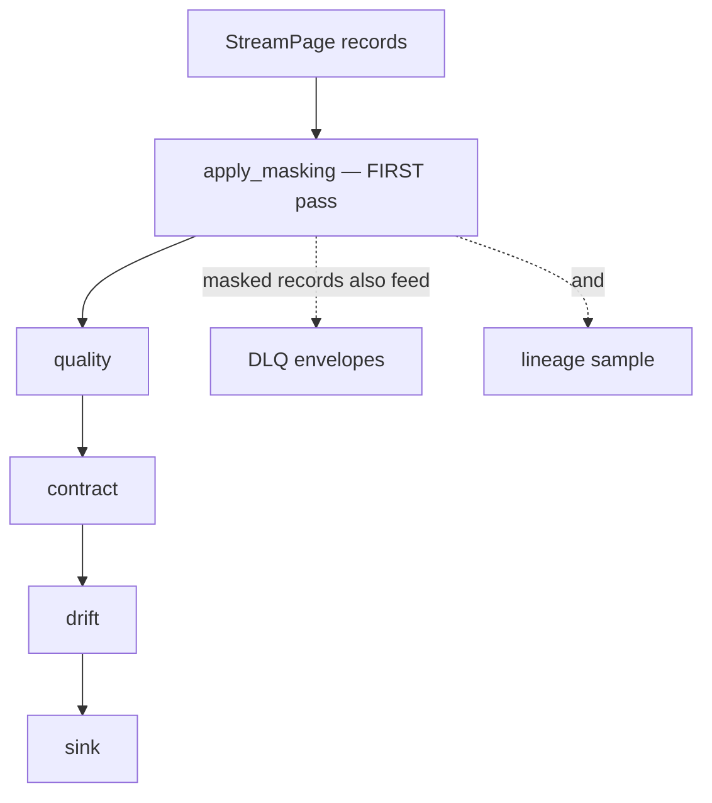

# PII masking

*A destination-scoped policy that detects and rewrites sensitive fields before any component observes them.*

## Why it exists

Personally identifiable information must not leak — not to the sink, not to a
dead-letter queue, not into a lineage sample or a log. The only way to guarantee
that is to mask *first*, before any other component touches the page. faucet-stream
therefore runs masking as the very first per-page pass in `run_stream`.

## Problem it solves

- **PII exfiltration through side channels.** A record quarantined by a later
  quality check would otherwise carry raw PII into the DLQ; a lineage sampler
  would capture it. Masking-first closes every such channel at once.
- **Determinism vs secrecy.** Some pipelines need masked values to remain
  *joinable* across runs (analytics on pseudonymized keys). Keyed HMAC hashing
  gives determinism; unkeyed hashing gives pseudonymization; both are distinct
  from redaction.

## Major components

Under `crates/core/src/masking/`:

- `config.rs` — `MaskingSpec`, `MaskRule` (`match`, `action`, `applies_to[]`),
  `MatchSpec` (`field_pattern` regex over dot-path / `value_detector` /
  `fields[]`), `Detector` (`email`/`credit_card`/`ssn`/`phone`/`ipv4`),
  `MaskAction` (`redact` / `hash` / `tokenize` / `partial`).
- `detect.rs` — conservative, anchored detectors (Luhn for cards; SSN excludes
  invalid area codes).
- `hash.rs` — `Hasher` (keyed HMAC-SHA256 or unkeyed SHA-256; `Debug` never prints
  the key).
- `compile.rs` — `CompiledMasking::compile` (all rules) and
  `compile_for_sink(spec, &[ids])` (drops rules whose non-empty `applies_to`
  names none of the sink's ids, still validating every rule).
- `mod.rs` — `apply_masking(page, &m) -> MaskingOutcome { records, hits }`
  (infallible depth-first dot-path walk; first matching rule wins per field).

## Execution flow

Because masking runs first, every downstream observer — sink, DLQ, lineage — sees
only masked values.

## Invariants

- **Masking runs first, unconditionally.** Wired via `Pipeline::with_masking` /
  `RunStreamOptions::with_masking` ahead of quality/contract/drift and every write.
- **Key-preserving and value-only.** It never adds/removes fields and never
  reorders keys, so downstream quality/contract checks remain meaningful over the
  masked data.
- **Never quarantines or fails → no DLQ gate.** Unlike quality/contract
  quarantine, masking cannot route a record away, so it imposes no DLQ requirement.
- **Determinism is preserved.** Keyed hash/tokenize produce stable outputs, so
  masked keys stay joinable; per-key uniqueness and non-null-ness are preserved
  (null is never masked).
- **The key comes from secrets, resolved before masking.** The masking pass runs
  after the secrets-interpolation pass, so a `${vault:…}` key is available.

## Trade-offs

- **Scalar-only actions coerce number/bool to string** (a masked value is
  textual); a name-match on a container redacts the whole subtree, which is
  coarse but safe.
- **Unkeyed digests are pseudonymization, not secrecy** — recomputable by anyone
  with the input space. The docs call this out so operators do not mistake it for
  encryption.

## Failure scenarios

- **A detector false-negative** (a novel PII format) → not masked; detectors are
  deliberately conservative (anchored, Luhn-checked) to avoid mangling non-PII,
  so the mitigation is an explicit `field_pattern`/`fields[]` rule.
- **Empty rule / bad regex** → `FaucetError::Config` at compile.

## Future evolution

- Additional detectors (IBAN, passport) and format-preserving encryption as a
  fourth action class.

## Related

- [Schema handling](./schema.md) · [Quality](./quality.md) · [Contracts](./contracts.md)
- [Pipeline](./pipeline.md) · [Design invariants](./invariants.md)
- User guide: [../book/src/cookbook/masking.md](../book/src/cookbook/masking.md)
