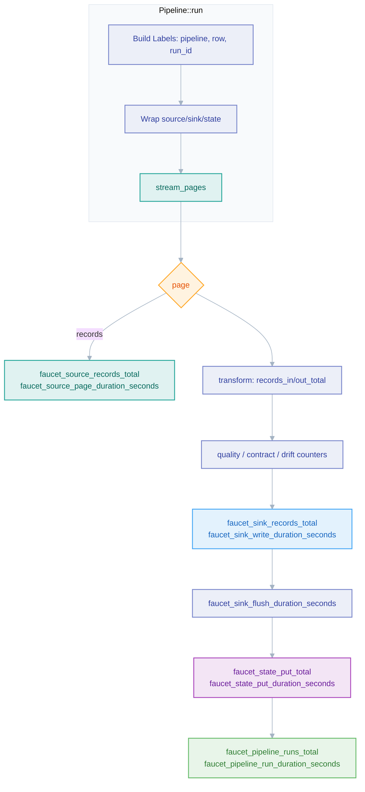

# Observability

*How every pipeline emits tracing spans and metrics automatically, without per-connector code.*

## Why it exists

A data-movement tool is only trustworthy if operators can answer "is it moving,
how fast, and where did it stall?" without reading source. faucet-stream treats
observability as a property of the *runtime*, not of each connector: the moment
a connector is dropped into a `Pipeline`, it is wrapped in instrumentation that
emits a uniform metric and span vocabulary. This keeps the [connector
SDK](./connector-sdk.md) minimal (a connector author writes I/O, not telemetry)
while guaranteeing that a third-party `faucet-source-foo` is exactly as
observable as a built-in one.

## Problem it solves

- **No telemetry drift between connectors.** If each connector emitted its own
  metrics, names and label sets would diverge and dashboards would rot. A single
  decorator layer forces one schema.
- **Zero-cost to connector authors.** The `Source`/`Sink` traits carry no
  metrics methods; authors only override `connector_name()` for a friendly
  label.
- **Cardinality safety by construction.** High-cardinality identifiers (run ids,
  record ids, URLs) must never become Prometheus labels. The decorators decide
  what is a label and what is a span attribute, so an author cannot accidentally
  explode series count.

## Major components

All live under `crates/core/src/observability/`:

| Module | Role |
|---|---|
| `source.rs` / `sink.rs` | `InstrumentedSource` / `InstrumentedSink` wrap a connector and time every page fetch / batch write. |
| `state.rs` | `InstrumentedStateStore` times `get`/`put`/`delete` and records hit/miss. |
| `transform.rs` | `instrumented_apply_stages` counts records in/out per page. |
| `pipeline.rs` | Run-level counters, in-flight gauge, run-duration histogram, bookmark-lag gauges. |
| `resilience.rs` | Retry / circuit-breaker / poison-pill counters (see [resilience](./resilience.md)). |
| `otel.rs` | OTLP export lifecycle (`OtelConfig`, `init_otel_provider`, `OtelErrorCountLayer`); gated on the `otel` feature. |

`Pipeline::run` (`crates/core/src/pipeline.rs`) constructs a `Labels` value once
and threads it through `InstrumentedSource::new`, `InstrumentedSink::new`, and
`InstrumentedStateStore::new`, so a single identity is shared across the whole
run.

## Execution flow

Every measured operation is also wrapped in a `tracing` span
(`faucet.pipeline.run`, `faucet.source.*`, etc.). Spans carry the high-cardinality
attributes (`run_id`, `parent_record_key`) that must not be metric labels.

## Invariants

- **Common labels are exactly `pipeline`, `row`, `connector`.** `row` is `""`
  for non-matrix runs; Prometheus treats an empty label as absent.
- **`run_id` is a span attribute only, never a metric label.** Same for
  `parent_record_key` in parent/child matrices. This is the single most
  important cardinality rule.
- **`connector_name()` must return a non-empty `&'static str`.** Empty strings
  fall back to `"unknown"` in release builds and trip a `debug_assert!` in debug.
- **Timers are drop-guards.** `DurationGuard` samples on `Drop`, so a duration is
  recorded even when the run is cancelled mid-await.
- **Panics are isolated, not swallowed silently.** A connector panic is caught
  via `AssertUnwindSafe.catch_unwind()` and surfaced as the `Panic` error kind
  rather than aborting the process.
- **`install_observability` is idempotent.** A second attempt to install a
  recorder/subscriber warns rather than panicking.

## Trade-offs

- **A fixed label schema limits per-connector custom metrics.** Connector-specific
  detail belongs in span attributes or connector-side logging, not new labels —
  the price of guaranteed dashboard portability.
- **The decorator adds one indirection per page.** This is negligible against
  network/DB I/O and buys uniform telemetry; the hot per-record path is untouched
  (instrumentation is per-page, not per-record).
- **Metrics fan out to both Prometheus and OTLP when both are configured.** Export
  failures on the OTLP side are non-fatal (`faucet_otel_export_failures_total`)
  and never propagate into the pipeline.

## Failure scenarios

- **Metrics endpoint port in use / malformed listen address** → typed
  `CliError::Observability`, surfaced before any run starts.
- **OTLP collector unreachable** → export errors counted, pipeline continues; a
  dropped span/metric is never a data-movement failure.
- **Recorder already installed** (e.g. embedded in a host process) → warn and
  reuse, so faucet-as-a-library does not fight the host's telemetry stack.

## Future evolution

- Exemplar linking (trace-id on histogram buckets) once the OTLP stack supports
  it stably on the pinned 0.31 line.
- A `build_info`-style gauge already exists (`faucet_build_info{version}`); the
  direction is more such annotation gauges for `group_left` joins rather than
  more dynamic labels.

## Related modules

The full metric catalog (every counter/histogram and its labels) is maintained
in `.claude/rules/architecture.md` under "Observability" — that is the source of
truth; this page explains the model, not the exhaustive list.

## Related

- [Pipeline](./pipeline.md) · [Execution](./execution.md) · [Resilience](./resilience.md)
- [State management](./state-management.md) · [Design invariants](./invariants.md)
- [ADR 0008 — Observability](../adr/0008-observability.md)
- [Logging standard](../standards/logging.md)
- User guide: [../book/src/operations/observability.md](../book/src/operations/observability.md)
