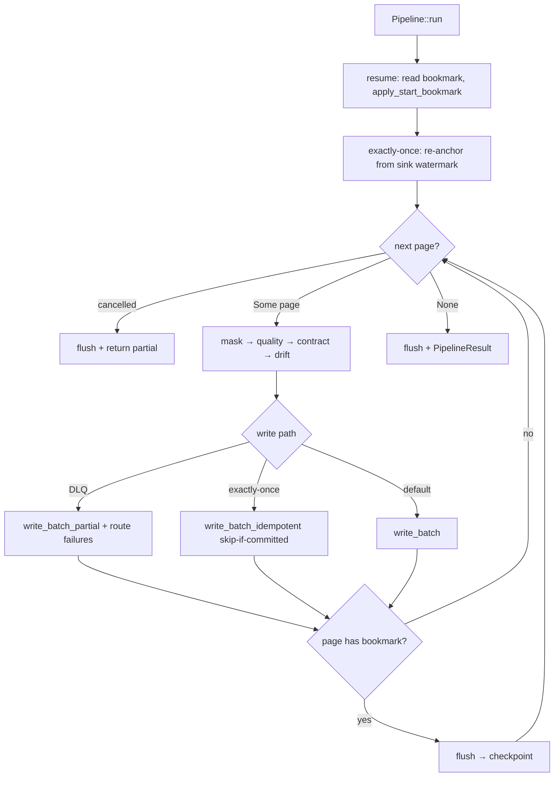

# Pipeline engine

*The `Pipeline` / `run_stream` core: one page-at-a-time loop that owns the write→flush→checkpoint contract.*

## Why it exists

`Pipeline` is the single place where a source, a sink, a state store, and the
protection/validation passes are wired together and driven. Concentrating this in
one function (`run_stream`, `crates/core/src/pipeline.rs`) means the
data-integrity ordering is written **once** and every connector inherits it — no
connector can get checkpointing wrong because no connector implements it.

## Major components

- **`Pipeline<'a, So, Si>`** — a builder over borrowed `&Source` / `&Sink`
  (object-safe, so `Box<dyn Source>` works). Configured progressively with
  `with_state_store`, `with_dlq`, `with_quality`, `with_contract`, `with_masking`,
  `with_schema_drift`, `with_resilience`, `with_delivery`, `with_cancel`,
  `with_adaptive`. See [ADR 0003](../adr/0003-builder-pattern.md).
- **`Pipeline::run`** — resolves run identity (name/row/run_id), wraps the source,
  sink, and state store in observability decorators, performs bookmark resume, then
  hands off to `run_stream`.
- **`run_stream`** — the free function that drives the page loop. Also callable
  directly by library authors who already have a `Stream<StreamPage>`.
- **`RunStreamOptions`** — the option bag carrying everything the loop needs
  (state, dlq, quality, contract, masking, drift, resilience, delivery, cancel).
- **`StreamPage { records, bookmark }`** / **`PipelineResult`** — the unit of work
  and the run summary. See [stream-pages](./stream-pages.md).

## Execution flow

### The three write paths

`run_stream` branches on configuration into three mutually exclusive paths, each
of which preserves the checkpoint-ordering invariant:

1. **DLQ path** — `write_batch_partial` splits per-row successes from failures;
   failures are enveloped and routed to the DLQ sink; then flush + checkpoint. A
   deferred abort (DLQ budget, circuit breaker, drift-`fail`) fires *after* the page
   is durable so nothing is stranded.
2. **Exactly-once path** — issues a monotonic commit token per bookmark-carrying
   page (`format_token_with_bookmark`), skips the write if the sink's committed seq
   is already ≥ the page's (idempotent replay), else `write_batch_idempotent`; then
   flush + `wrap_state(bookmark, seq)` checkpoint. See [recovery](./recovery.md).
3. **Default path** — `write_batch`, then (on a bookmark-carrying page) flush +
   checkpoint. This is the at-least-once baseline.

## Invariants

- **Write → flush → checkpoint, always.** In all three paths the bookmark is
  persisted only after `write_batch*` and `flush()` both return `Ok`. This is *the*
  data-integrity invariant — see [invariants](./invariants.md) and
  [ADR 0002](../adr/0002-checkpoint-ordering.md).
- **Empty, bookmark-less pages are skipped** (`records.is_empty() && bookmark.is_none()`).
- **A bookmark-less page is written but not checkpointed** — it stays at-least-once
  for that page (rare; CDC sources bookmark every committed transaction).
- **Every early exit flushes.** The loop runs inside an inner future; a source
  error, a propagated write/flush/state error, or a cancellation all fall through to
  a best-effort final flush, so a buffered sink (Parquet footer, S3 multipart)
  commits what it has rather than orphaning the file.
- **Masking runs first, unconditionally**, before any sink, the DLQ, or a lineage
  sample observes the records. See [masking](./masking.md).

## Trade-offs

- **One page in memory at a time** bounds memory at `O(batch_size)` but ties
  throughput to page size and sink round-trip latency (mitigated by
  [adaptive batching](./batching.md) and sink-side bulk APIs).
- **Fixed pass order** removes a config knob but eliminates PII-leak and
  bad-row-written bug classes. See [schema](./schema.md).
- **A single hot loop** keeps the contract in one place but means new cross-cutting
  behaviour (a new pass) is a change to `run_stream` itself — reviewed with care.

## Failure scenarios

- **Crash between flush and checkpoint** → at-least-once replays the page;
  exactly-once skips it via the committed token. No data loss either way; only
  at-least-once risks duplicates. See [recovery](./recovery.md).
- **Sink commits server-side but the response is lost, then a retry fires** →
  duplication, unless the sink is idempotent. The retry layer refuses to retry a
  non-idempotent `write_batch` for exactly this reason — see [retries](./retries.md).
- **A validation pass aborts** → `contract: fail` writes nothing from the page;
  `drift: fail` defers until survivors are durable.

## Future evolution

- Batch-level parallelism across sinks without breaking per-page ordering.
- A columnar page type behind the same loop ([RFC 0002](../../rfcs/0002-arrow-support.md)).

## Related

- [Stream pages](./stream-pages.md) · [Batching](./batching.md) · [State management](./state-management.md)
- [Recovery](./recovery.md) · [Retries](./retries.md) · [Schema](./schema.md)
- [Design invariants](./invariants.md)
- [ADR 0002 — Checkpoint ordering](../adr/0002-checkpoint-ordering.md) · [ADR 0003 — Builder pattern](../adr/0003-builder-pattern.md)
