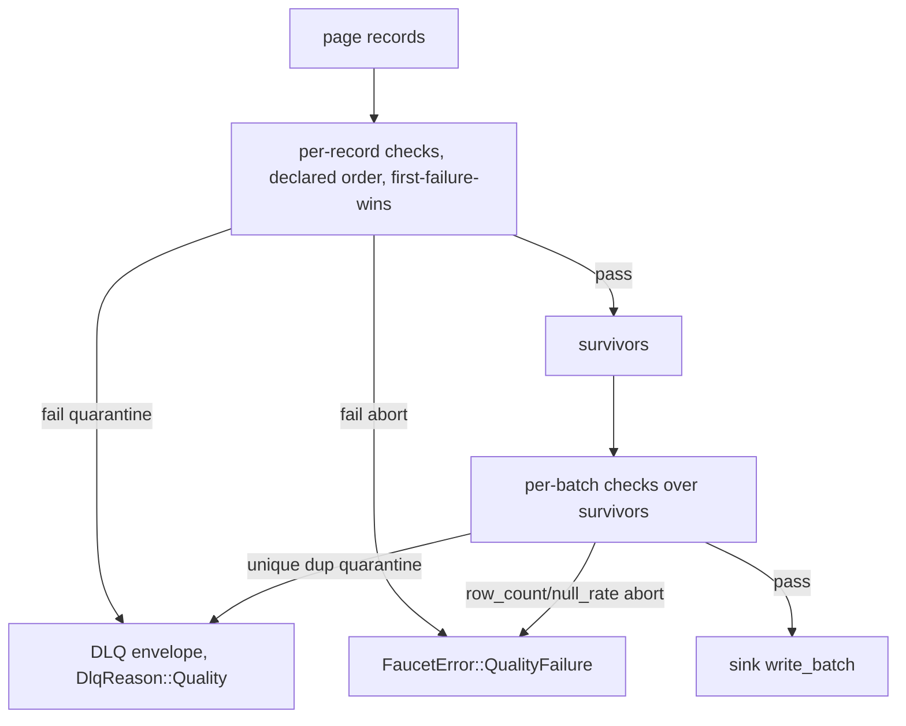

# Data quality

*Per-record and per-batch checks that quarantine or abort bad data before it reaches a sink.*

## Why it exists

Silent downstream corruption is the worst class of bug this project recognizes:
a malformed record that lands in a warehouse is far more expensive than a loud
failure. The quality subsystem lets a pipeline declare invariants about its data
and choose what happens when a record violates them — drop it to a dead-letter
queue, or abort the run — *before* the sink writes anything.

## Problem it solves

- **Bad data reaching the destination.** Checks run after transforms and before
  the sink, so a violating record is caught at the last safe moment.
- **All-or-nothing failure.** Not every bad row should kill a run; `quarantine`
  isolates the offenders and lets the rest flow, while `abort` stops on the first
  breach when correctness demands it.
- **Late failure.** Compilation is fail-fast: bad regexes, invalid JSON Schemas,
  out-of-range bounds all surface at config-load, never mid-run.

## Major components

Under `crates/core/src/quality/`:

- `QualitySpec` / `RecordCheck` / `BatchCheck` / `OnFailure` — config types.
- `CompiledQuality::compile` — fail-fast compilation; `requires_dlq()` reports
  whether any check uses a quarantine action.
- `apply_quality` → `QualityOutcome { survivors, quarantined }` + `CheckTally`.
- Feature-gated: `quality` (base checks) and `quality-jsonschema` (adds the
  `json_schema` record check).

## Execution flow

Runs inside `run_stream` after the masking pass and before the contract pass (see
[schema](./schema.md) for the full ordering). Surviving records flow to the sink
and the bookmark advances only after the sink confirms — an `abort` never commits
partial progress.

## Invariants

- **Per-record before per-batch.** Aggregate checks (`row_count`, `null_rate`,
  `distinct_count`, `unique`) run over the *survivor* slice, not the raw page.
- **`quarantine` requires a DLQ.** `requires_dlq()` is checked at config-load and
  again at run start; a quarantine action without a `dlq:` block is a
  `FaucetError::Config`, never a silent drop.
- **First-failure-wins per record**, checks evaluated in declared order — the
  envelope records the specific failed check.
- **`abort` writes nothing from the page** and does not advance the bookmark.

## Trade-offs

- **Per-page semantics.** A `unique`/`distinct_count` check sees one page at a
  time, not the whole stream. Global uniqueness needs `batch_size: 0` (whole
  result set in one page) — a deliberate consequence of the streaming model.
- **Checks add a per-page pass**, negligible against I/O, and only when a spec is
  attached.

## Failure scenarios

- **Invalid check config** (bad regex, out-of-range bound) → rejected at compile,
  before any data moves.
- **Quarantine flood** — if most rows fail, the DLQ absorbs them; the DLQ budget
  (see [pipeline](./pipeline.md)) can still abort the run as a circuit breaker,
  but only after the current page is durable.

## Future evolution

- Streaming-window aggregate checks (cross-page uniqueness without
  `batch_size: 0`), which would require carrying check state across pages.

## Related

- [Schema handling](./schema.md) · [Contracts](./contracts.md) · [Pipeline](./pipeline.md)
- [Design invariants](./invariants.md) · [ADR 0009 — Schema validation](../adr/0009-schema-validation.md)
- User guide: [../book/src/cookbook/quality.md](../book/src/cookbook/quality.md)
