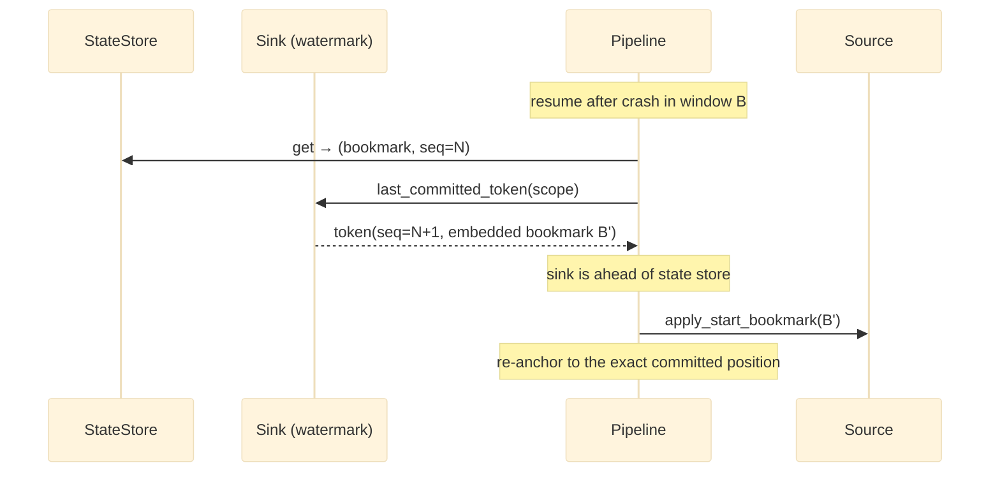

# Recovery

*What happens after a crash — the checkpoint contract, sink-anchored resume, and orphan recovery.*

## Why it exists

Any long-running data movement will be interrupted — a deploy, an OOM, a network
partition, a killed pod. The question is not *whether* a run dies mid-flight but
*what state it leaves behind*. faucet-stream's recovery design guarantees the worst
outcome is a bounded, well-understood re-delivery — never silent data loss and
never silent corruption.

## The two crash windows

A page moves through: `write_batch` → `flush` → `StateStore::put`. A crash can land
in one of two windows:

- **Window A — crash before flush.** The write may or may not be durable
  (sink-dependent). The bookmark was not advanced, so the next run replays the page.
- **Window B — crash after flush, before checkpoint.** The sink is durable but the
  state store is one page behind. The next run replays a page the sink already has.

Both windows resolve to **re-delivery of at most one page**, never loss. The
delivery mode decides what re-delivery costs.

## Recovery by delivery mode

### At-least-once (default)

On resume, `Pipeline::run` reads the stored bookmark and calls
`apply_start_bookmark` on the source. Window-B pages are replayed and re-written.
Duplicates are possible and acceptable — that is the definition of at-least-once.
The retry layer refuses to retry a non-idempotent `write_batch` so retries never
*add* duplicates beyond this bounded window (see [retries](./retries.md)).

### Exactly-once — sink-anchored resume (#291)

The problem with a naïve exactly-once resume is that it assumes the source replays
*identical page boundaries*. Log-positional sources like Kafka cannot promise that.
faucet-stream solves this by making the **sink's committed watermark the source of
truth for position**:

Each exactly-once commit token embeds the page's resume bookmark
(`format_token_with_bookmark`, `crates/core/src/idempotency.rs`). On resume the
pipeline reads `Sink::last_committed_token`, and if the sink's sequence is ahead of
the state store, it re-anchors the source to the **embedded** bookmark and
fast-forwards the sequence. Nothing is re-written, and nothing depends on the
source reproducing the same page boundaries. This is exactly what qualifies the
Kafka source for exactly-once. Legacy bare tokens (no embedded bookmark) fall back
to the count-based skip path, where a page whose seq ≤ committed is skipped. See
[ADR 0005](../adr/0005-runtime-recovery.md).

## Orphan recovery in `faucet serve`

A clustered/persistent `serve` deployment adds a second recovery concern: a run
owned by a process that died. The SQL run-history backend stamps each non-terminal
run with an `owner` (a per-process UUID `instance_id`) and a `lease_expires_at`. A
lease loop heartbeats this instance's own runs; a run is marked failed **only when
its owner's lease has expired**. This instance-fencing (#146 H7) means a starting or
running instance never fails a live peer's in-flight runs on a shared database.

## Invariants

- **No bookmark is ever ahead of a durable write.** The write→flush→checkpoint
  ordering guarantees the state store is always equal to or behind the sink, never
  ahead. Recovery therefore only ever *replays*, never *skips unwritten data*.
- **Re-delivery is bounded to one page.** The unit of potential replay is a single
  `StreamPage`.
- **Exactly-once re-delivery is a no-op.** A replayed token-stamped write is skipped
  or idempotently re-applied; the observable effect is zero.
- **Cancellation flushes.** A cooperative cancel (`with_cancel`) stops at a page
  boundary and flushes, so a clean shutdown leaves a durable, checkpointed position
  — not a torn buffer.

## Trade-offs

- **At-least-once accepts duplicates** in exchange for working with *any* source and
  sink and requiring no watermark table.
- **Exactly-once requires** a deterministic-replay source *or* a keyed-upsert sink, a
  durable state store, and no DLQ — a deliberately narrow, verifiable contract
  enforced at config-load (see [pipeline](./pipeline.md) and
  [invariants](./invariants.md)).

## Failure scenarios

- **State store lost entirely** → the run restarts from the source's beginning (or
  its own natural bookmark). At-least-once re-delivers; exactly-once with a durable
  sink watermark still de-duplicates via `last_committed_token`.
- **Sink watermark and state store disagree** → the sink wins (it is the durable
  record of what was actually committed); the source is re-anchored to it.
- **`serve` instance killed mid-run** → the lease expires, a peer marks the run
  failed, and a resubmit (same idempotency key) replays it safely.

## Future evolution

- Extending sink-anchored resume to more sinks as their watermark storage matures.
- A recovery-simulation test harness (fault injection at each window) as a
  first-class CI job.

## Related

- [State management](./state-management.md) · [Retries](./retries.md) · [Pipeline engine](./pipeline.md)
- [Design invariants](./invariants.md)
- [ADR 0005 — Runtime recovery](../adr/0005-runtime-recovery.md) · [ADR 0002 — Checkpoint ordering](../adr/0002-checkpoint-ordering.md)
