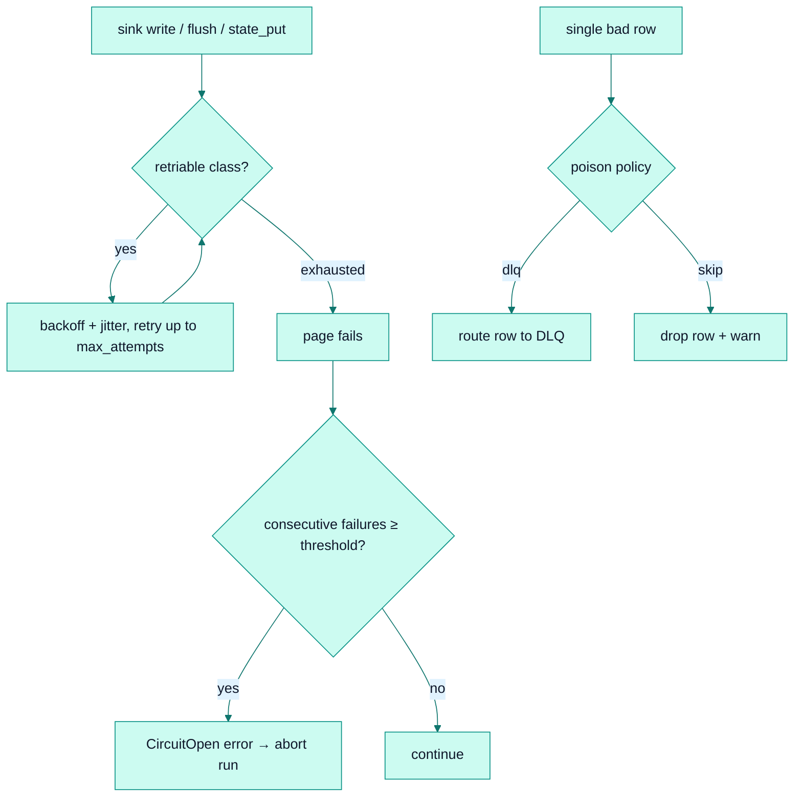

# Resilience

*The unified policy that composes retry, circuit breaking, and poison-pill handling into one declarative block.*

## Why it exists

Retry alone is not resilience. A dependency that is *down* (not merely flaky) should
not be hammered with retries; a single record that can never be written should not
wedge a whole pipeline forever. faucet-stream unifies three complementary
mechanisms — **retry**, a **circuit breaker**, and a **poison-pill** policy — behind
one opt-in `resilience:` config block so an operator reasons about failure handling
in a single place. The subsystem lives in `crates/core/src/resilience/`.

## Major components

- **`classify.rs`** — maps a `FaucetError` to a closed `RetryClass`
  (`Http5xx` / `RateLimited` / `Connection` / `Timeout`) and a `RetryClassSet`. This
  is the vocabulary the whole policy is expressed in.
- **`policy.rs`** — the config types: `RetryPolicy`, `BackoffKind`,
  `CircuitBreakerConfig`, `PoisonPolicy`, `PoisonAction`, and the umbrella
  `ResiliencePolicy`.
- **`breaker.rs`** — `CircuitBreaker`, a consecutive-failure counter.
- **`execute.rs`** — `execute_with_policy[_metered]`, the retry+backoff runner gated
  on the class set, jitter, and cancel-aware sleeps. This is what
  [retries](./retries.md) drives.

No Cargo feature gates it — resilience is always compiled; it is simply inert when
no `resilience:` block is configured.

## How the three mechanisms compose

- **Retry** handles transient, self-healing failures (see [retries](./retries.md)).
- **The circuit breaker** counts *consecutive fully-failed pages*; on trip it raises
  `FaucetError::CircuitOpen { failures, cooldown }` and aborts — the signal that the
  dependency is down, not flaky, and retrying further is futile.
- **The poison-pill policy** handles a single row that repeatedly fails, routing it
  to the DLQ (`action: dlq`, which requires a `dlq:` block) or dropping it with a
  one-shot warning, so one bad record cannot wedge the pipeline.

## Where it wires in

- **Sink side** — `run_stream` wraps `write_batch*` / `flush` / `state_put` via the
  `with_retry!` macro and holds the `CircuitBreaker`.
- **Source side** — the `retry` sub-policy is injected into the HTTP sources
  (`rest`, `xml`, `graphql`) via `Source::with_retry_policy`.

## Invariants

- **The circuit counts consecutive failures**, resetting on the first success — so a
  pipeline that fails intermittently but makes progress never trips.
- **`poison.action: dlq` requires a DLQ**, validated at config-load, never
  discovered mid-run.
- **Cooldown is advisory for `faucet schedule`** (it delays the next cron tick); an
  already-queued `overlap: queue` run is not delayed.
- **The duplication-safety rule from [retries](./retries.md) is preserved** — the
  circuit and poison layers never cause a non-idempotent write to be retried.

## Trade-offs

- **Fully opt-in.** With no `resilience:` block, sink writes are not retried and
  sources keep their built-in defaults. This preserves the simplest possible default
  behaviour and makes the failure model explicit only when an operator asks for it.
- **Consecutive-failure breaker** (vs. an error-rate window) is simple and
  predictable but can trip late under a low, steady error rate — an acceptable trade
  for a mechanism whose job is to detect a *hard down*, not a degraded, dependency.
- **REST field precedence** — REST's legacy `max_retries` / `retry_backoff` win when
  explicitly set; only `max_attempts` + `base` of the injected policy apply to REST.
  See [retries](./retries.md).

## Failure scenarios

- **Dependency hard-down** → retries exhaust per page, consecutive-failure count
  climbs, breaker opens, run aborts with `CircuitOpen`; the next run resumes from the
  last durable bookmark.
- **One malformed row the sink always rejects** → poison policy routes it to the DLQ
  (or drops it), and the rest of the page proceeds.

## Future evolution

- An error-rate (sliding-window) breaker mode alongside the consecutive-failure one.
- DLQ-path circuit breaking (the breaker is already threaded for it).

## Related

- [Retries](./retries.md) · [Recovery](./recovery.md) · [Pipeline engine](./pipeline.md)
- [Observability](./observability.md) (the `faucet_resilience_*` metrics)
- [ADR 0007 — Retries](../adr/0007-retries.md)
- User guide: [Resilience cookbook](../book/src/cookbook/resilience.md)
