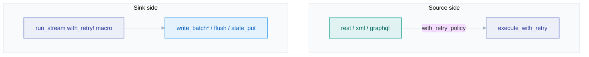

# Retries

*Two retry layers, and the one rule that keeps retries from silently duplicating data.*

## Why it exists

Transient failures — a 503, a rate limit, a dropped connection, a timeout — are the
common case in networked data movement, not the exception. Retrying them turns a
flaky dependency into a reliable pipeline. But a naïve retry is one of the most
dangerous things a data tool can do: **retrying a write that already succeeded
server-side duplicates data**, which is the repository's stated worst bug class
(silent downstream corruption). The retry design exists to get the upside without
that downside.

## The two layers

Retries happen in two distinct places, for two distinct reasons:

1. **Source side** — HTTP sources (`rest`, `xml`, `graphql`) retry their own
   requests. The `rest` source predates the unified policy and keeps its own
   `max_retries` / `retry_backoff` plus special `429` / `Retry-After` handling;
   `xml` / `graphql` use the shared `execute_with_retry` (`crates/core/src/retry.rs`).
   A `ResiliencePolicy` is injected via `Source::with_retry_policy`.
2. **Sink side** — `run_stream` wraps every `write_batch*`, `flush`, and
   `StateStore::put` in a `with_retry!` macro gated on the attached
   `ResiliencePolicy`. With no policy the macro is a bare `.await`, so the write path
   is byte-for-byte identical to the un-retried path.

## The duplication-safety rule

This is the single most important line in the retry design (`with_retry_write!` in
`crates/core/src/pipeline.rs`):

> A non-idempotent `write_batch` is retried **only** when the sink reports
> `supports_idempotent_writes()`. Otherwise the write falls through to a bare
> `.await` with no retry.

The reasoning: a bare `write_batch` makes no atomicity promise. If the request
commits on the server but the response is lost, a pipeline-level retry re-sends
every row — silent duplication. So faucet-stream *declines to retry* exactly those
writes. The idempotent exactly-once path (`write_batch_idempotent`) is always safe
to retry, because a replayed token-stamped write is a no-op. See
[ADR 0007](../adr/0007-retries.md) and [pipeline](./pipeline.md).

## Backoff and jitter

Retriable errors back off exponentially with jitter (`crates/core/src/retry.rs`):

- **`base * 2^attempt`**, capped at `MAX_BACKOFF` so a large attempt count saturates
  rather than sleeping unboundedly.
- **Decorrelated `[0.5, 1.5)` jitter** seeded per-call so concurrent retries in one
  process draw *different* delays — otherwise they realign and recreate the
  thundering herd the jitter exists to break.
- **Cancel-aware sleeps** — a cancellation during a backoff sleep returns the last
  error promptly so the caller can flush and stop.

## What is retriable

Only errors classified as transient are retried, gated on
`FaucetError::is_retriable` and the policy's `RetryClass` set
(`crates/core/src/resilience/classify.rs`): `Http5xx`, `RateLimited`, `Connection`,
`Timeout`. A `Config`, `Auth`, or `Json` error is not transient and is never
retried — retrying it would only waste time and delay the real failure.

## Invariants

- **A non-idempotent write is never retried.** (The duplication-safety rule.)
- **The no-policy path is unchanged.** Attaching no resilience policy leaves the
  write path allocation-free and identical to the pre-resilience code.
- **Retries are gated on classification.** Non-transient errors fail fast.
- **Jitter is per-call random**, never fixed, to avoid synchronised retry storms.

## Trade-offs

- **REST keeps its own retry runner** for back-compat; when its `max_retries` /
  `retry_backoff` are at defaults the injected policy's `max_attempts` + `base`
  apply, but `retry_on` / `max` / `jitter` are inert on REST (honoured in full on
  `xml`/`graphql` and every sink-side write). This asymmetry is a deliberate
  compatibility concession, documented in [resilience](./resilience.md).
- **Declining to retry non-idempotent writes** means a transient sink blip aborts
  the run (to be replayed) rather than silently retrying — the safe default, at the
  cost of a restart.

## Failure scenarios

- **Sink commits, response lost, retry fires (idempotent sink)** → the re-sent
  token-stamped write is a no-op; no duplication.
- **Sink commits, response lost (non-idempotent sink)** → no retry; the run aborts
  and the page is replayed on the next run (bounded at-least-once duplication).
- **Persistent 5xx** → retries exhaust `max_attempts`, then the circuit breaker may
  open — see [resilience](./resilience.md).

## Future evolution

- Folding the bespoke REST retry runner into the unified policy so `retry_on` /
  `jitter` apply uniformly.
- Per-sink idempotency hints richer than the current boolean, enabling safe retry of
  more write shapes ([RFC 0001](../../rfcs/0001-capability-traits.md)).

## Related

- [Resilience](./resilience.md) · [Recovery](./recovery.md) · [Pipeline engine](./pipeline.md)
- [Design invariants](./invariants.md)
- [ADR 0007 — Retries](../adr/0007-retries.md)
- User guide: [Resilience cookbook](../book/src/cookbook/resilience.md)
