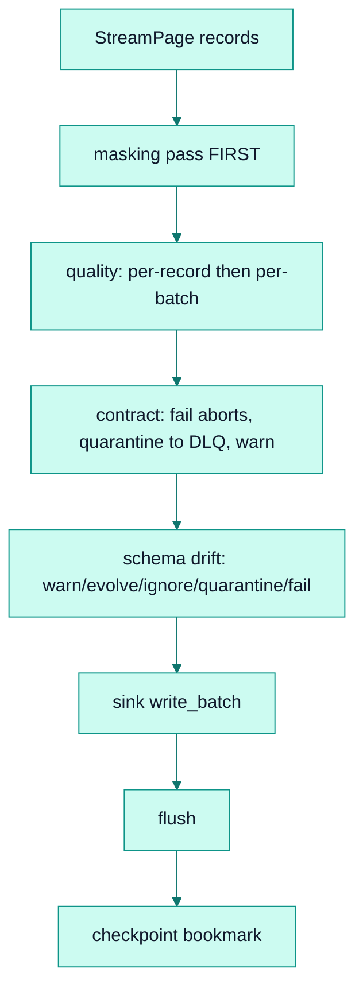

# Schema handling

*Inference, and the ordered per-page passes that mask, validate, and reconcile record shape before a write.*

## Why it exists

Records flowing through faucet-stream are dynamically typed
(`serde_json::Value` — see [ADR 0004](../adr/0004-json-record-model.md)). To move
them safely into typed destinations and to catch bad data early, the runtime
needs (a) a way to *infer* a schema from records and (b) a set of *policies* that
act on the gap between what arrives and what the destination expects. These
policies run per page, in a fixed order, inside `run_stream`.

## Problem it solves

- **No schema, no safety.** JSON has no declared shape; `infer_schema` derives
  one from samples so drift and contracts can be evaluated.
- **Ordering matters for correctness.** PII must be masked before anything else
  observes it; a contract breach must abort before a write; drift handling must
  see the post-contract survivors. A wrong order is a data-safety bug, not a
  cosmetic one.

## Major components

- `infer_schema` (`crates/core/src/schema.rs`) — merges types across sampled
  records and detects nullability, producing an `{"type":"object","properties":…}`
  shape.
- `drift.rs` — pure `diff_schema(dest, page, allow_widening)` classifying each
  **top-level** column into additions / widenings / incompatible /
  droppable-required; `SchemaDriftPolicy` compiled from `SchemaDriftSpec`.
- `quality/` and `contract/` — the two validation passes (documented in
  [quality](./quality.md) and [contracts](./contracts.md)).
- `masking/` — the PII pass (documented in [masking](./masking.md)).

## Execution flow — the per-page pipeline

The order — **masking → quality → contract → drift** — is enforced in
`run_stream` and is deliberate:

1. **Masking first** so PII never reaches a sink, the DLQ, or a lineage sample.
2. **Quality** removes/aborts bad records so downstream passes see clean data.
3. **Contract** enforces the versioned output promise; `fail` writes nothing.
4. **Drift** reconciles shape against the live destination schema last, because it
   operates on exactly the records about to be written.

## Invariants

- **Drift is evaluated on top-level columns only.** A nested object is one
  column; changes *inside* it never surface. This keeps `diff_schema` pure and
  predictable at the cost of nested-field granularity.
- **`contract: fail` aborts and writes nothing from the page**; **`drift: fail`
  defers** — the page's survivors are individually valid, so they are committed
  and the abort fires only after the page is durable (mirrors the DLQ-budget and
  circuit-breaker deferral). This asymmetry is intentional and documented in
  [contracts](./contracts.md).
- **The destination schema is fetched lazily once and refreshed after `evolve`.**
  A sink reporting `None` (schemaless / not-yet-created) makes the drift pass
  inert regardless of mode.
- **`FaucetError::SchemaDrift { columns, message }`** is raised only under an
  `on_drift: fail` / `on_incompatible: fail` policy.

## Trade-offs

- **Top-level-only drift** trades nested precision for a simple, total diff.
- **Per-page inference** means a schema is only as good as the page's sample; a
  column absent from every record on a page is invisible until it appears.
- **Fixed pass order** removes a configuration knob but eliminates an entire class
  of "why did my PII leak / why did a bad row get written" bugs.

## Failure scenarios

- **A field narrows type mid-stream** (string→int) under `evolve` → routed by
  `on_incompatible` (fail or quarantine); never silently coerced.
- **Sink cannot evolve** but `on_drift: evolve` is set → rejected at config-load
  by the expand-time gate, not discovered mid-run.

## Future evolution

- Nested-column drift, contingent on a nested-aware `diff_schema`.
- Sharing the inferred schema with the [lineage](./observability.md) facet so a
  single inference feeds both drift and the OpenLineage schema facet.

## Related

- [Quality](./quality.md) · [Contracts](./contracts.md) · [Masking](./masking.md)
- [Pipeline](./pipeline.md) · [Design invariants](./invariants.md)
- [ADR 0009 — Schema validation](../adr/0009-schema-validation.md)
- User guide: [../book/src/cookbook/schema-drift.md](../book/src/cookbook/schema-drift.md)
