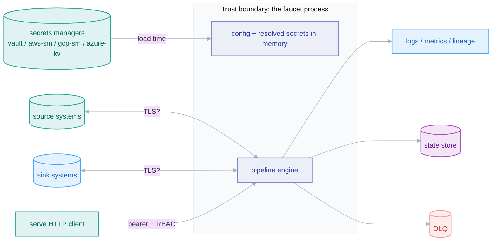

# Security model

*How faucet-stream handles your credentials and your data — the trust boundaries, the redaction boundary and its sharp edges, transport and at-rest posture, and a hardening checklist.*

## Why this exists

faucet-stream is a *data-movement* tool: to do its job it holds credentials for
dozens of external systems and streams potentially sensitive records between
them. That makes its security posture a first-class concern, not an afterthought.
This page is the coherent security model an operator — or an enterprise security
reviewer — needs before running faucet against production data. It documents
what faucet protects, what it explicitly does *not*, and how to run it safely.

For **reporting a vulnerability**, see the repository's
[`SECURITY.md`](../../SECURITY.md). This page is the architecture; that file is
the disclosure policy.

## Threat model scope

faucet runs in three shapes, each with a different exposure:

| Shape | Surface |
|-------|---------|
| **`faucet run` / `schedule` / `replicate` / `backfill`** (CLI) | a local process holding resolved credentials in memory; writes state/DLQ to configured stores; emits logs/metrics |
| **`faucet serve`** (HTTP control plane) | a long-running network service accepting pipeline configs over HTTP; adds authn/authz, an audit log, and (in cluster mode) a shared database |
| **embedded library** | the host process owns everything; faucet-core provides the engine only |

**In scope:** credential handling, secret resolution and redaction, transport
security options, PII handling, the serve auth/authz surface, and SQL-injection
prevention. **Out of scope (host responsibility):** OS/process isolation,
network segmentation, the security of the external systems faucet connects to,
and the secrecy of the environment faucet runs in.

## Credentials and secrets

### The auth model

Every connector's credentials serialize as one adjacently-tagged shape,
`{ type, config }` (e.g. `auth: { type: bearer, config: { token: … } }`).
Credentials may be inline **or** referenced from the top-level `auth:` catalog
via `auth: { ref: <name> }`. The CLI builds each named provider **once**
(`cli/src/auth_catalog.rs`) and shares one `Arc<dyn AuthProvider>` across every
connector that references it, so N matrix rows hitting one IdP share a single
token with single-flight refresh rather than each caching a copy.

### Secret interpolation

Four `${scheme:reference}` directives resolve at config-load time as the final
load-time stage (`cli/src/secrets/`):

- `${vault:<path>[#field]}` — HashiCorp Vault KV v2
- `${aws-sm:<name-or-ARN>[#field]}` — AWS Secrets Manager
- `${gcp-sm:projects/…/secrets/…/versions/…}` — GCP Secret Manager
- `${azure-kv:<vault>/<secret>[/<version>]}` — Azure Key Vault

They are **off by default** (feature-gated: `secrets-vault`, `secrets-aws-sm`,
`secrets-gcp-sm`, `secrets-azure-kv`), fetched concurrently and de-duplicated,
and `#field` extracts one key from a JSON secret body (Vault/AWS). Because the
secrets pass runs after variable/template resolution and before the `auth:`
catalog is built, a shared provider can itself hold a `${vault:…}` secret.

## The redaction boundary — and its sharp edges

This is the single most important security caveat in faucet, and the one most
easily misunderstood. Resolved secret values are scrubbed from output by a
`RedactingWriter` at the I/O boundary (`cli/src/secrets/registry.rs`). **But the
boundary covers only faucet's own tracing / log / error output.** It does **not**
cover:

- **third-party connector debug logging** (a driver that logs its own connection
  string);
- **Prometheus metric labels** and **tracing span attributes**;
- anything written by a library the connector depends on.

The operational rule that follows is absolute:

> **Never run a pipeline with `FAUCET_LOG=debug` (or any verbose third-party log
> level) when connector configs hold resolved secrets.** Debug logging can emit
> credentials from outside faucet's redaction boundary.

`faucet serve` additionally registers all bearer tokens (and RBAC principal
tokens) for redaction, so they are scrubbed from its logs — subject to the same
boundary limitation.

## Transport security

TLS is configured per connector, and **some connectors default to plaintext —
explicitly, never silently**. The clearest example is the PostgreSQL CDC source:
`tls: disable | require | verify_ca | verify_full`, defaulting to `disable`
(plaintext). This is a deliberate "safe defaults are explicit" choice — the
default is documented and visible in the config schema, not hidden — but it means
**an operator moving production data must set TLS explicitly**. Treat every
connector's `tls` / transport option as something to configure, not to inherit.

## Data handling: PII, DLQ, and state at rest

- **PII masking runs first.** When a `masking:` policy is configured, the masking
  pass runs *before* quality/contract/drift and before every sink, the DLQ, and
  any lineage sample — so PII never leaves the pipeline in the clear
  ([masking](./masking.md)). Masking is deterministic (keyed HMAC), so masked
  values stay joinable.
- **The DLQ can hold raw records.** A dead-letter queue stores the *failed*
  records in an envelope. If masking is **not** configured, those envelopes
  contain the original (possibly sensitive) data. Treat the DLQ location with the
  same sensitivity as the source data, and apply masking if the source carries
  PII. See [`../book/src/cookbook/dlq.md`](../book/src/cookbook/dlq.md).
- **State at rest.** Bookmarks are usually non-sensitive (offsets, timestamps,
  max-column values) but can contain primary-key values. `FileStateStore`
  supports optional at-rest encryption (`crates/core/src/encryption.rs`); the
  Redis/Postgres backends inherit the security of those stores.
- **Lineage** emits dataset URIs; `redact_uri_credentials`
  (`faucet_core::util`) strips embedded credentials from URIs before they appear
  in OpenLineage events.

## `faucet serve` — the network surface

- **Authentication is mandatory-by-opt-out.** The server refuses to start
  bearer-less unless `--no-auth` is explicitly passed (a deliberate gate).
  Bearer checks are constant-time and scoped to `/v1`.
- **RBAC** (`--auth-config`): principals map to `viewer` (read-only) /
  `operator` (+ run writes, doctor, triggers) / `admin` (+ audit). An unmapped
  `/v1` route is **admin-only, fail-closed**.
- **Audit log** records `run.submit` / `run.cancel` / `run.delete` and every
  denial, through a single choke point (`serve/audit.rs`).
- **The static UI shell is public; all `/v1` data is bearer-gated.** The browser
  stores the token in `localStorage`.
- **Cluster mode** shares a SQL database across instances; secure that database
  as a trust-sensitive component (it holds run configs and audit records).

## SQL-injection prevention

Dynamic SQL is a first-class hazard for a tool that templates queries. The core
provides the safe primitives and marks the unsafe ones:

- `quote_ident` — identifier quoting for dynamically-composed SQL.
- `substitute_context_bind_params` — SQL-safe value substitution via **bind
  markers**, not string interpolation.
- `substitute_context` — placeholder substitution for URLs/paths that is
  **explicitly documented as NOT safe for SQL or JSON**; `substitute_context_json`
  is the JSON-safe variant.

Connector authors composing SQL **must** use the bind-parameter path and
`quote_ident`, never raw string interpolation. See
[error handling](../standards/error-handling.md) and the connector rules.

## Supply chain

Dependencies are gated by `cargo-deny` (`deny.toml`) as a **required** CI job
("Supply chain (cargo-deny)"): a new dependency introducing a disallowed license
fails the build. Toolchain and edition are pinned (`rust-toolchain.toml`); crate
versions are semver-gated by `cargo-semver-checks`.

## Hardening checklist

For production deployments:

- [ ] Set **TLS explicitly** on every connector that touches production data
  (do not rely on plaintext defaults).
- [ ] Keep log levels at `info` or below in any run holding resolved secrets;
  **never** `debug` with third-party logging enabled.
- [ ] Configure a **masking** policy if the source carries PII — and remember the
  DLQ holds raw records without it.
- [ ] Source secrets from a secrets manager (`${vault:…}` etc.), not inline
  config or committed files.
- [ ] For `faucet serve`: never use `--no-auth` outside a trusted network; prefer
  `--auth-config` RBAC over a single admin token; secure the cluster database.
- [ ] Restrict filesystem access to the state store and DLQ locations.
- [ ] Review connector debug output before enabling it anywhere near secrets.

## Non-goals

faucet does not encrypt data in transit between its own components beyond what
the connectors' TLS options provide, does not manage the lifecycle of the
external systems' credentials (rotation is the secrets manager's job), and does
not sandbox third-party connector code — a connector runs with the full trust of
the faucet process.

## Related

- [Masking](./masking.md) · [State management](./state-management.md) · [Observability](./observability.md)
- [Standards: logging & redaction](../standards/logging.md) · [Standards: error handling](../standards/error-handling.md)
- [Glossary](../glossary.md)
- Disclosure policy: [`SECURITY.md`](../../SECURITY.md)
- User guide: [Secrets-manager interpolation](../book/src/cookbook/secrets.md) · [Dead-letter queues](../book/src/cookbook/dlq.md)
