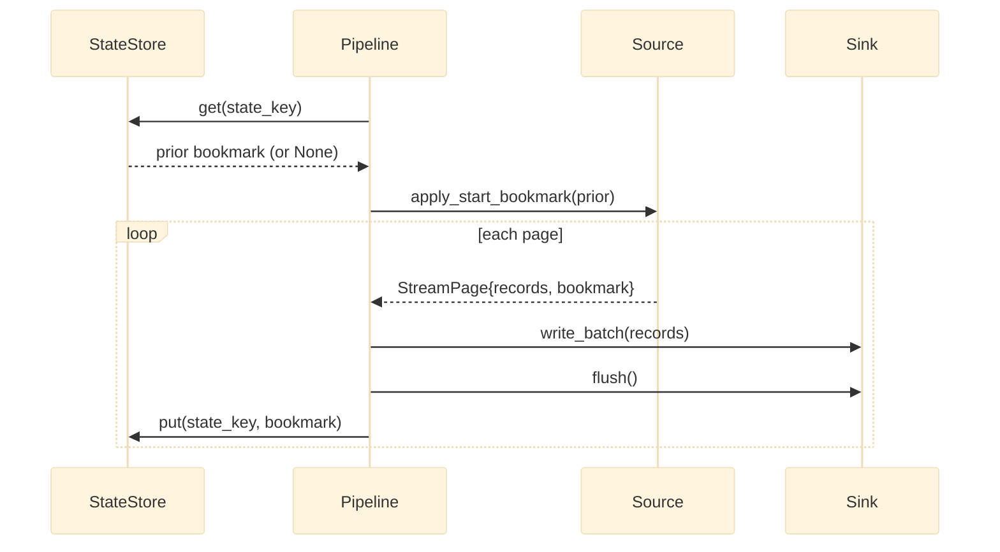

# State management

*Durable bookmarks, the `StateStore` abstraction, and the key scheme that makes every invocation independently resumable.*

## Why it exists

Incremental replication and crash recovery both need one thing: a durable record of
"how far did we get". faucet-stream calls that record a **bookmark** and stores it
through a single narrow abstraction, the `StateStore`. Keeping state behind one
trait means connectors never talk to a state backend directly — they produce and
consume opaque bookmark values, and the pipeline handles persistence with the
correct ordering. See [ADR 0006](../adr/0006-state-management.md).

## Major components

- **`StateStore`** (`crates/core/src/state.rs`) — an async trait with three
  operations over `serde_json::Value`:

  ```rust
  async fn get(&self, key: &str) -> Result<Option<Value>, FaucetError>;
  async fn put(&self, key: &str, value: &Value) -> Result<(), FaucetError>;
  async fn delete(&self, key: &str) -> Result<(), FaucetError>;
  ```

- **Built-in backends in core** — `MemoryStateStore` (ephemeral, single-process) and
  `FileStateStore` (one JSON file per key, written via atomic rename, optional
  at-rest encryption). Kept in `faucet-core` because they add no dependencies.
- **Heavier backends in their own crates** — `faucet-state-redis`
  (`{namespace}:{key}`) and `faucet-state-postgres` (a single
  `faucet_state(key, value, updated_at)` table with `ON CONFLICT DO UPDATE`). These
  live outside core so `faucet-core` stays dependency-light. See
  [ADR 0006](../adr/0006-state-management.md) and [ADR 0010](../adr/0010-pipeline-runtime.md).
- **`validate_state_key`** — rejects empty, hidden (`.`-prefixed), and traversal-
  unsafe keys, so a key can be used as a filename component without escaping the
  store's root.

## How a bookmark flows



The `put` happens **after** `write_batch` + `flush` — never before. That ordering
is the whole point; it is documented as the central invariant in
[invariants](./invariants.md) and [ADR 0002](../adr/0002-checkpoint-ordering.md).

## The state-key scheme

A key identifies a resumable position uniquely across the matrix DAG:

| Node | Key |
|---|---|
| Source's natural key | `Source::state_key()` (e.g. `postgres-cdc:<slot>`) |
| Matrix root row | `{name}::{row_id}` |
| Matrix child (per parent record) | `{name}::{row_id}::{parent_record_key}` |
| Replication CDC node | `{name}::cdc`; phase marker `{name}::__replication__` |
| Backfill unit | `{name}::backfill::{unit}` (live bookmark untouched) |

The executor wraps each invocation's source with a `StateKeyOverride` so the
per-row key wins over the source's natural key. This is why two matrix rows using
the same connector never clobber each other's progress.

## Exactly-once: the state envelope

Under `delivery: exactly_once` (atomic-watermark mechanism) the stored value is not
a bare bookmark but an envelope carrying both the bookmark and the monotonic
sequence: `wrap_state(bookmark, seq)` / `unwrap_state(value)`
(`crates/core/src/idempotency.rs`). The sequence lets recovery reconcile the state
store against the sink's committed watermark. See [recovery](./recovery.md).

## Invariants

- **A bookmark is persisted only after a durable, flushed write.** (The central
  invariant.)
- **Keys are validated before use** on every `get`/`put`/`delete`, so a malformed
  key fails loudly rather than escaping the store root.
- **The bookmark is opaque to the store.** The store round-trips a `Value`; only the
  source interprets it. This keeps the store fully generic.
- **`memory` state is not durable.** Gates that require durability
  (`delivery: exactly_once`, SLA baselines) reject or warn on the memory backend at
  config-load.

## Trade-offs

- **`Value`-typed, three-method interface** maximises backend portability at the
  cost of any store-specific optimisation (range scans, TTLs). Bookmarks are tiny
  and low-frequency, so this is the right trade.
- **One file per key** (FileStateStore) is simple and atomic but not ideal for
  thousands of matrix children — that is what the Redis/Postgres backends are for.

## Failure scenarios

- **Store unreachable at checkpoint** → the `put` errors, the run aborts after a
  flush; the next run re-reads the last durable bookmark and replays from there
  (at-least-once) or skips (exactly-once).
- **Corrupt/legacy stored value** → `unwrap_state` tolerates a bare bookmark
  (legacy) vs. an envelope, so upgrading delivery modes does not strand state.

## Future evolution

- Optional compare-and-swap semantics for stores that support it, to fence
  concurrent writers to one key.
- A typed bookmark trait so sources can express bookmark *comparability* (for
  SLA/lag math) without leaking their internal shape.

## Related

- [Recovery](./recovery.md) · [Pipeline engine](./pipeline.md) · [Stream pages](./stream-pages.md)
- [Design invariants](./invariants.md) · [Standards: state](../standards/state.md)
- [ADR 0006 — State management](../adr/0006-state-management.md) · [ADR 0002 — Checkpoint ordering](../adr/0002-checkpoint-ordering.md)
- User guide: [Incremental replication & state](../book/src/cookbook/state.md)
