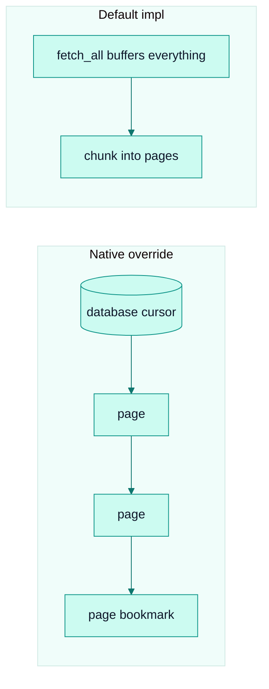

# Stream pages

*The `StreamPage` model — the unit of streaming that bounds memory and carries the checkpoint.*

## Why it exists

The naïve way to move data is to fetch everything, then write everything. That
buffers the entire dataset in memory and delays the first write until the last
record arrives — unacceptable for a tool whose Primary Goal is
efficient, reliable movement of arbitrarily large datasets. The streaming model
replaces "fetch-all, write-all" with "pull a page, write a page, checkpoint,
repeat", bounding memory at `O(batch_size)` on both sides regardless of total
volume. See [ADR 0001](../adr/0001-stream-pages.md).

## The unit of work

```rust
pub struct StreamPage {
    pub records: Vec<Value>,       // the chunk to write
    pub bookmark: Option<Value>,   // Some → checkpoint after this page is durable
}
```

`Source::stream_pages(ctx, batch_size) -> Stream<Item = Result<StreamPage, _>>` is
the primary streaming entry point. The pipeline calls `Sink::write_batch` once per
yielded page, and flushes + checkpoints whenever a page carries `Some(bookmark)`.

The `bookmark` field is the linchpin of two very different resumption styles under
one type:

- **Whole-result sources** (a REST paginator, a SQL query) know their bookmark only
  after seeing every record, so they emit `Some` on the **final** page.
- **CDC-style sources** (postgres-cdc, mysql-cdc, mongodb-cdc) emit `Some` **per
  committed transaction**, getting per-transaction durability automatically.

Both are handled by the same loop — the source decides *when* a page is
checkpointable; the pipeline decides *how* to make it durable.

## Native streaming vs. the default

`stream_pages` has a **default implementation** that calls `fetch_all` and chunks
the buffered result into pages. This lets a connector author implement only
`fetch_with_context` and still participate in the streaming loop (buffered, but
correct). Connectors that can stream from their underlying primitive **override**
`stream_pages` to be truly incremental:



Sources that override for native streaming include `rest`, `postgres`, all three
CDC sources, `mysql`, `mssql`, `sqlite`, `mongodb`, `s3`/`gcs` (JSONL/raw),
`parquet`, `csv`, `xml`, `elasticsearch` (scroll), `kafka`, `kinesis`, `spanner`,
`websocket`, `redis`, and server-streaming `grpc`. Sources that intentionally keep
the default: unary `grpc` (no paging primitive) and `webhook` (buffer-shaped by
nature). The authoritative list is in
`.claude/rules/connectors.md`.

## Invariants

- **`batch_size` passed to `stream_pages` is a hint.** Overriding sources use their
  own config field as the authoritative knob, so a pipeline hint can never silently
  override an explicit config value.
- **A page carrying `Some(bookmark)` triggers flush + checkpoint before the next
  page is polled.** This is what makes per-transaction CDC durability free.
- **The bookmark is opaque to the pipeline.** It is a `serde_json::Value` the source
  produced and only the source interprets (via `apply_start_bookmark`). See
  [state-management](./state-management.md).

## Trade-offs

- **Page granularity is a throughput/latency/durability three-way.** Smaller pages
  → lower memory, more frequent checkpoints, more sink round-trips. Larger pages →
  fewer round-trips, coarser recovery. [Batching](./batching.md) covers the sizing
  model and the `batch_size: 0` "one giant page" sentinel.
- **The default impl buffers.** A connector that only implements `fetch_all` gets
  correctness but not the memory bound — acceptable for small sources, a smell for
  large ones (the author should implement `stream_pages`).

## Failure scenarios

- **A source yields `Err` mid-stream** → the loop propagates it after a best-effort
  flush; already-checkpointed pages stay durable, so the next run resumes cleanly.
- **An empty page with no bookmark** → skipped (no-op), so a source can emit
  keepalive/empty pages cheaply.

## Future evolution

- Backpressure and multi-page pipelining without breaking per-page ordering.
- A columnar `StreamPage` variant for zero-copy paths. Both are explored in
  [RFC 0004](../../rfcs/0004-streaming-improvements.md) and
  [RFC 0002](../../rfcs/0002-arrow-support.md).

## Related

- [Pipeline engine](./pipeline.md) · [Batching](./batching.md) · [State management](./state-management.md)
- [Connector SDK](./connector-sdk.md) · [Design invariants](./invariants.md)
- [ADR 0001 — Stream pages](../adr/0001-stream-pages.md)
