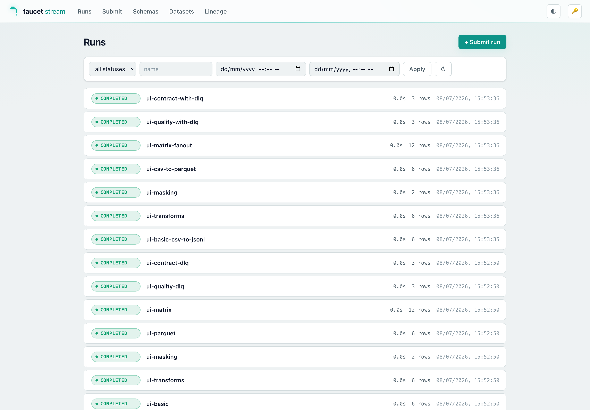
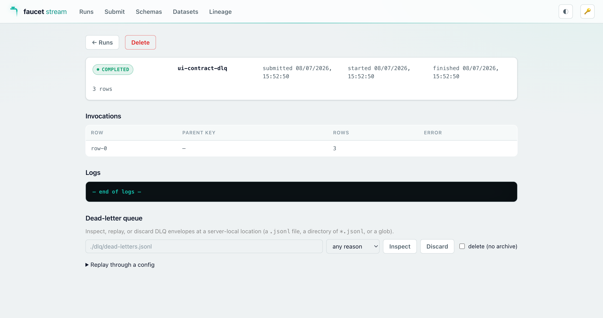
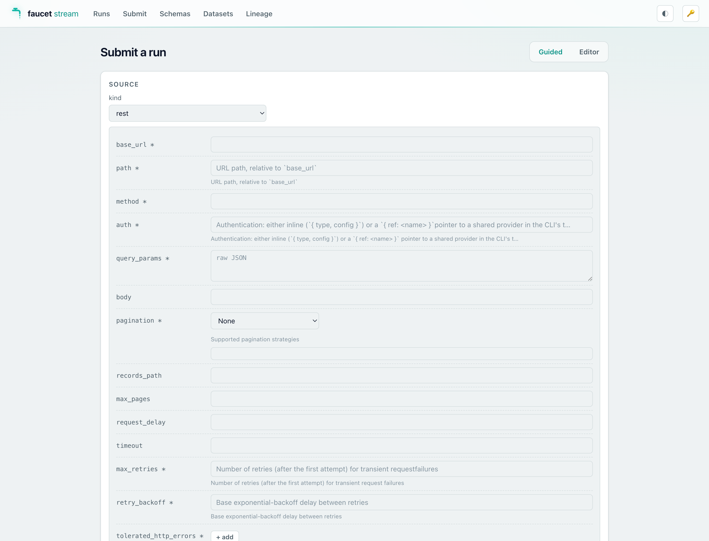
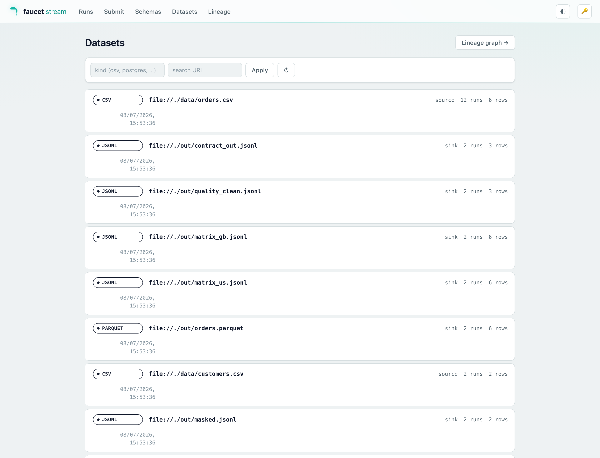
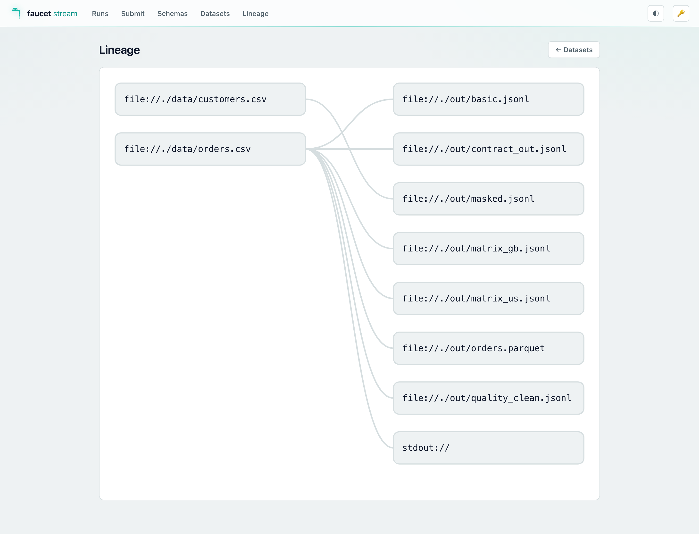

# Web console (`serve-ui`)

`faucet serve` optionally serves an embedded browser-based web console at `/`
when built with the `serve-ui` Cargo feature. The console gives you a visual
interface for the same HTTP API that `curl` or an orchestrator would use —
useful for ad-hoc runs, browsing logs, and exploring connector schemas without
leaving a browser tab.

> The console is a thin static single-page application bundled into the binary
> via `rust-embed`. There is no separate deployment and no network call during
> startup.

> **Want to see it populated in one command?** The
> [Try it locally](../getting-started/try-it-locally.md) quickstart builds the
> CLI, runs a battery of demo pipelines, and leaves this console up with Runs,
> Datasets, and Lineage already filled in — the screenshots below are from it.

## Enabling the feature

```bash
# Install with the embedded console (add serve-ui to your --features list)
cargo install faucet-cli --features serve-ui

# Or build locally
cargo build -p faucet-cli --features serve-ui
```

`serve-ui` implies `serve`, so you do not need to list both. The `full`
aggregate already includes `serve-ui`.

Once built, start the server normally:

```bash
FAUCET_SERVE_AUTH_TOKEN=s3cret faucet serve --listen 127.0.0.1:8080
```

Then open `http://127.0.0.1:8080/` in a browser.

## Token flow

The static shell at `/` is served **without authentication** so the browser can
load the page before it has a token. All `/v1` API calls that populate the
console's data are bearer-gated as usual.

On first load (or after a 401) the console prompts you to paste the bearer
token (the same value as `FAUCET_SERVE_AUTH_TOKEN` / `--auth-token`). The token
is stored in browser `localStorage` and sent as `Authorization: Bearer <token>`
on every subsequent `/v1` request. A key-icon button in the top bar lets you
update or clear it at any time.

> **Security:** the bearer token is as sensitive as the API itself — anyone who
> obtains it can submit arbitrary pipeline configs with the server's identity
> (see the [security model](./serve.md#️-security-model--read-before-exposing)).
> Serve the console only over localhost or a TLS-terminating proxy; never paste
> a production token into a browser tab on a shared machine.

## Views

### Runs dashboard

Lists all runs with live status badges. You can:

- Filter by name, status, or time range.
- Page through history.
- Click any row to open the run detail view.
- Click **+ Submit run** to go directly to the Submit view.



### Run detail

Shows the full run record (status, timestamps, labels, config) plus every
invocation in the matrix. For in-flight runs it streams structured log events
live via SSE (the same `GET /v1/runs/{id}/logs` endpoint). You can cancel or
delete a run from this view.

It also embeds a **dead-letter-queue panel** — enter a server-local DLQ location
(a `.jsonl` file, a directory, or a glob), then **Inspect** it (grouped by
reason), **Discard** envelopes (optionally archiving first), or **Replay
through a config** — paste a pipeline config and re-feed the quarantined
payloads through its transforms / quality / contract / sink, with a dry-run
toggle. This is the [DLQ replay](./dlq.md) workflow, in the browser (backed by
`POST /v1/dlq/{inspect,replay,discard}`).



### Submit

Two modes for submitting a new pipeline run:

- **Raw editor** — paste or type YAML/JSON directly into a text area. The same
  format accepted by `POST /v1/runs`.
- **Schema wizard** — select a source and sink from the compiled connector list,
  fill in the generated form fields, and the wizard assembles a valid config.
  The form is derived from the same JSON Schemas returned by
  `GET /v1/schemas/{kind}/{name}`.



### Schemas explorer

Browses the connector catalog compiled into the running server
(`GET /v1/schemas`). Click any source, sink, or transform to view its full
JSON Schema — useful for checking config field names and types without leaving
the browser.

### Datasets & Lineage (Data Movement Catalog)

When the server is built with the `catalog` feature, two more views browse the
[Data Movement Catalog](./catalog.md) accumulated in the `--history` backend:

- **Datasets** — a filterable list (kind / URI search) of every dataset the
  server's pipelines have touched. Clicking a dataset opens its detail:
  freshness and run counters, per-run volume bars, the deduplicated schema
  timeline with per-version diff badges, and its upstream/downstream edges.

  

- **Lineage** — the source→sink edge graph rendered as a layered SVG (sources
  left, sinks right). Hover an edge for the pipeline/run context; click a node
  to open its dataset detail; open a rooted, depth-bounded slice from any
  dataset's detail page.

  

On a server built without the `catalog` feature both views show a short
"not available" notice (the endpoints are absent).

## Disabling the console at runtime

If you built with `serve-ui` but want to serve only the API (no static assets),
pass `--no-ui`:

```bash
FAUCET_SERVE_AUTH_TOKEN=s3cret faucet serve --no-ui
```

`/` and `/assets/*` return 404; the `/v1` API and the unauthenticated probes
(`/healthz`, `/readyz`, `/metrics`) are unaffected.

## New API endpoints

The `serve-ui` feature ships three new bearer-gated endpoints that the console
(and any other client) can call:

| Method | Path | Description |
|--------|------|-------------|
| `GET` | `/v1/schemas` | Catalog of all compiled sources, sinks, transforms, and state-store kinds. |
| `GET` | `/v1/schemas/{kind}/{name}` | JSON Schema for one connector or transform (`kind` ∈ `source`/`sink`/`transform`). Returns 404 for unknown kind or name. |
| `POST` | `/v1/doctor` | Validate and probe a submitted config without running it. Returns 200 (all probes pass) or 422 (any probe fails) with a probe report. Request body: `{ "config": "<yaml-or-json>", "config_format": "yaml" }`. |

These endpoints require the `serve` feature and are available at runtime
regardless of whether `--no-ui` was passed.

## Related pages

- [Running faucet as a service](./serve.md) — the full `faucet serve` guide.
- [HTTP API reference](../reference/http-api.md) — complete endpoint/schema reference.
- [`faucet serve` CLI flags](../reference/cli.md#serve) — all `faucet serve` flags.
