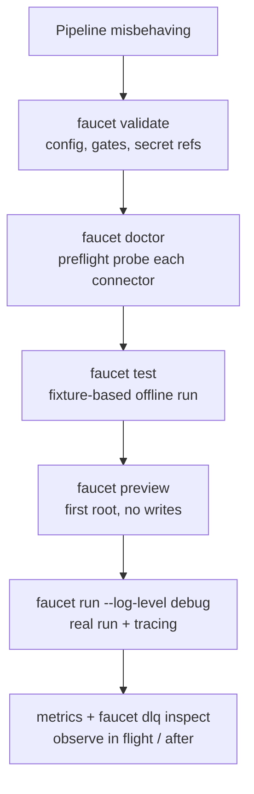

# Debugging a pipeline

*The tools and order of operations for finding out why a pipeline misbehaves — without shipping a change to find out.*

faucet-stream is designed to be diagnosable *before* you run anything against
real infrastructure. Reach for the offline tools first; they catch most
problems in seconds.

## Offline first

- **`faucet validate [--show-composed]`** — parses, composes (`extends`/
  profiles/`!include`), interpolates, and runs every config-load gate
  (exactly-once, write-mode, quarantine-requires-DLQ). It also resolves and
  reports secret references as a real preflight (use `--no-secrets` to stay
  fully offline). If validate fails, nothing else matters yet.
- **`faucet doctor [--json]`** — a non-mutating preflight that calls each
  connector's `check()` (connect/auth/metadata probe) under a timeout and prints
  a green/red checklist. This is how you confirm credentials and reachability
  without moving data. See [`crates/core/src/check.rs`](../../crates/core/src/check.rs).
- **`faucet test <spec>`** — the fixture-based offline harness
  (`cli/src/pipeline_test/`). It feeds fixture records through the *real*
  `Pipeline` per-page path (transforms → quality → contract → masking) with an
  in-memory source and a capturing sink/DLQ, and asserts on the output. This is
  the fastest way to reproduce a transform/quality/contract bug deterministically
  — write a failing test case, then fix.
- **`faucet preview`** — runs only the first root invocation (children need
  parent records) so you can see real output shape without a full run.

## Live

- **Tracing.** Set `--log-level debug` or `FAUCET_LOG=debug`. Every source,
  sink, transform, and state op is wrapped in a span
  (`faucet.pipeline.run` at the top). The `run_id` is a span attribute you can
  correlate across events.
- **Metrics.** The universal metric set is emitted automatically — no per-run
  flag. `faucet_source_records_total`, `faucet_sink_errors_total`,
  `faucet_pipeline_seconds_since_last_bookmark`, and
  `faucet_pipeline_pages_skipped_total` are the first gauges to check for a
  stalled or replaying run. See [observability](../architecture/observability.md).
- **The DLQ.** If rows are being quarantined, `faucet dlq inspect <location>`
  classifies and summarizes the dead-letter envelopes, and
  `faucet dlq replay` re-runs them through a fresh pipeline. See
  [`cli/src/dlq_replay/`](../../cli/src/dlq_replay/).

## The secret-redaction caveat

faucet redacts resolved secret values from *its own* tracing/log/error output at
the I/O boundary. That boundary does **not** cover third-party connector debug
logging (e.g. a database driver's own logs), Prometheus label values, or span
attributes. **Never run `FAUCET_LOG=debug` on a pipeline whose connector configs
hold resolved secrets** — a driver may log the connection string with the
password in it. Debug against non-production credentials.

## Related

- [Observability architecture](../architecture/observability.md)
- [Recovery & resume](../architecture/recovery.md)
- [Testing](./testing.md)
- [Common mistakes](./common-mistakes.md)
- [Troubleshooting cookbook](../book/src/cookbook/troubleshooting.md)
