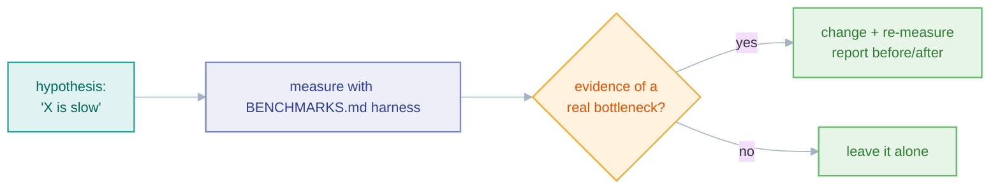

# Performance

*The connector performance checklist, how to measure, and what not to touch without evidence.*

Performance and reliability are the reason this library exists — every connector
should be the fastest way to move data between its endpoints in Rust. This page
is the contributor checklist; the *why* behind the design choices is in
[`docs/architecture/performance.md`](../architecture/performance.md).

## The checklist

Apply these when adding or modifying any connector. They are not optional
polish — they are the baseline a reviewer will expect:

- **Reuse clients and connections.** Build S3 clients, DB pools, Redis
  connections, and `reqwest` clients in `new()` and store them on the struct.
  Never construct a client per call — that is the single most common throughput
  bug in a connector.
- **Pool database connections.** Every DB connector exposes a configurable
  `max_connections` (default 10 for sources, 5 for sinks).
- **Multi-row `INSERT`.** DB sinks must batch into
  `INSERT INTO … VALUES (…), (…), …`, never one statement per record.
- **Wrap batches in transactions** where the backend supports it (the SQLite
  sink wraps each batch in `BEGIN`/`COMMIT`).
- **Parallel I/O.** Use `buffer_unordered(concurrency)` for concurrent object
  reads/writes (S3/GCS/Parquet), a semaphore for concurrent HTTP sends, and
  concurrent partition processing where the source supports it.
- **Prefer bulk/batch APIs** — Elasticsearch `_bulk`, BigQuery `insertAll`,
  MongoDB `insert_many`, Redis pipelines + `MGET`.
- **Buffered I/O** for file sinks; use `spawn_blocking` for sync CPU/FS work
  (the CSV sink does) so you never block the async runtime.
- **Expose configurable concurrency** (`concurrency` / `max_connections`) with
  sensible defaults.

The memory model is fixed by the pipeline: streaming holds only one
[page](../architecture/stream-pages.md) at a time, so memory is O(batch_size) on
both sides regardless of total volume. Don't defeat this by buffering the whole
result set in your `stream_pages` override.

## Measuring

There is a benchmark harness — see [`BENCHMARKS.md`](../../BENCHMARKS.md) and
`scripts/`. When you claim a speed-up, back it with a before/after number from
the harness, not intuition. The benchmark VM and scenarios are documented there
(Scenario C is the head-to-head throughput comparison).

## What NOT to do

- **Don't micro-optimize without evidence.** A clever allocation-avoidance that
  isn't on a measured hot path adds risk and review burden for no gain. The
  hot path is `run_stream` and the per-record transform loop; almost everything
  else is cold.
- **Don't trade correctness for speed.** A faster write path that can duplicate
  rows on retry is a regression, not an optimization — see the
  [retries ADR](../adr/0007-retries.md). Correctness outranks throughput every
  time.
- **Don't add mandatory heavy dependencies to `faucet-core`.** Core must stay
  lightweight for connector authors; connector-specific deps belong in the
  connector crate.

## Related

- [Performance architecture](../architecture/performance.md)
- [Batching & backpressure](../architecture/batching.md)
- [Stream pages](../architecture/stream-pages.md)
- [Performance standards](../standards/performance.md)
- [BENCHMARKS.md](../../BENCHMARKS.md)
