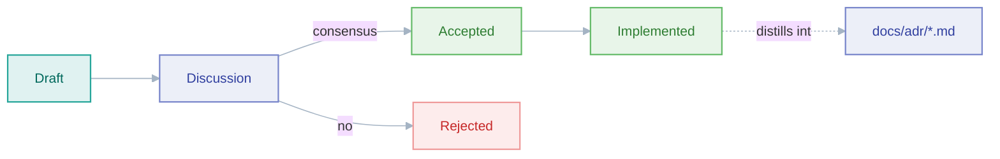

# faucet-stream RFCs

*The design-review process for cross-cutting, breaking, or new-subsystem changes — and how it relates to issues, ADRs, and the roadmap.*

Most changes to faucet-stream do **not** need an RFC. Adding a connector, fixing
a bug, tuning a hot path, or extending an existing config block is ordinary
work: open a PR (see [`CONTRIBUTING.md`](../CONTRIBUTING.md)), or file a GitHub
issue first if the work needs scoping. The RFC process exists for the small
number of changes whose cost of being wrong is paid by every future contributor
and every downstream connector author.

## When an RFC is required

Write an RFC when a change touches the parts of the system that are expensive to
reverse:

- **The connector contract.** Anything that changes the `Source` / `Sink`
  traits in `crates/core/src/traits.rs`, their object-safety, or the meaning of
  an existing method. Third-party connectors depend only on `faucet-core`; a
  trait change is a change to a public compatibility surface.
- **The record model.** Replacing or supplementing `serde_json::Value` as the
  in-flight record type (see [ADR 0004](../docs/adr/0004-json-record-model.md)).
- **Delivery / durability semantics.** Anything that alters the
  write → flush → checkpoint ordering, the exactly-once mechanisms, or the
  `StateStore` contract. These carry the framework's data-integrity guarantees
  (see [ADR 0002](../docs/adr/0002-checkpoint-ordering.md) and the
  [design invariants](../docs/architecture/invariants.md)).
- **A new subsystem** that will accrete its own config surface, feature flags,
  and maintenance burden (e.g. the plugin system, an Arrow record path).
- **Cross-cutting conventions** that many crates must adopt at once.

If you are unsure, open a GitHub issue and ask. A one-paragraph issue that gets
the answer "just send the PR" is cheaper than an RFC nobody needed.

## When an RFC is *not* the right tool

- **A single new connector** — this is routine. The standing project preference
  is to grow runtime/CLI/observability capability rather than the connector
  count, but adding one follows the connector-authoring guide, not an RFC.
- **A scoped feature or bug** — file a GitHub issue with the type/tier labels and
  cross-link it to the roadmap epic (**#38**). The issue *is* the design record
  for work of that size.
- **Documentation, refactors, tests, CI** — just open the PR.

The rule of thumb: an **issue** captures *what* to build and *why*; an **RFC**
is warranted only when the *how* is contentious, hard to reverse, or must be
agreed before code exists.

## Lifecycle

1. **Draft** — copy [`0000-template.md`](./0000-template.md) to
   `rfcs/NNNN-short-title.md`, fill it in, open a PR that adds only that file.
2. **Discussion** — review happens on the PR. The bar is a clear motivation,
   an honest accounting of drawbacks, and at least one seriously-considered
   alternative. Grounding claims about *current* behaviour in real code is
   mandatory — a reviewer must be able to tell exactly what changes.
3. **Accepted / Rejected** — set the `Status` header. A rejected RFC is still
   merged (with its rationale) so the decision is not re-litigated.
4. **Implemented** — once shipped, update the status and link the PRs.

## Numbering

RFCs are numbered sequentially, zero-padded to four digits, in filename order.
`0000` is the template. Pick the next free number when you open the draft PR;
if two drafts collide, the second to merge renumbers.

## RFCs, ADRs, and issues

These three records answer different questions and should not be conflated:

| Record | Question | Lives in | Timing |
|---|---|---|---|
| **Issue** | What should we build, and why? | GitHub (+ epic #38) | Before/around the work |
| **RFC** | How should we build a contentious, hard-to-reverse thing — before we commit? | `rfcs/` | Before the code |
| **ADR** | What did we decide and why, now that it is built? | [`docs/adr/`](../docs/adr/) | After the code, as the durable record |

An accepted-and-implemented RFC frequently distills into an ADR: the RFC keeps
the full exploratory argument (alternatives, drawbacks, unresolved questions);
the ADR is the terse "this is how it works and why" that new contributors read.
The RFCs here that describe *proposed* work (0001–0005) will, if implemented,
each produce or update an ADR.

## Related

- [`CONTRIBUTING.md`](../CONTRIBUTING.md) — build/test/PR mechanics
- [Architecture Decision Records](../docs/adr/) — decisions already made
- [Documentation hub](../docs/README.md) — the full documentation map
- [Roadmap](../docs/roadmap.md) — architectural direction these RFCs feed
